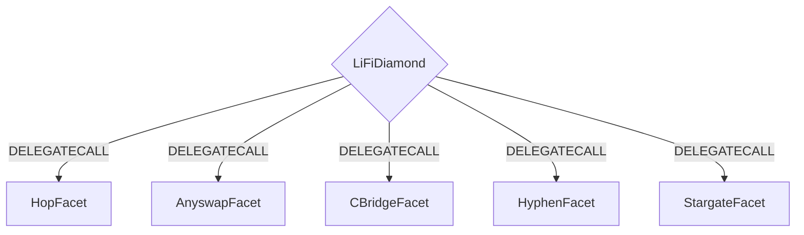
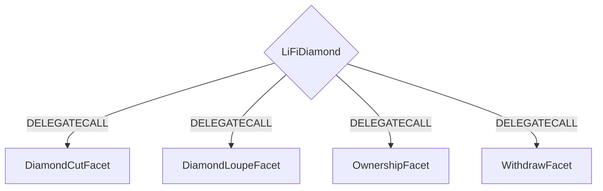

[](https://github.com/lifinance/contracts/actions/workflows/forge.yml)

# LI.FI Smart Contracts

You can find the ABI of LifiDiamond in our auto generated [lifi-contract-types repository](https://github.com/lifinance/lifi-contract-types/blob/main/dist/diamond.json).

## Table of contents

1. [General](#general)
2. [Why LI.FI?](#why)
   1. [Our Thesis](#thesis)
   2. [Ecosystem Problems](#ecosystem-problems)
   3. [Developer Problems](#developer-problems)
   4. [Solution](#solution)
3. [How It Works](#how-it-works)
4. [Architecture](#architecture)
   1. [Contract Flow](#contract-flow)
   2. [Diamond Helper Contracts](#diamond-helper-contracts)
5. [Repository Structure](#repository-structure)
6. [Getting Started](#getting-started)
   1. [Prerequisites](#prerequisites)
   2. [Development Environment](#development-environment)
   3. [Cursor IDE Setup](#cursor-setup)
   4. [INSTALL](#install)
   5. [TEST](#test)
   6. [TEST With Foundry/Forge](#foundry-forge)
   7. [Adding a New Bridge](#new-bridge)
7. [Development Workflow](#development-workflow)
8. [Code Quality & Standards](#code-quality)
9. [Contract Docs](#contract-docs)
10. [DEPLOY](#deploy)
11. [More Information](#more-information)

## General<a name="general"></a>

Our vision is to create a middle layer between DeFi infrastructure and the application layer.
LI.FI aims to aggregate and abstract away the most important bridges and connect them to DEXs and DEX aggregators on each chain to facilitate cross-chain any-2-any swaps.

To decide which bridge to use, we assess and measure the degree of decentralization, trust assumptions, fees, gas efficiency, speed, and other qualitative and quantitative factors.
Then, we use the thresholds and preferences of our integration partners and end-users to select the right path.

## Why LI.FI?<a name="why"></a>

### Our Thesis<a name="thesis"></a>

- The future is multi-chain
- Cross-chain bridging solutions will play a major role on infrastructure level
- Aggregation will pave the way for mass adoption

---

### Ecosystem Problems<a name="ecosystem-problems"></a>

**dApps**: Many users come across a new interesting dApp on a chain they don't have funds in and struggle to get their funds there. This is significant friction in user onboarding as they have to research and find bridges to that chain to start using the dApp.

**Yield Aggregators**: There are definitely protocols with better yield on new L2/side-chains but there isn't a secure, reliable way to transfer your funds.

**Wallets**: Multichain wallets want to compete with CEXes, but they don't have a way to allow easy swap between assets like CEXes.

**DeFi Protocols**: DeFi Dashboards, lending protocols, yield farms, etc., that are present on new chains create a need to do cross-chain swaps, but their users have to wander the ecosystem to quench this need.

---

### Developer Problems<a name="developer-problems"></a>

**Too many bridges** to educate yourself about.
It'd be good to have access to all of them and getting good guidance from people and algorithms that are specialized.

➔ LI.FI does that.

**Bridges are still immature** so it's good to have not only one bridge but fallback solutions in place.
Immaturity comes with security risks, insufficient liquidity and a lot of maintenance overhead.

➔ LI.FI maintains all bridge connections, gives you access to multiple ones and handles fallbacks and decision-making programmatically.

**Bridges are most often not enough**.
You also need DEXes/DEX aggregators as bridges are limited to stable-coins and native currencies.

➔ LI.FI not only aggregates bridges, but also connects to sorts of DEX aggregators and if not available, the DEXs directly in order to find the best swap possible to arrive at the desired token and to allow to start the whole process with any asset.

---

### Solution<a name="solution"></a>

A data mesh of cross-chain liquidity sources: cross-chain liquidity networks, bridges, DEXes, bridges, and lending protocols.

As a bridge and DEX aggregator, LI.FI can route any asset on any chain to the desired asset on the desired chain, thus providing a remarkable UX to their users.

All of this will be made available on an API/Contract level which comes as SDK, iFrame solution, and as a widget for other developers to plug directly into their products.
No need for users to leave your dApps anymore.

## How It Works<a name="how-it-works"></a>

Our [API](https://apidocs.li.fi/) and [SDK](https://docs.li.fi/products/integrate-li.fi-js-sdk/install-li.fi-sdk) allow dApps and dApp developers to request the best routes for a desired cross-chain swap.
Our backend will calculate the best possible routes based on the transaction fees, gas costs and execution duration.

The then returned routes contain already populated transactions which can directly be sent via the user's wallet to our contracts.
A single transaction can contain multiple steps (e.g. AAVE on Polygon -> DAI on Polygon using Paraswap -> DAI on Avalanche using Stargate -> SPELL on Avalanche using Paraswap) which will be executed by our contract.
Finally, the final amount of the requested token is sent to the user's wallet.

## Architecture<a name="architecture"></a>

The LI.FI Contract is built using the EIP-2535 (Multi-facet Proxy) standard. The contract logic lives behind a single contract that in turn uses DELEGATECALL to call **facet** contracts that contain the business logic.

All business logic is built using **facet** contracts which live in `src/Facets`.

For more information on EIP-2535 you can view the entire EIP [here](https://eips.ethereum.org/EIPS/eip-2535).

---

### Contract Flow<a name="contract-flow"></a>

A basic example would be a user bridging from one chain to another using Hop Protocol. The user would interact with the LI.FIDiamond contract which would pass the Hop specific call to the HopFacet which then passes required calls + parameters to Hop Protocol's contracts.

The basic flow is illustrated below.



---

### Diamond Helper Contracts<a name="diamond-helper-contracts"></a>

The LiFiDiamond contract is deployed along with some helper contracts that facilitate things like upgrading facet contracts, look-ups for methods on facet contracts, ownership checking and withdrawals of funds. For specific details please check out [EIP-2535](https://eips.ethereum.org/EIPS/eip-2535).



## Repository Structure<a name="repository-structure"></a>

```
contracts
│ README.md                   // you are here
│ ...                         // setup and development configuration files
│
├─── config                   // service configuration files
├─── constants                // general constants
├─── deploy                   // deployment scripts
├─── diamondABI               // Diamond ABI definition
├─── export                   // deployed results
├─── scripts                  // scripts containing sample calls for demonstration
│
├─── src                      // the contract code
│   ├── Facets                // service facets
│   ├── Interfaces            // interface definitions
│   └── Libraries             // library definitions
│
├───tasks
│   │ generateDiamondABI.ts   // script to generate Diamond ABI including all facets
│
├─── test                     // contract unit tests
│   ├─── facets               // facet tests
│   ├─── fixtures             // service fixtures for running the tests
│   └─── utils                // testing utility functions
│
└─── utils                    // utility scripts
```

## Contract Docs<a name="contract-docs"></a>

You can read more details documentation on each facet [here](./docs/README.md).
Sample requests to fetch transactions for each facet can be found at the end of each section.

## Getting Started<a name="getting-started"></a>

### Prerequisites<a name="prerequisites"></a>

- Node.js (v18 or later)
- Bun (latest version)
- Foundry (latest version)
- Git
- Cursor IDE (recommended) or VSCode

### Development Environment<a name="development-environment"></a>

1. Clone the repository:

```bash
git clone https://github.com/lifinance/contracts.git
cd contracts
```

2. Install dependencies:

```bash
bun i
forge install
```

3. Set up environment variables:

```bash
cp .env.example .env
# Edit .env with your configuration
```

### Cursor IDE Setup<a name="cursor-setup"></a>

For optimal AI assistance in Cursor IDE:

1. Copy `.cursorrules.example` to `.cursorrules`:

```bash
cp .cursorrules.example .cursorrules
```

2. The `.cursorrules` file provides context for AI interactions with our codebase. It helps the AI understand:

   - Project structure and conventions
   - Development environment and tools
   - Key files and their purposes
   - Testing and deployment requirements

3. You can customize `.cursorrules` based on your needs, but we recommend keeping the core context intact.

### INSTALL<a name="install"></a>

```bash
bun i
```

### TEST<a name="test"></a>

```bash
bun run test
```

### TEST With Foundry/Forge<a name="foundry-forge"></a>

Make sure to install the latest version of Foundry by downloading the installer.

```
curl -L https://foundry.paradigm.xyz | bash
```

Then, in a new terminal session or after reloading your PATH, run it to get the latest forge and cast binaries:

```
foundryup
```

Install dependencies

```
forge install
```

Run tests

```
bun run test
```

### Adding a New Bridge<a name="new-bridge"></a>

We try to keep up with all the latest bridges and DEXes but can't always add them as fast as we would like. If you would like to speed up the process of adding your bridge, we've made it easy for you to contribute yourself.

[Read More](./docs/AddingANewBridge.md)

### DEPLOY<a name="deploy"></a>

Follow the deployment checklist [here](./docs/Deploy.md)

## Development Workflow<a name="development-workflow"></a>

1. **Branch Management**

   - Create feature branches from `main`
   - Use descriptive branch names (e.g., `feature/add-new-bridge`, `fix/hop-integration`)
   - **Important**: PRs must be created from branches within the main repository, not from forks. This is because our GitHub Actions workflows require access to repository secrets and cannot run correctly on forked repositories.

2. **Code Quality**

   - Follow our [coding conventions](./conventions.md)
   - Write comprehensive tests for new features
   - Ensure all tests pass before submitting PRs

3. **Pull Request Process**

   - Create PRs against `main`
   - Include clear descriptions and testing instructions
   - Request reviews from team members
   - Ensure CI checks pass

4. **Testing Requirements**
   - Unit tests for all new functionality
   - Integration tests for bridge interactions
   - Gas optimization tests where applicable
   - Coverage requirements: >90% for new code

## Code Quality & Standards<a name="code-quality"></a>

Our codebase follows strict quality standards defined in [conventions.md](./conventions.md). Key aspects include:

1. **Code Organization**

   - Clear file structure and naming conventions
   - Consistent contract organization
   - Proper documentation and NatSpec comments

2. **Error Handling**

   - Custom errors for better gas efficiency
   - Clear error messages
   - Proper validation and checks

3. **Security**

   - Access control patterns
   - Reentrancy protection
   - Input validation
   - Emergency functionality

4. **Gas Optimization**
   - Efficient storage patterns
   - Memory usage optimization
   - Batch operations where possible

## More Information<a name="more-information"></a>

- [Website](https://li.fi/)
- [General Documentation](https://docs.li.fi/)
- [API Documentation](https://apidocs.li.fi/)
- [SDK Documentation](https://docs.li.fi/products/integrate-li.fi-js-sdk/install-li.fi-sdk)
- [Transfer UI](https://transferto.xyz/)
- [Internal Documentation](./docs/README.md)
- [Coding Conventions](./conventions.md)

```

```
