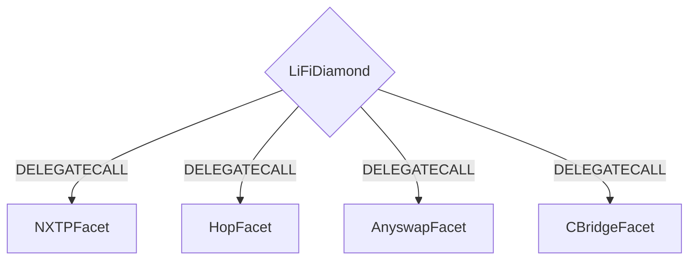
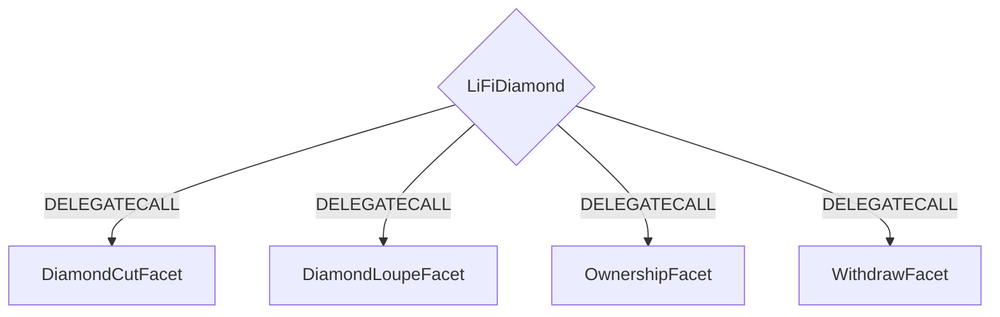

[](https://github.com/lifinance/lifi-contracts/actions/workflows/main.yml)

# LiFi Smart Contracts

## Architecture

The LiFi Contract is built using the EIP-2535 (Multi-facet Proxy) standard. The contract logic lives behind a single contract that in turn uses DELEGATECALL to call **facet** contracts the contain the business logic.

All business logic is built using **facet** contracts which live in `src/Facets`.

For more information on EIP-2535 you can view the entire EIP [here](https://eips.ethereum.org/EIPS/eip-2535).

---

### Contract Flow

A basic example would be a user bridging from one chain to another using Hop Protocol. The user would interact with the LiFiDiamond contract which would pass the Hop specific call to the HopFacet which then passes required calls + parameters to Hop Protocol's contracts.

The basic flow is illustrated below.



---

### Diamond Helper Contracts

The LiFiDiamond contract is deployed along with some helper contracts that facilitate things like upgrading facet contracts, look ups for methods on facet contracts, ownership checking and withdrawals of funds. For specific details please check out [EIP-2535](https://eips.ethereum.org/EIPS/eip-2535).



---

## Docs

You can read more details documentation on each facet [here](./docs/README.md).

## Getting Started

Make sure to copy `.env.example` to `.env` and fill out the missing values.

### INSTALL

```bash
yarn
```

### TEST

```bash
yarn test
```
