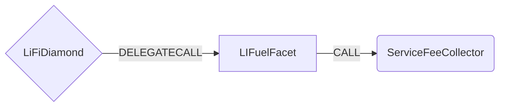

# LIFuel Facet

## How it works

The LIFuel Facet is used to deposit tokens on the source chain and receive native on the destination chain.
It works by forwarding funds to the ServiceFee collector, which in turn will emit an event with the deposit info. 
The event will be used by trusted relayers to pickup the deposit and relay it to the destination chain.
The relayers currently only support stablecoins.
The amount of relayed token will be an amount of native that corresponds to the USD price of deposited tokens at the time of relay.



## Public Methods

- `function startBridgeTokensViaLIFuel(BridgeData memory _bridgeData)`
  - Simply deposits tokens using LIFuel
- `function swapAndStartBridgeTokensViaLIFuel(BridgeData memory _bridgeData, SwapData[] calldata _swapData)`
  - Performs swap(s) before depositing tokens using LIFuel

## Swap Data

Some methods accept a `SwapData _swapData` parameter.

Swapping is performed by a swap specific library that expects an array of calldata to can be run on various DEXs (i.e. Uniswap) to make one or multiple swaps before performing another action.

The swap library can be found [here](../src/Libraries/LibSwap.sol).

## LiFi Data

Some methods accept a `BridgeData _bridgeData` parameter.

This parameter is strictly for analytics purposes. It's used to emit events that we can later track and index in our subgraphs and provide data on how our contracts are being used. `BridgeData` and the events we can emit can be found [here](../src/Interfaces/ILiFi.sol).

## Getting Sample Calls to interact with the Facet

In the following some sample calls are shown that allow you to retrieve a populated transaction that can be sent to our contract via your wallet.

All examples use our [/quote endpoint](https://apidocs.li.fi/reference/get_quote) to retrieve a quote which contains a `transactionRequest`. This request can directly be sent to your wallet to trigger the transaction.

The quote result looks like the following:

```javascript
const quoteResult = {
  id: '0x...', // quote id
  type: 'lifi', // the type of the quote (all lifi contract calls have the type "lifi")
  tool: 'hop', // the bridge tool used for the transaction
  action: {}, // information about what is going to happen
  estimate: {}, // information about the estimated outcome of the call
  includedSteps: [], // steps that are executed by the contract as part of this transaction, e.g. a swap step and a cross step
  transactionRequest: {
    // the transaction that can be sent using a wallet
    data: '0x...',
    to: '0x...',
    value: '0x00',
    from: '{YOUR_WALLET_ADDRESS}',
    chainId: 100,
    gasLimit: '0x...',
    gasPrice: '0x...',
  },
}
```

A detailed explanation on how to use the /quote endpoint and how to trigger the transaction can be found [here](https://docs.li.fi/products/more-integration-options/li.fi-api/transferring-tokens-example).

**Hint**: Don't forget to replace `{YOUR_WALLET_ADDRESS}` with your real wallet address in the examples.

### Cross Only (Stable only)

To get a transaction for a transfer from 0.5USDC on POL to BNB on Binance you can execute the following request:

```shell
curl 'https://li.quest/v1/quote?fromChain=POL&fromAmount=5000000&fromToken=USDC&toChain=BSC&toToken=BNB&slippage=0.03&allowBridges=lifuel&fromAddress={YOUR_WALLET_ADDRESS}'
```

### Swap & Cross (Any token)

To get a transaction for a transfer from 1SUSHI on POL to BNB on Binance you can execute the following request:

```shell
curl 'https://li.quest/v1/quote?fromChain=AVA&fromAmount=1000000000000000000&fromToken=SUSHI&toChain=BSC&toToken=BNB&slippage=0.03&allowBridges=lifuel&fromAddress={YOUR_WALLET_ADDRESS}'
```
