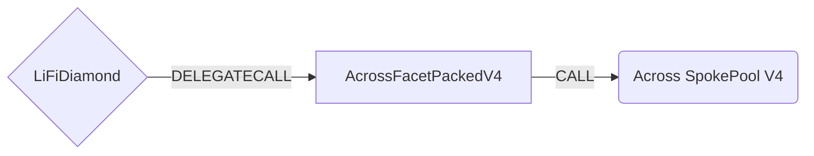

# Across Facet Packed V4

## How it works

The Across Facet Packed V4 works by forwarding Across V4 specific calls to the [Across SpokePool contract](https://github.com/across-protocol/contracts-v2/blob/main/contracts/SpokePool.sol). Across V4 introduces support for non-EVM chains by using `bytes32` addresses instead of `address` types, allowing for cross-chain bridging to chains like Solana.

The packed version provides gas-optimized bridging by encoding parameters directly into calldata, reducing transaction costs significantly.



## Key V4 Changes

- **Bytes32 Addresses**: All addresses are now `bytes32` to support non-EVM chains
- **New Deposit Function**: Uses `deposit()` instead of `depositV3()`
- **Enhanced Chain Support**: Supports Solana and other non-EVM chains
- **Improved Gas Efficiency**: Packed calldata reduces transaction costs

## Public Methods

### Native Token Bridging

- `function startBridgeTokensViaAcrossV4NativePacked()`
  - Bridge native assets by passing custom encoded callData
- `function startBridgeTokensViaAcrossV4NativeMin(PackedParameters calldata _parameters)`
  - Bridge native assets by passing minimal required parameters

### ERC20 Token Bridging

- `function startBridgeTokensViaAcrossV4ERC20Packed()`
  - Bridge ERC20 tokens by passing custom encoded callData
- `function startBridgeTokensViaAcrossV4ERC20Min(PackedParameters calldata _parameters, address sendingAssetId, uint256 inputAmount)`
  - Bridge ERC20 tokens by passing minimal required parameters

### Encoding/Decoding Functions

- `function encode_startBridgeTokensViaAcrossV4NativePacked(PackedParameters calldata _parameters)`
  - Generate packed transaction data for native asset transfers
- `function encode_startBridgeTokensViaAcrossV4ERC20Packed(PackedParameters calldata _parameters, address sendingAssetId, uint256 inputAmount)`
  - Generate packed transaction data for ERC20 token transfers
- `function decode_startBridgeTokensViaAcrossV4NativePacked(bytes calldata data)`
  - Decode packed calldata for native transfers
- `function decode_startBridgeTokensViaAcrossV4ERC20Packed(bytes calldata data)`
  - Decode packed calldata for ERC20 transfers

### Utility Functions

- `function setApprovalForBridge(address[] calldata tokensToApprove)`
  - Set token approvals for the Across SpokePool
- `function executeCallAndWithdraw(address _callTo, bytes calldata _callData, address _assetAddress, address _to, uint256 _amount)`
  - Execute calls and withdraw assets (owner only)

## Parameters

### PackedParameters Struct

```solidity
struct PackedParameters {
  bytes32 transactionId;
  bytes32 receiver;
  bytes32 depositor;
  uint64 destinationChainId;
  bytes32 receivingAssetId;
  uint256 outputAmount;
  bytes32 exclusiveRelayer;
  uint32 quoteTimestamp;
  uint32 fillDeadline;
  uint32 exclusivityDeadline;
  bytes message;
}
```

### Parameter Descriptions

- `transactionId`: Custom transaction ID for tracking
- `receiver`: Receiving address (bytes32 for non-EVM support)
- `depositor`: Depositor address (bytes32 for non-EVM support)
- `destinationChainId`: Target chain ID
- `receivingAssetId`: Token to receive on destination (bytes32 for non-EVM support)
- `outputAmount`: Expected output amount on destination
- `exclusiveRelayer`: Exclusive relayer address (bytes32 for non-EVM support)
- `quoteTimestamp`: Timestamp of the quote
- `fillDeadline`: Deadline for filling the deposit
- `exclusivityDeadline`: Deadline for exclusive relayer
- `message`: Additional message data
- `sendingAssetId`: Source token address (for ERC20 transfers)
- `inputAmount`: Amount to bridge (for ERC20 transfers)

## Packed Calldata Format

The packed version optimizes gas usage by encoding parameters directly into calldata with specific byte offsets:

### Native Packed Calldata Mapping

```
[0:4]   - function selector
[4:12]  - transactionId
[12:44] - receiver (bytes32)
[32:64] - depositor (bytes32)
[44:48] - destinationChainId (uint32)
[56:88] - receivingAssetId (bytes32)
[88:120] - outputAmount (uint256)
[120:152] - exclusiveRelayer (bytes32)
[152:156] - quoteTimestamp (uint32)
[156:160] - fillDeadline (uint32)
[160:164] - exclusivityDeadline (uint32)
[164:]   - message
```

### ERC20 Packed Calldata Mapping

```
[0:4]   - function selector
[4:12]  - transactionId
[12:44] - receiver (bytes32)
[32:64] - depositor (bytes32)
[64:84] - sendingAssetId (address)
[84:100] - inputAmount (uint128)
[100:104] - destinationChainId (uint32)
[104:136] - receivingAssetId (bytes32)
[136:168] - outputAmount (uint256)
[168:200] - exclusiveRelayer (bytes32)
[200:204] - quoteTimestamp (uint32)
[204:208] - fillDeadline (uint32)
[208:212] - exclusivityDeadline (uint32)
[212:]   - message
```

## Usage Examples

### Encoding Native Transfer

```solidity
// Create packed parameters
PackedParameters memory params = PackedParameters({
    transactionId: bytes32("someID"),
    receiver: bytes32(uint256(uint160(RECEIVER_ADDRESS))),
    depositor: bytes32(uint256(uint160(DEPOSITOR_ADDRESS))),
    destinationChainId: 137,
    receivingAssetId: bytes32(uint256(uint160(USDC_ADDRESS))),
    outputAmount: 1000000,
    exclusiveRelayer: bytes32(0),
    quoteTimestamp: uint32(block.timestamp),
    fillDeadline: uint32(block.timestamp + 3600),
    exclusivityDeadline: 0,
    message: ""
});

// Encode the calldata
bytes memory packedCalldata = acrossFacetPackedV4.encode_startBridgeTokensViaAcrossV4NativePacked(params);

// Execute the call
(bool success, ) = address(diamond).call{value: amountNative}(packedCalldata);
```

### Encoding ERC20 Transfer

```solidity
// Create packed parameters
PackedParameters memory params = PackedParameters({
    transactionId: bytes32("someID"),
    receiver: bytes32(uint256(uint160(RECEIVER_ADDRESS))),
    depositor: bytes32(uint256(uint160(DEPOSITOR_ADDRESS))),
    destinationChainId: 137,
    receivingAssetId: bytes32(uint256(uint160(USDC_ADDRESS))),
    outputAmount: 1000000,
    exclusiveRelayer: bytes32(0),
    quoteTimestamp: uint32(block.timestamp),
    fillDeadline: uint32(block.timestamp + 3600),
    exclusivityDeadline: 0,
    message: ""
});

// Encode the calldata
bytes memory packedCalldata = acrossFacetPackedV4.encode_startBridgeTokensViaAcrossV4ERC20Packed(
    params,
    USDT_ADDRESS,
    1000000
);

// Execute the call
(bool success, ) = address(diamond).call(packedCalldata);
```

## Getting Sample Calls

To interact with this optimized facet, use requests directly returned by the LI.FI API to ensure the packed parameters are formatted correctly.

## Deployment Requirements

- **Across SpokePool V4**: The V4 SpokePool contract address for the current network
- **Wrapped Native**: The wrapped native token address (as bytes32)
- **Owner**: The contract owner address for administrative functions

## Supported Networks

The Across Facet Packed V4 supports all networks that have Across V4 SpokePool deployments, including:

- Ethereum Mainnet
- Arbitrum
- Optimism
- Polygon
- Base
- And other networks with Across V4 support
