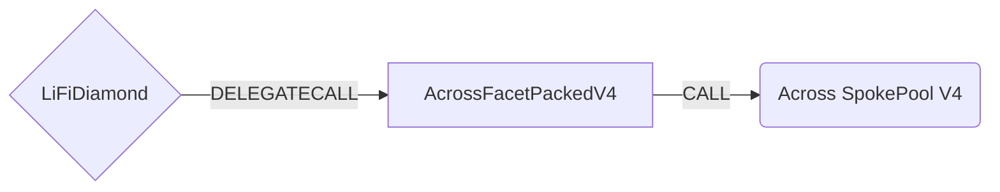

# AcrossFacetPackedV4

## How it works

The AcrossFacetPackedV4 works by forwarding Across V4 specific calls to the [Across SpokePool contract](https://github.com/across-protocol/contracts-v2/blob/main/contracts/SpokePool.sol). Across V4 introduces support for non-EVM chains by using `bytes32` addresses instead of `address` types, allowing for cross-chain bridging to chains like Solana.

The packed version provides gas-optimized bridging by encoding parameters directly into calldata, reducing transaction costs significantly.



## Key V4 Changes

- **Bytes32 Addresses**: All addresses are now `bytes32` to support non-EVM chains
- **New Deposit Function**: Uses `deposit()` instead of `depositV3()`
- **Enhanced Chain Support**: Supports Solana and other non-EVM chains
- **Improved Gas Efficiency**: Packed calldata reduces transaction costs

## Public Methods

### Native Token Bridging

- `function startBridgeTokensViaAcrossV4NativePacked()`
  - Bridge native assets by passing custom encoded callData
- `function startBridgeTokensViaAcrossV4NativeMin(PackedParameters calldata _parameters)`
  - Bridge native assets by passing minimal required parameters

### ERC20 Token Bridging

- `function startBridgeTokensViaAcrossV4ERC20Packed()`
  - Bridge ERC20 tokens by passing custom encoded callData
- `function startBridgeTokensViaAcrossV4ERC20Min(PackedParameters calldata _parameters, bytes32 sendingAssetId, uint256 inputAmount)`
  - Bridge ERC20 tokens by passing minimal required parameters

### Encoding/Decoding Functions

- `function encode_startBridgeTokensViaAcrossV4NativePacked(PackedParameters calldata _parameters)`
  - Generate packed transaction data for native asset transfers
- `function encode_startBridgeTokensViaAcrossV4ERC20Packed(PackedParameters calldata _parameters, bytes32 sendingAssetId, uint256 inputAmount)`
  - Generate packed transaction data for ERC20 token transfers
- `function decode_startBridgeTokensViaAcrossV4NativePacked(bytes calldata data)`
  - Decode packed calldata for native transfers
- `function decode_startBridgeTokensViaAcrossV4ERC20Packed(bytes calldata data)`
  - Decode packed calldata for ERC20 transfers

### Utility Functions

- `function setApprovalForBridge(address[] calldata tokensToApprove)`
  - Set token approvals for the Across SpokePool
- `function executeCallAndWithdraw(address _callTo, bytes calldata _callData, address _assetAddress, address _to, uint256 _amount)`
  - Execute calls and withdraw assets (owner only)

## Parameters

### PackedParameters Struct

```solidity
struct PackedParameters {
  bytes32 transactionId; // Custom transaction ID for tracking
  bytes32 receiver; // Receiving address (bytes32 for non-EVM support)
  bytes32 depositor; // Depositor address (bytes32 for non-EVM support)
  uint64 destinationChainId; // Target chain ID
  bytes32 receivingAssetId; // Token to receive on destination
  uint256 outputAmount; // Expected output amount on destination
  bytes32 exclusiveRelayer; // Exclusive relayer address
  uint32 quoteTimestamp; // Timestamp of the quote
  uint32 fillDeadline; // Deadline for filling the deposit
  uint32 exclusivityParameter; // Exclusivity deadline control
  bytes message; // Additional message data
}
```

### Exclusivity Parameter Usage

The `exclusivityParameter` controls when only the `exclusiveRelayer` can fill the deposit. Before the exclusivity deadline timestamp, only the designated exclusive relayer (if set to a non-zero address) can fill this deposit. There are three ways to use this parameter:

- **0 (NO EXCLUSIVITY)**: If this value is set to 0, then a timestamp of 0 will be emitted in the deposit event, meaning there is no exclusivity period and any relayer can fill the deposit immediately.

- **< MAX_EXCLUSIVITY_PERIOD_SECONDS (OFFSET)**: If this value is less than the maximum exclusivity period, it's treated as an offset. The system adds this value to the current `block.timestamp` to derive the exclusive relayer deadline. This allows for relative timing from the current block.

- **≥ MAX_EXCLUSIVITY_PERIOD_SECONDS (ABSOLUTE TIMESTAMP)**: If this value is greater than or equal to the maximum exclusivity period, it's treated as an absolute timestamp. The system uses this value directly as the exclusivity deadline timestamp, allowing for precise control over when the exclusivity period ends.

**Note**: `sendingAssetId` and `inputAmount` are separate parameters to the encoding function, not part of this struct.

## Packed Calldata Format

The packed version optimizes gas usage by encoding parameters directly into calldata with specific byte offsets:

### Native Packed Calldata Mapping

```text
[0:4]   - function selector
[4:12]  - transactionId (bytes8)
[12:44] - depositor (bytes32)
[44:76] - receiver (bytes32)
[76:108] - receivingAssetId (bytes32)
[108:140] - outputAmount (uint256)
[140:148] - destinationChainId (uint64 - 8 bytes to support large chain IDs)
[148:180] - exclusiveRelayer (bytes32)
[180:184] - quoteTimestamp (uint32)
[184:188] - fillDeadline (uint32)
[188:192] - exclusivityParameter (uint32)
[192:]   - message
```

**Important Notes:**

- For native transfers, `inputToken` is always `WRAPPED_NATIVE` and `inputAmount` is always `msg.value`
- These values are **NOT** read from calldata but are hardcoded for gas optimization
- The `destinationChainId` is stored as 8 bytes (uint64) to support large chain IDs like Solana
- **Note**: The native packed function has been optimized to remove unnecessary `sendingAssetId` parameter, reducing calldata from 220 to 196 bytes
- **Note**: ERC20 transfers still require `sendingAssetId` as a separate parameter since it's needed for token transfers

### ERC20 Packed Calldata Mapping

```text
[0:4]   - function selector
[4:12]  - transactionId (bytes8)
[12:44] - depositor (bytes32)
[44:76] - receiver (bytes32)
[76:108] - sendingAssetId (bytes32)
[108:140] - receivingAssetId (bytes32)
[140:156] - inputAmount (uint128)
[156:188] - outputAmount (uint256)
[188:196] - destinationChainId (uint64 - 8 bytes to support large chain IDs)
[196:228] - exclusiveRelayer (bytes32)
[228:232] - quoteTimestamp (uint32)
[232:236] - fillDeadline (uint32)
[236:240] - exclusivityParameter (uint32)
[240:]   - message
```

**Important Notes:**

- For ERC20 transfers, `sendingAssetId` is required and must be passed as a separate parameter to the encoding/decoding functions
- The `inputAmount` is limited to `uint128` to fit within the calldata structure
- The `destinationChainId` is stored as 8 bytes (uint64) to support large chain IDs like Solana
- For ERC20 transfers, `inputToken` and `inputAmount` are read from calldata positions `[76:108]` and `[140:156]` respectively
- **Note**: The ERC20 packed function uses 240 bytes total calldata to accommodate the 8-byte destinationChainId

## Usage Examples

### Encoding Native Transfer

```solidity
// Create packed parameters
PackedParameters memory params = PackedParameters({
    transactionId: bytes8("someID"),
    receiver: bytes32(uint256(uint160(RECEIVER_ADDRESS))),
    depositor: bytes32(uint256(uint160(DEPOSITOR_ADDRESS))),
    destinationChainId: 137,
    receivingAssetId: bytes32(uint256(uint160(USDC_ADDRESS))),
    outputAmount: 1000000,
    exclusiveRelayer: bytes32(0),
    quoteTimestamp: uint32(block.timestamp),
    fillDeadline: uint32(block.timestamp + 3600),
    exclusivityParameter: 0,
    message: ""
});

// Encode the calldata
bytes memory packedCalldata = acrossFacetPackedV4.encode_startBridgeTokensViaAcrossV4NativePacked(params);

// Execute the call
(bool success, ) = address(diamond).call{value: amountNative}(packedCalldata);
```

### Encoding ERC20 Transfer

// Create packed parameters
PackedParameters memory params = PackedParameters({
transactionId: bytes8("someID"),
receiver: bytes32(uint256(uint160(RECEIVER_ADDRESS))),
depositor: bytes32(uint256(uint160(DEPOSITOR_ADDRESS))),
destinationChainId: 137,
receivingAssetId: bytes32(uint256(uint160(USDC_ADDRESS))),
outputAmount: 1000000,
exclusiveRelayer: bytes32(0),
quoteTimestamp: uint32(block.timestamp),
fillDeadline: uint32(block.timestamp + 3600),
exclusivityParameter: 0,
message: ""
});
// Encode the calldata
bytes memory packedCalldata = acrossFacetPackedV4.encode_startBridgeTokensViaAcrossV4ERC20Packed(
params,
USDT_ADDRESS,
1000000
);

// Execute the call
(bool success, ) = address(diamond).call(packedCalldata);

```

## Getting Sample Calls

To interact with this optimized facet, use requests directly returned by the LI.FI API to ensure the packed parameters are formatted correctly.

## Deployment Requirements

- **Across SpokePool V4**: The V4 SpokePool contract address for the current network
- **Wrapped Native**: The wrapped native token address
- **Owner**: The contract owner address for administrative functions

## Supported Networks

The Across Facet Packed V4 supports all networks that have Across V4 SpokePool deployments, including:

- Ethereum Mainnet
- Arbitrum
- Optimism
- Polygon
- Base
- And other networks with Across V4 support
```
