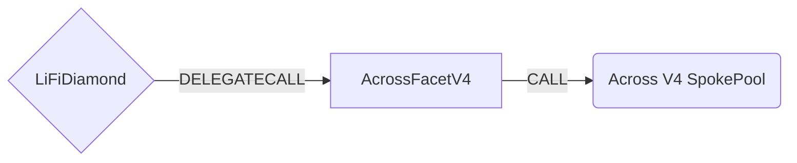

# AcrossFacetV4

## How it works

The AcrossFacetV4 works by forwarding Across specific calls to one of [Across SpokePools](https://github.com/across-protocol/contracts-v2/tree/master/contracts). All bridging is done by calling the `deposit` method from the V4 SpokePool interface.



## Key Features

- **Non-EVM Chain Support**: Enhanced support for non-EVM chains like Solana with proper address validation and event emission
- **Bytes32 Address Format**: Uses `bytes32` format for addresses to support both EVM and non-EVM chains
- **Decimal Adjustment**: Automatic output amount adjustment for pre-bridge swaps using `outputAmountMultiplier`
- **Chain ID Mapping**: Custom chain ID mapping for non-EVM chains (e.g., Solana uses Across-specific ID 34268394551451)
- **Enhanced Validation**: Improved validation for receiver addresses and destination calls

## Public Methods

- `function startBridgeTokensViaAcrossV4(BridgeData memory _bridgeData, AcrossV4Data calldata _acrossData)`
  - Simply bridges tokens using Across V4
- `swapAndStartBridgeTokensViaAcrossV4(BridgeData memory _bridgeData, SwapData[] calldata _swapData, AcrossV4Data calldata _acrossData)`
  - Performs swap(s) before bridging tokens using Across V4

## Across Specific Parameters

The methods listed above take a variable labeled `_acrossData`. This data is specific to Across V4 and is represented as the following struct type:

```solidity
/// @param receiverAddress The address that will receive the token on dst chain
///                        (our Receiver contract or the user-defined receiver address)
/// @param refundAddress The address that will be used for potential bridge refunds
/// @param sendingAssetId The address of the token being sent from the source chain
/// @param receivingAssetId The address of the token to be received at destination chain
/// @param outputAmount The amount to be received at destination chain (after fees)
/// @param outputAmountMultiplier In case of pre-bridge swaps we need to adjust the output amount (uint128 type, 1e18 base)
/// @param exclusiveRelayer This is the exclusive relayer who can fill the deposit before the exclusivity deadline.
/// @param quoteTimestamp The timestamp of the Across quote that was used for this transaction
/// @param fillDeadline The destination chain timestamp until which the order can be filled
/// @param exclusivityParameter This value is used to set the exclusivity deadline timestamp in the emitted deposit
///                           event. Before this destination chain timestamp, only the exclusiveRelayer (if set to a non-zero address),
///                           can fill this deposit. There are three ways to use this parameter:
///                           1. NO EXCLUSIVITY: If this value is set to 0, then a timestamp of 0 will be emitted,
///                              meaning that there is no exclusivity period.
///                           2. OFFSET: If this value is less than MAX_EXCLUSIVITY_PERIOD_SECONDS, then add this value to
///                              the block.timestamp to derive the exclusive relayer deadline.
///                           3. TIMESTAMP: Otherwise, set this value as the exclusivity deadline timestamp.
/// @param message Arbitrary data that can be used to pass additional information to the recipient along with the tokens
struct AcrossV4Data {
  bytes32 receiverAddress;
  bytes32 refundAddress;
  bytes32 sendingAssetId;
  bytes32 receivingAssetId;
  uint256 outputAmount;
  uint128 outputAmountMultiplier;
  bytes32 exclusiveRelayer;
  uint32 quoteTimestamp;
  uint32 fillDeadline;
  uint32 exclusivityParameter;
  bytes message;
}
```

### Key Differences from V3

1. **Address Format**: All addresses are now `bytes32` instead of `address` to support non-EVM chains
2. **Output Amount Multiplier**: Replaces `outputAmountPercent` with `outputAmountMultiplier` for more precise decimal handling
3. **Non-EVM Support**: Enhanced validation and event emission for non-EVM chains
4. **Chain ID Mapping**: Custom chain ID conversion for non-EVM chains

### Chain ID Mapping

AcrossFacetV4 includes custom chain ID mapping for non-EVM chains:

- **LiFi Internal ID**: `LIFI_CHAIN_ID_SOLANA = 1151111081099710` (used internally by LiFi)
- **Across-Specific ID**: `ACROSS_CHAIN_ID_SOLANA = 34268394551451` (used when calling Across SpokePool)
- **EVM Chains**: Chain IDs are passed through unchanged (no mapping required)

The `_getAcrossChainId()` function automatically converts LiFi internal chain IDs to their Across-specific equivalents when needed.

### Output Amount Multiplier

The `outputAmountMultiplier` field is used to adjust the output amount when performing pre-bridge swaps. It accounts for differences in token decimals between input and output tokens. The calculation is:

```
adjustedOutputAmount = (inputAmount * outputAmountMultiplier) / 1e18
```

The division by 1e18 allows for adjustment in both directions (e.g., from 6 to 18 decimals and vice versa). The multiplier should be calculated as: `multiplierPercentage * 1e18 * 10^(outputDecimals - inputDecimals)`.

## Non-EVM Chain Support

AcrossFacetV4 includes enhanced support for non-EVM chains:

- **Solana Support**: Custom chain ID mapping (34268394551451) for Solana
- **Address Validation**: Proper validation for non-EVM receiver addresses
- **Event Emission**: Special events for non-EVM chain transfers
- **Bytes32 Format**: All addresses use bytes32 format for cross-chain compatibility

## Swap Data

Some methods accept a `SwapData _swapData` parameter.

Swapping is performed by a swap specific library that expects an array of calldata to can be run on various DEXs (i.e. Uniswap) to make one or multiple swaps before performing another action.

The swap library can be found [here](../src/Libraries/LibSwap.sol).

## LiFi Data

Some methods accept a `BridgeData _bridgeData` parameter.

This parameter is strictly for analytics purposes. It's used to emit events that we can later track and index in our subgraphs and provide data on how our contracts are being used. `BridgeData` and the events we can emit can be found [here](../src/Interfaces/ILiFi.sol).

## Getting Sample Calls to interact with the Facet

In the following some sample calls are shown that allow you to retrieve a populated transaction that can be sent to our contract via your wallet.

All examples use our [/quote endpoint](https://apidocs.li.fi/reference/get_quote) to retrieve a quote which contains a `transactionRequest`. This request can directly be sent to your wallet to trigger the transaction.

The quote result looks like the following:

```javascript
const quoteResult = {
  id: '0x...', // quote id
  type: 'lifi', // the type of the quote (all lifi contract calls have the type "lifi")
  tool: 'across', // the bridge tool used for the transaction
  action: {}, // information about what is going to happen
  estimate: {}, // information about the estimated outcome of the call
  includedSteps: [], // steps that are executed by the contract as part of this transaction, e.g. a swap step and a cross step
  transactionRequest: {
    // the transaction that can be sent using a wallet
    data: '0x...',
    to: '0x...',
    value: '0x00',
    from: '{YOUR_WALLET_ADDRESS}',
    chainId: 100,
    gasLimit: '0x...',
    gasPrice: '0x...',
  },
}
```

A detailed explanation on how to use the /quote endpoint and how to trigger the transaction can be found [here](https://docs.li.fi/products/more-integration-options/li.fi-api/transferring-tokens-example).

**Hint**: Don't forget to replace `{YOUR_WALLET_ADDRESS}` with your real wallet address in the examples.

### Cross Only

To get a transaction for a transfer from 30 USDC.e on Avalanche to USDC on Binance you can execute the following request:

```shell
curl 'https://li.quest/v1/quote?fromChain=AVA&fromAmount=30000000&fromToken=USDC&toChain=BSC&toToken=USDC&slippage=0.03&allowBridges=across&fromAddress={YOUR_WALLET_ADDRESS}'
```

### Swap & Cross

To get a transaction for a transfer from 30 USDT on Avalanche to USDC on Binance you can execute the following request:

```shell
curl 'https://li.quest/v1/quote?fromChain=AVA&fromAmount=30000000&fromToken=USDT&toChain=BSC&toToken=USDC&slippage=0.03&allowBridges=across&fromAddress={YOUR_WALLET_ADDRESS}'
```

### Non-EVM Chain Transfer

To get a transaction for a transfer to a non-EVM chain like Solana, the facet will automatically handle the address format conversion and chain ID mapping.
