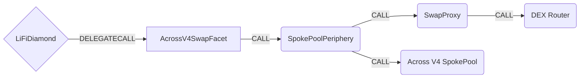

# AcrossV4SwapFacet

> **WARNING**
>
> **This facet consumes opaque calldata generated off-chain.**
>
> For `swapApiTarget = SpokePool` and `swapApiTarget = SpokePoolPeriphery`, the final receiver is encoded inside dynamic calldata that cannot be reliably validated on-chain against `BridgeData.receiver` (unlike most LI.FI facets).
> To protect integrators/clients/partners, these two paths require a LI.FI backend signature over `BridgeData` and the calldata hash, which gates usage to backend-generated calldata and prevents arbitrary calldata injection via public entrypoints.
>
> The sponsored paths (`swapApiTarget = SponsoredOFTSrcPeriphery` / `SponsoredCCTPSrcPeriphery`) already include receiver validation in the signed quote flow, so this additional facet-level signature is not required there.

For more information on the Across Swap API, see [Across docs](https://docs.across.to/developer-quickstart/introduction-to-swap-api).

## How it works

The AcrossV4SwapFacet integrates with Across Protocol's Swap API contracts to enable calldata-driven bridge (and optional swap) execution.



## Public Methods

- `function startBridgeTokensViaAcrossV4Swap(BridgeData calldata _bridgeData, AcrossV4SwapFacetData calldata _acrossV4SwapFacetData)`
  - Bridges tokens via Across Swap API contracts using `swapApiTarget` + selector-less `callData`
- `function swapAndStartBridgeTokensViaAcrossV4Swap(BridgeData memory _bridgeData, LibSwap.SwapData[] calldata _swapData, AcrossV4SwapFacetData calldata _acrossV4SwapFacetData)`
  - Performs LI.FI internal swap(s) before bridging (supports positive-slippage adjustments depending on target)

## AcrossV4SwapFacet Specific Parameters

The methods listed above take `_acrossV4SwapFacetData`, represented as:

```solidity
enum SwapApiTarget {
  SpokePool, // callData = abi.encode(IAcrossSpokePoolV4.DepositParams)
  SpokePoolPeriphery, // callData = abi.encode(ISpokePoolPeriphery.SwapAndDepositData)
  SponsoredOFTSrcPeriphery, // callData = abi.encode(ISponsoredOFTSrcPeriphery.Quote, bytes signature)
  SponsoredCCTPSrcPeriphery // callData = abi.encode(ISponsoredCCTPSrcPeriphery.SponsoredCCTPQuote, bytes signature)
}

/// @param swapApiTarget Which Across contract should be called
/// @param callData Selector-less ABI-encoded calldata for the selected target
/// @param signature Required only for `SpokePool` / `SpokePoolPeriphery` (EIP-712 signature produced by LI.FI backend)
struct AcrossV4SwapFacetData {
  SwapApiTarget swapApiTarget;
  bytes callData;
  bytes signature;
}
```

## Signature requirement (SpokePool / SpokePoolPeriphery)

For `swapApiTarget = SpokePool` and `swapApiTarget = SpokePoolPeriphery`, the facet requires an EIP-712 signature that commits to:

- selected `BridgeData` fields (`transactionId`, `minAmount`, `receiver`, `destinationChainId`, `sendingAssetId`)
- `swapApiTarget`
- `callDataHash = keccak256(callData)`

This signature is validated against a configured backend signer address, and exists because the receiver cannot be safely validated on-chain for these opaque calldata flows.

## Swap Data

Some methods accept a `SwapData _swapData` parameter.

Swapping is performed by a swap-specific library that expects an array of calldata that can be run on various DEXs (i.e. Uniswap) to make one or multiple swaps before performing another action.

The swap library can be found in [LibSwap.sol](../src/Libraries/LibSwap.sol).

## LiFi Data

Some methods accept a `BridgeData _bridgeData` parameter.

This parameter is strictly for analytics purposes. It's used to emit events that we can later track and index in our subgraphs and provide data on how our contracts are being used. `BridgeData` and the events we can emit can be found in [ILiFi.sol](../src/Interfaces/ILiFi.sol).

## Getting Sample Calls to interact with the Facet

In the following some sample calls are shown that allow you to retrieve a populated transaction that can be sent to our contract via your wallet.

All examples use our [/quote endpoint](https://apidocs.li.fi/reference/get_quote) to retrieve a quote which contains a `transactionRequest`. This request can directly be sent to your wallet to trigger the transaction.

The quote result looks like the following:

```javascript
const quoteResult = {
  id: '0x...', // quote id
  type: 'lifi', // the type of the quote (all lifi contract calls have the type "lifi")
  tool: 'acrossV4Swap', // the bridge tool used for the transaction
  action: {}, // information about what is going to happen
  estimate: {}, // information about the estimated outcome of the call
  includedSteps: [], // steps that are executed by the contract as part of this transaction
  transactionRequest: {
    // the transaction that can be sent using a wallet
    data: '0x...',
    to: '0x...',
    value: '0x00',
    from: '{YOUR_WALLET_ADDRESS}',
    chainId: 100,
    gasLimit: '0x...',
    gasPrice: '0x...',
  },
}
```

A detailed explanation on how to use the /quote endpoint and how to trigger the transaction can be found in the [LI.FI API documentation](https://docs.li.fi/products/more-integration-options/li.fi-api/transferring-tokens-example).

**Hint**: Don't forget to replace `{YOUR_WALLET_ADDRESS}` with your real wallet address in the examples.

### Cross Only

To get a transaction for a transfer from 30 USDC on Ethereum to USDC on Polygon you can execute the following request:

```shell
curl 'https://li.quest/v1/quote?fromChain=ETH&fromAmount=30000000&fromToken=USDC&toChain=POL&toToken=USDC&slippage=0.03&allowBridges=acrossV4Swap&fromAddress={YOUR_WALLET_ADDRESS}'
```

### Swap & Cross

To get a transaction for a transfer from 30 DAI on Ethereum to USDC on Polygon you can execute the following request:

```shell
curl 'https://li.quest/v1/quote?fromChain=ETH&fromAmount=30000000000000000000&fromToken=DAI&toChain=POL&toToken=USDC&slippage=0.03&allowBridges=acrossV4Swap&fromAddress={YOUR_WALLET_ADDRESS}'
```
