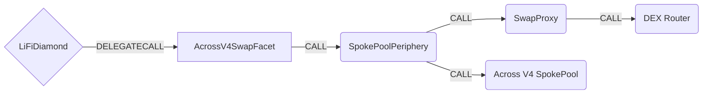

# AcrossV4SwapFacet

## How it works

The AcrossV4SwapFacet integrates with Across Protocol's SpokePoolPeriphery contract to enable swap-and-bridge functionality. Unlike the standard AcrossFacetV4 which calls the SpokePool directly, this facet delegates swap execution to Across's SpokePoolPeriphery, which uses an isolated SwapProxy contract for secure swap execution.



## Public Methods

- `function startBridgeTokensViaAcrossV4Swap(BridgeData calldata _bridgeData, AcrossV4SwapData calldata _acrossV4SwapData)`
  - Bridges tokens using the Across Swap API (SpokePoolPeriphery)
- `function swapAndStartBridgeTokensViaAcrossV4Swap(BridgeData memory _bridgeData, LibSwap.SwapData[] calldata _swapData, AcrossV4SwapData calldata _acrossV4SwapData)`
  - Performs LiFi internal swap(s) before bridging via Across Swap API

## AcrossV4Swap Specific Parameters

The methods listed above take a variable labeled `_acrossV4SwapData`. This data is specific to the Across Swap API and is represented as the following struct type:

```solidity
/// @param depositData Core deposit parameters for the Across bridge
/// @param swapToken The token to swap from on the source chain
/// @param exchange The DEX router address to execute the swap
/// @param transferType How to transfer tokens to the exchange (Approval, Transfer, Permit2Approval)
/// @param routerCalldata The calldata to execute on the DEX router
/// @param minExpectedInputTokenAmount Minimum amount of bridgeable token expected after swap
/// @param enableProportionalAdjustment If true, adjusts outputAmount proportionally based on swap results
struct AcrossV4SwapData {
  BaseDepositData depositData;
  address swapToken;
  address exchange;
  TransferType transferType;
  bytes routerCalldata;
  uint256 minExpectedInputTokenAmount;
  bool enableProportionalAdjustment;
}

/// @param inputToken Token deposited on origin chain (after swap)
/// @param outputToken Token received on destination chain (bytes32 for non-EVM support)
/// @param outputAmount Amount of output token to be received
/// @param depositor Account credited with deposit (receives refunds)
/// @param recipient Account receiving tokens on destination (bytes32 for non-EVM support)
/// @param destinationChainId Destination chain ID
/// @param exclusiveRelayer Exclusive relayer address (bytes32, zero for none)
/// @param quoteTimestamp Timestamp for fee calculation
/// @param fillDeadline Deadline for fill on destination
/// @param exclusivityParameter Exclusivity deadline/offset
/// @param message Message for destination call
struct BaseDepositData {
  address inputToken;
  bytes32 outputToken;
  uint256 outputAmount;
  address depositor;
  bytes32 recipient;
  uint256 destinationChainId;
  bytes32 exclusiveRelayer;
  uint32 quoteTimestamp;
  uint32 fillDeadline;
  uint32 exclusivityParameter;
  bytes message;
}

/// Transfer type determines how tokens are moved to the DEX
enum TransferType {
  Approval, // Exchange is approved to spend tokens from SwapProxy
  Transfer, // Tokens are transferred directly to exchange
  Permit2Approval // Permit2 is used to approve exchange
}
```

## Key Differences from AcrossFacetV4

| Feature               | AcrossFacetV4             | AcrossV4SwapFacet                |
| --------------------- | ------------------------- | -------------------------------- |
| **Contract Called**   | SpokePool directly        | SpokePoolPeriphery               |
| **Swap Execution**    | LiFi internal (SwapperV2) | Across SwapProxy (isolated)      |
| **Output Adjustment** | outputAmountMultiplier    | enableProportionalAdjustment     |
| **Use Case**          | Standard bridging         | DEX swap + bridge via Across API |

## Swap Data

Some methods accept a `SwapData _swapData` parameter.

Swapping is performed by a swap-specific library that expects an array of calldata that can be run on various DEXs (i.e. Uniswap) to make one or multiple swaps before performing another action.

The swap library can be found in [LibSwap.sol](../src/Libraries/LibSwap.sol).

## LiFi Data

Some methods accept a `BridgeData _bridgeData` parameter.

This parameter is strictly for analytics purposes. It's used to emit events that we can later track and index in our subgraphs and provide data on how our contracts are being used. `BridgeData` and the events we can emit can be found in [ILiFi.sol](../src/Interfaces/ILiFi.sol).

## Getting Sample Calls to interact with the Facet

In the following some sample calls are shown that allow you to retrieve a populated transaction that can be sent to our contract via your wallet.

All examples use our [/quote endpoint](https://apidocs.li.fi/reference/get_quote) to retrieve a quote which contains a `transactionRequest`. This request can directly be sent to your wallet to trigger the transaction.

The quote result looks like the following:

```javascript
const quoteResult = {
  id: '0x...', // quote id
  type: 'lifi', // the type of the quote (all lifi contract calls have the type "lifi")
  tool: 'acrossV4Swap', // the bridge tool used for the transaction
  action: {}, // information about what is going to happen
  estimate: {}, // information about the estimated outcome of the call
  includedSteps: [], // steps that are executed by the contract as part of this transaction
  transactionRequest: {
    // the transaction that can be sent using a wallet
    data: '0x...',
    to: '0x...',
    value: '0x00',
    from: '{YOUR_WALLET_ADDRESS}',
    chainId: 100,
    gasLimit: '0x...',
    gasPrice: '0x...',
  },
}
```

A detailed explanation on how to use the /quote endpoint and how to trigger the transaction can be found in the [LI.FI API documentation](https://docs.li.fi/products/more-integration-options/li.fi-api/transferring-tokens-example).

**Hint**: Don't forget to replace `{YOUR_WALLET_ADDRESS}` with your real wallet address in the examples.

### Cross Only

To get a transaction for a transfer from 30 USDC on Ethereum to USDC on Polygon you can execute the following request:

```shell
curl 'https://li.quest/v1/quote?fromChain=ETH&fromAmount=30000000&fromToken=USDC&toChain=POL&toToken=USDC&slippage=0.03&allowBridges=acrossV4Swap&fromAddress={YOUR_WALLET_ADDRESS}'
```

### Swap & Cross

To get a transaction for a transfer from 30 DAI on Ethereum to USDC on Polygon you can execute the following request:

```shell
curl 'https://li.quest/v1/quote?fromChain=ETH&fromAmount=30000000000000000000&fromToken=DAI&toChain=POL&toToken=USDC&slippage=0.03&allowBridges=acrossV4Swap&fromAddress={YOUR_WALLET_ADDRESS}'
```
