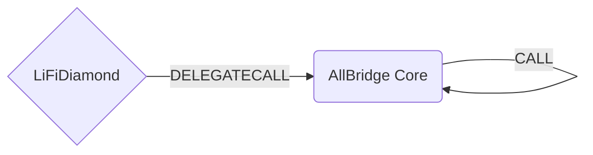

# AllBridge Bridge Facet

## How it works

The AllBridge bridge facet works by forwarding calls to the AllBridge core contract on the source chain. It is possible to find the core contract addresses and token pools by curling [token-info endpoint](https://core.api.allbridgecoreapi.net/token-info).

One feature that makes AllBridge different from other bridges is that it uses pools on either side of the bridge. This allows them to no having to have canonical representation on the destination chain. Thus for EVM based chain this means that the pool needs to be approved to spend the bridged tokens.

Underneath, AllBridge can use different message protocols to transfer tokens. These are represented in an enum like

```
/// @title AllBridge Messenger Protocol Enum
enum MessengerProtocol {
    None,
    Allbridge,
    Wormhole,
    LayerZero
}
```



## Public Methods

- `function startBridgeTokensViaAllBridge(BridgeData calldata _bridgeData, AllBridgeData calldata _allBridgeData)`
  - Simply bridges tokens using bridgeFacet
- `function swapAndStartBridgeTokensViaAllBridge(BridgeData memory _bridgeData, LibSwap.SwapData[] calldata _swapData, AllBridgeData calldata _allBridgeData)`
  - Performs swap(s) before bridging tokens using bridgeFacet

## Bridge Specific Parameters

Some of the methods listed above take a variable labeled `_allBridgeData`.

This data is specific to allBridgefacet and is represented as the following struct type:

```solidity
/// @notice The struct for the AllBridge data.
/// @param fees The amount of token to pay the messenger and the bridge
/// @param recipient The address of the token receiver after bridging.
/// @param destinationChainId The destination chain id.
/// @param receiveToken The token to receive on the destination chain.
/// @param nonce A random nonce to associate with the tx.
/// @param messenger The messenger protocol enum
/// @param payFeeWithSendingAsset Whether to pay the relayer fee with the sending asset or not
struct AllBridgeData {
  uint256 fees;
  bytes32 recipient;
  uint256 destinationChainId;
  bytes32 receiveToken;
  uint256 nonce;
  IAllBridge.MessengerProtocol messenger;
  bool payFeeWithSendingAsset;
}
```

The fees field is the sum of two fees charged by AllBridge, namely

- MessengerFee: Fee charged by the underlying message layer. Parts of the messenger fee should cover relay fees as well.
- AllBridgeFee. Fee charged by AllBridge itself.

## Swap Data

Some methods accept a `SwapData _swapData` parameter.

Swapping is performed by a swap specific library that expects an array of calldata to can be run on variaous DEXs (i.e. Uniswap) to make one or multiple swaps before performing another action.

The swap library can be found [here](../src/Libraries/LibSwap.sol).

## LiFi Data

Most of the methods accept a `ILiFiBridgeData _bridgeData` parameter.

In the AllBridge contract call the fields `minAmount` and `sendingAssetId` are used for the transfer amount and the asset to be sent. Since the AllBridge bridge does not support native token bridging (it's mainly a stablecoin bridge) the methods will fail if native assets are tried to be bridged.

It's also used to emit events that we can later track and index in our subgraphs and provide data on how our contracts are being used. `BridgeData` and the events we can emit can be found [here](../src/Interfaces/ILiFi.sol).

## Getting Sample Calls to interact with the Facet

In the following some sample calls are shown that allow you to retrieve a populated transaction that can be sent to our contract
