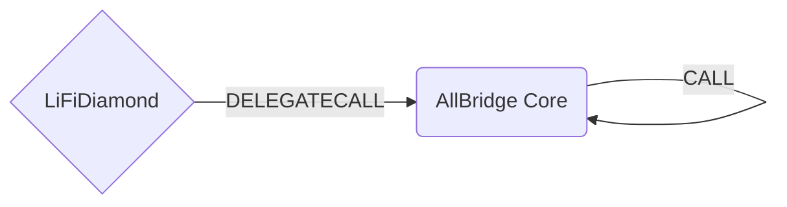

# AllBridge Bridge Facet

## How it works

The AllBridge bridge facet works by forwarding calls to the AllBridge core contract on the source chain. It is possible to find the core contract addresses and token pools by curling [token-info endpoint](https://core.api.allbridgecoreapi.net/token-info).

One feature that makes AllBridge different from other bridges is that it uses pools on either side of the bridge. This allows them to avoid the need for a canonical representation on the destination chain. Thus for EVM based chain this means that the pool needs to be approved to spend the bridged tokens.

Underneath, AllBridge can use different message protocols to transfer tokens. These are represented in an enum like

```
/// @title AllBridge Messenger Protocol Enum
enum MessengerProtocol {
    None,
    Allbridge,
    Wormhole,
    LayerZero
}
```


```mermaid
graph LR;
    D{LiFiDiamond}-- DELEGATECALL -->C(AllBridgeFacet);
    C(AllBridgeFacet) -- CALL --> C(AllBridge Core)
```

## Public Methods

- `function startBridgeTokensViaAllBridge(BridgeData memory _bridgeData, AllBridgeData calldata _allBridgeData)`
  - Simply bridges tokens using bridgeFacet
- `function swapAndStartBridgeTokensViaAllBridge(BridgeData memory _bridgeData, SwapData[] calldata _swapData, AllBridgeData calldata _allBridgeData)`
  - Performs swap(s) before bridging tokens using bridgeFacet
- `function initAllBridge(ChainIdConfig[] calldata chainIdConfigs)`
  - Owner-only. Seeds the LI.FI chain ID → AllBridge chain ID mapping. Must be called (via the diamond cut) before the facet can bridge.
- `function setChainIdToAllBridgeChainId(ChainIdConfig[] calldata chainIdConfigs)`
  - Owner-only. Adds or overwrites one or more chain ID mappings after initialization.
- `function unsetChainIdToAllBridgeChainId(uint256 _chainId)`
  - Owner-only. Removes a chain ID mapping.
- `function getChainIdToAllBridgeChainId(uint256 _chainId) returns (uint256)`
  - Returns the AllBridge chain ID for a given LI.FI chain ID; reverts `UnsupportedAllBridgeChainId` if unmapped.

## Chain ID Mappings

AllBridge identifies destination chains by its own internal chain IDs (Ethereum = 1,
BSC = 2, Stellar = 7, …), which differ from LI.FI chain IDs. The facet translates
`BridgeData.destinationChainId` to the AllBridge chain ID through a mapping held in
diamond storage. The mapping is owner-updatable (`initAllBridge` /
`setChainIdToAllBridgeChainId` / `unsetChainIdToAllBridgeChainId`), so new destinations
— for example non-EVM chains such as Stellar (`LIFI_CHAIN_ID_STELLAR` →
`allBridgeChainId 7`) — can be added without redeploying the facet.

The mapping values live in `config/allbridge.json` under `mappings`. AllBridge chain IDs
start at 1, so a stored `0` unambiguously means "unmapped" and any unmapped destination
reverts `UnsupportedAllBridgeChainId`. The authoritative source for each network's
`allBridgeChainId` is the AllBridge `token-info` endpoint
(`https://core.api.allbridgecoreapi.net/token-info`). After changing the config, run
`script/tasks/proposeAllBridgeChainIdMappings.ts` to propose the equivalent on-chain
mapping updates on every network where the facet is deployed.

Bridging to a non-EVM destination (e.g. Stellar) follows the standard non-EVM flow:
`BridgeData.receiver` is the `NON_EVM_ADDRESS` sentinel and the real recipient travels as
a 32-byte value in `AllBridgeData.recipient`, which the facet only checks to be non-zero.

## Bridge Specific Parameters

Some of the methods listed above take a variable labeled `_allBridgeData`.

This data is specific to allBridgefacet and is represented as the following struct type:

```solidity
/// @notice The struct for the AllBridge data.
/// @param recipient The address of the token receiver after bridging.
/// @param fees The amount of token to pay the messenger and the bridge.
/// @param receiveToken The token to receive on the destination chain.
/// @param nonce A random nonce to associate with the tx.
/// @param messenger The messenger protocol enum.
/// @param payFeeWithSendingAsset Whether to pay the relayer fee with the sending asset or not.
struct AllBridgeData {
  bytes32 recipient;
  uint256 fees;
  bytes32 receiveToken;
  uint256 nonce;
  MessengerProtocol messenger;
  bool payFeeWithSendingAsset;
}
```

The `fees` field is the sum of two fees charged by AllBridge, namely

- MessengerFee: Fee charged by the underlying message layer. Parts of the messenger fee should cover relay fees as well.
- AllBridgeFee. Fee charged by AllBridge itself.

## Swap Data

Some methods accept a `SwapData _swapData` parameter.

Swapping is performed by a swap specific library that expects an array of calldata to can be run on various DEXs (i.e. Uniswap) to make one or multiple swaps before performing another action.

The swap library can be found [here](../src/Libraries/LibSwap.sol).

## LiFi Data

Most of the methods accept a `BridgeData _bridgeData` parameter.

In the AllBridge contract call the fields `minAmount` and `sendingAssetId` are used for the transfer amount and the asset to be sent. Since the AllBridge bridge does not support native token bridging (it's mainly a stablecoin bridge) the methods will fail if native assets are tried to be bridged.

It's also used to emit events that we can later track and index in our subgraphs and provide data on how our contracts are being used. `BridgeData` and the events we can emit can be found [here](../src/Interfaces/ILiFi.sol).

## Getting Sample Calls to interact with the Facet

In the following some sample calls are shown that allow you to retrieve a populated transaction that can be sent to our contract
