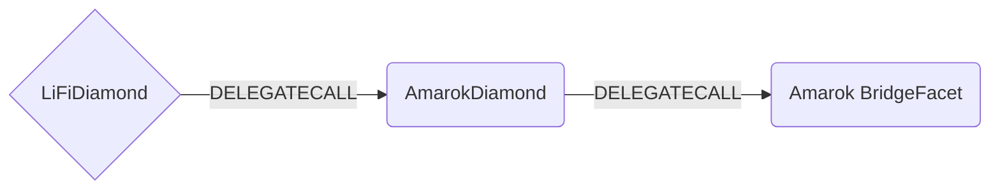

# Amarok Facet

## How it works

The Amarok Facet works by forwarding Amarok specific calls to Connext Amarok BridgeFacet [contract](https://github.com/connext/nxtp/blob/main/packages/deployments/contracts/contracts/core/connext/facets/BridgeFacet.sol).



## Public Methods

- `function startBridgeTokensViaAmarokBridge(BridgeData calldata _bridgeData, AmarokData calldata _amarokData)`
  - Simply bridges tokens using Amarok BridgeFacet
- `function swapAndStartBridgeTokensViaAmarokBridge(BridgeData memory _bridgeData, LibSwap.SwapData[] calldata _swapData, AmarokData calldata _amarokData)`
  - Performs swap(s) before bridging tokens using Amarok BridgeFacet

## Amarok Specific Parameters

Some of the methods listed above take a variable labeled `_amarokData`.

This data is specific to Amarok BridgeFacet and is represented as the following struct type:

```solidity
/// @param callData The data to execute on the receiving chain. If no crosschain call is needed, then leave empty.
/// @param relayerFee The amount of relayer fee the tx called xcall with
/// @param slippageTol Max bps of original due to slippage (i.e. would be 9995 to tolerate .05% slippage)
struct AmarokData {
  bytes callData;
  uint256 relayerFee;
  uint256 slippageTol;
}

```

## Swap Data

Some methods accept a `SwapData _swapData` parameter.

Swapping is performed by a swap specific library that expects an array of calldata to can be run on variaous DEXs (i.e. Uniswap) to make one or multiple swaps before performing another action.

The swap library can be found [here](../src/Libraries/LibSwap.sol).

## LiFi Data

Some methods accept a `BridgeData _bridgeData` parameter.

This parameter is strictly for analytics purposes. It's used to emit events that we can later track and index in our subgraphs and provide data on how our contracts are being used. `BridgeData` and the events we can emit can be found [here](../src/Interfaces/ILiFi.sol).

## Getting Sample Calls to interact with the Facet

In the following some sample calls are shown that allow you to retrieve a populated transaction that can be sent to our contract via your wallet.

All examples use our [/quote endpoint](https://apidocs.li.finance/reference/get_quote-1) to retrieve a quote which contains a `transactionRequest`. This request can directly be sent to your wallet to trigger the transaction.

The quote result looks like the following:

```javascript
const quoteResult = {
  id: '0x...', // quote id
  type: 'lifi', // the type of the quote (all lifi contract calls have the type "lifi")
  tool: 'hop', // the bridge tool used for the transaction
  action: {}, // information about what is going to happen
  estimate: {}, // information about the estimated outcome of the call
  includedSteps: [], // steps that are executed by the contract as part of this transaction, e.g. a swap step and a cross step
  transactionRequest: {
    // the transaction that can be sent using a wallet
    data: '0x...',
    to: '0x...',
    value: '0x00',
    from: '{YOUR_WALLET_ADDRESS}',
    chainId: 100,
    gasLimit: '0x...',
    gasPrice: '0x...',
  },
}
```

A detailed explanation on how to use the /quote endpoint and how to trigger the transaction can be found [here](https://apidocs.li.finance/reference/how-to-transfer-tokens).

**Hint**: Don't forget to replace `{YOUR_WALLET_ADDRESS}` with your real wallet address in the examples.

### Cross Only

To get a transaction for a transfer from 20 DAI on Ethereum to DAI on Amarok you can execute the following request:

```shell
curl 'https://li.quest/v1/quote?fromChain=ETH&fromAmount=20000000000000000000&fromToken=DAI&toChain=DAI&toToken=DAI&slippage=0.03&allowBridges=Amarok&fromAddress={YOUR_WALLET_ADDRESS}'
```

### Swap & Cross

To get a transaction for a transfer from 10 USDT on Ethereum to DAI on Amarok you can execute the following request:

```shell
curl 'https://li.quest/v1/quote?fromChain=ETH&fromAmount=10000000000000000000&fromToken=USDT&toChain=DAI&toToken=DAI&slippage=0.03&allowBridges=Amarok&fromAddress={YOUR_WALLET_ADDRESS}'
```
