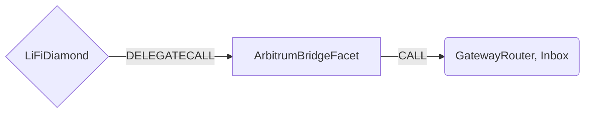

# Arbitrum Bridge Facet

## How it works

The Arbitrum Bridge Facet works by forwarding Arbitrum Native Bridge specific calls to a Gateway Router or Inbox [contracts](https://developer.offchainlabs.com/docs/useful_addresses). The Arbitrum protocol's ability to pass messages between L1 and L2 can be leveraged to trustlessly move assets from Ethereum to an Arbitrum chain.



## Public Methods

- `function startBridgeTokensViaArbitrumBridge(BridgeData calldata _bridgeData, BridgeData calldata _arbitrumData)`
  - Simply bridges tokens using Arbitrum Native Bridge
- `function swapAndStartBridgeTokensViaArbitrumBridge(BridgeData memory _bridgeData, LibSwap.SwapData[] calldata _swapData, BridgeData calldata _arbitrumData)`
  - Performs swap(s) before bridging tokens using Arbitrum Native Bridge

## Arbitrum Native Bridge Specific Parameters

Some of the methods listed above take a variable labeled `_arbitrumData`.

To populate `_arbitrumData` you will need to get the `gatewayRouter` and `tokenRouter`. Also you should get `maxSubmissionCost`, `maxGas`, `maxGasPrice` from the Arbitrum chain.

- `maxSubmissionCost`
  Maximum amount of ETH allocated to pay for the base submission fee. The base submission fee is a parameter unique to retryable transactions; the user is charged the base submission fee to cover the storage costs of keeping their ticket’s calldata in the retry buffer.
  Base submission fee is querable via `ArbRetryableTx.getSubmissionPrice`.
  Base submission fee should be increased by specific percentage to get max submission cost. Currently, the increment percentage is 340%.
  `ArbRetryableTx` contract address and function abi can be found in configuration.
- `maxGas`
  Maximum Gas limit for immediate L2 execution attempt.
  Gas limit can be estimated via `NodeInterface.estimateRetryableTicket`.
  Gas limit should be increased by specific percentage to get maximum gas limit. The increment percentage is 50% now.
  `NodeInterface` contract address and function abi can be found in configuration.
- `maxGasPrice`
  L2 Gas price bid for immediate L2 execution attempt.
  It can be get with the same call to get the gas limit above.

You will need to send additional amount of ETH for the fee.
If you do not desire immediate redemption, you should provide a DepositValue of at least `CallValue + MaxSubmissionCost`. If you do desire immediate execution, you should provide a DepositValue of at least `CallValue + MaxSubmissionCost + (GasPrice x MaxGas)`.

This data is specific to Arbitrum Native Bridge and is represented as the following struct type:

```solidity
/// @param maxSubmissionCost Max gas deducted from user's L2 balance to cover base submission fee.
/// @param maxGas Max gas deducted from user's L2 balance to cover L2 execution.
/// @param maxGasPrice price bid for L2 execution.
struct ArbitrumData {
  uint256 maxSubmissionCost;
  uint256 maxGas;
  uint256 maxGasPrice;
}
```

## Swap Data

Some methods accept a `SwapData _swapData` parameter.

Swapping is performed by a swap specific library that expects an array of calldata to can be run on variaous DEXs (i.e. Uniswap) to make one or multiple swaps before performing another action.

The swap library can be found [here](../src/Libraries/LibSwap.sol).

## LiFi Data

Some methods accept a `BridgeData _bridgeData` parameter.

This parameter is strictly for analytics purposes. It's used to emit events that we can later track and index in our subgraphs and provide data on how our contracts are being used. `BridgeData` and the events we can emit can be found [here](../src/Interfaces/ILiFi.sol).

The receiving asset id can be get from `gatewayRouter.calculateL2TokenAddress(assetId)`.

## Getting Sample Calls to interact with the Facet

In the following some sample calls are shown that allow you to retrieve a populated transaction that can be sent to our contract via your wallet.

All examples use our [/quote endpoint](https://apidocs.li.finance/reference/get_quote-1) to retrieve a quote which contains a `transactionRequest`. This request can directly be sent to your wallet to trigger the transaction.

The quote result looks like the following:

```javascript
const quoteResult = {
  id: '0x...', // quote id
  type: 'lifi', // the type of the quote (all lifi contract calls have the type "lifi")
  tool: 'arbitrum', // the bridge tool used for the transaction
  action: {}, // information about what is going to happen
  estimate: {}, // information about the estimated outcome of the call
  includedSteps: [], // steps that are executed by the contract as part of this transaction, e.g. a swap step and a cross step
  transactionRequest: {
    // the transaction that can be sent using a wallet
    data: '0x...',
    to: '0x...',
    value: '0x00',
    from: '{YOUR_WALLET_ADDRESS}',
    chainId: 100,
    gasLimit: '0x...',
    gasPrice: '0x...',
  },
}
```

A detailed explanation on how to use the /quote endpoint and how to trigger the transaction can be found [here](https://apidocs.li.finance/reference/how-to-transfer-tokens).

**Hint**: Don't forget to replace `{YOUR_WALLET_ADDRESS}` with your real wallet address in the examples.

### Cross Only

To get a transaction for a transfer from 20 DAI on Ethereum to DAI on Arbitrum you can execute the following request:

```shell
curl 'https://li.quest/v1/quote?fromChain=ETH&fromAmount=20000000000000000000&fromToken=DAI&toChain=ARB&toToken=DAI&slippage=0.03&allowBridges=arbitrum&fromAddress={YOUR_WALLET_ADDRESS}'
```

### Swap & Cross

To get a transaction for a transfer from 10 USDC on Ethereum to DAI on Arbitrum you can execute the following request:

```shell
curl 'https://li.quest/v1/quote?fromChain=ETH&fromAmount=10000000&fromToken=USDC&toChain=ARB&toToken=DAI&slippage=0.03&allowBridges=arbitrum&fromAddress={YOUR_WALLET_ADDRESS}'
```
