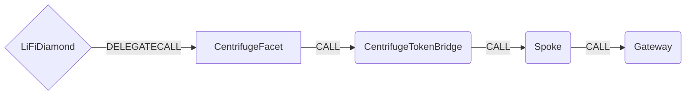

# Centrifuge Facet

## How it works

The Centrifuge Facet bridges tokens cross-chain via the Centrifuge TokenBridge contract, which is a Glacis Airlift-compatible wrapper around Centrifuge's existing cross-chain infrastructure (Spoke, Gateway, Adapters).



## Public Methods

- `function startBridgeTokensViaCentrifuge(BridgeData memory _bridgeData, CentrifugeData calldata _centrifugeData)`
  - Simply bridges tokens using Centrifuge TokenBridge
- `function swapAndStartBridgeTokensViaCentrifuge(BridgeData memory _bridgeData, LibSwap.SwapData[] calldata _swapData, CentrifugeData calldata _centrifugeData)`
  - Performs swap(s) before bridging tokens using Centrifuge TokenBridge

## Centrifuge Specific Parameters

The methods listed above take a variable labeled `_centrifugeData`. This data is specific to Centrifuge and is represented as the following struct type:

```solidity
/// @param receiver The receiver address on the destination chain (bytes32 for non-EVM support)
struct CentrifugeData {
    bytes32 receiver;
}
```

The `receiver` field is `bytes32` rather than `address` because Centrifuge supports non-EVM destination chains (e.g., their Substrate-based chain). For EVM destinations, the receiver address should be left-padded with zeros to fill the `bytes32` type.

## Cross-chain Gas Fees

The Centrifuge TokenBridge requires `msg.value` to cover cross-chain gas fees. Any excess ETH is refunded to the caller.

## Swap Data

Some methods accept a `SwapData _swapData` parameter.

Swapping is performed by a swap specific library that expects an array of calldata to can be run on various DEXs (i.e. Uniswap) to make one or multiple swaps before performing another action.

The swap library can be found [here](../src/Libraries/LibSwap.sol).

## LiFi Data

Some methods accept a `BridgeData _bridgeData` parameter.

This parameter is strictly for analytics purposes. It's used to emit events that we can later track and index in our subgraphs and provide data on how our contracts are being used. `BridgeData` and the events we can emit can be found [here](../src/Interfaces/ILiFi.sol).
