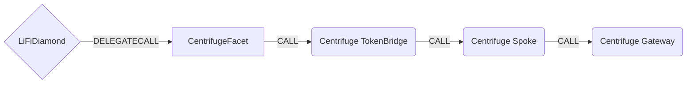

# Centrifuge Facet

## How it works

The Centrifuge Facet bridges **Centrifuge share tokens** (tokenized RWA fund shares, e.g. `deJAAA`)
by forwarding them to the Centrifuge `TokenBridge` via `send`. The LiFiDiamond custodies the share
token, approves the bridge, and calls `send` on behalf of the user, keeping LI.FI's regular funds
flow (including an optional pre-bridge swap step).


```mermaid
graph LR;
    D{LiFiDiamond}-- DELEGATECALL -->CentrifugeFacet;
    CentrifugeFacet -- CALL --> C(Centrifuge TokenBridge)
    C -- CALL --> S(Centrifuge Spoke)
    S -- CALL --> G(Centrifuge Gateway)
```

Key properties of the Centrifuge bridge:

- The bridged asset is **ERC20-only** (never native). `send` is `payable` because `msg.value` pays
  the cross-chain messaging fee, not the bridged amount.
- Only **registered Centrifuge share tokens** can be bridged. The bridge resolves the token through
  `spoke.shareTokenDetails(token)`, which reverts for anything else.
- There is **no on-chain fee quote**. The native messaging fee is supplied by the LI.FI backend as
  `CentrifugeData.nativeFee`.
- There is **no slippage parameter and no exchange rate** — the same share token arrives on the
  destination chain in the same amount. This is a transfer, not a swap.

## Deployed `TokenBridge` & integration dependencies

The `TokenBridge` is deployed and verified at `0x82a6C7753380f98c093B27c53f86ef6b09C40f49` on
**both** Ethereum (1) and Base (8453). Verified against that deployment:

- `send(address,uint256,bytes32,uint256,address)` pulls the share token from `msg.sender` via
  `SafeTransferLib.safeTransferFrom`, so the Diamond is the payer and **must hold an allowance**.
  The bridge's inline comment "No approval needed" refers to the *later* hop, where the Spoke pulls
  from the bridge via `authTransferFrom` — it does not apply to our call. The `ITokenBridge` NatSpec
  states the requirement explicitly ("after approving this contract with the token").
- The destination is validated by the bridge itself against its own `chainIdToCentrifugeId` map;
  an unmapped chain reverts `InvalidChainId()`. At integration time only Ethereum (centrifugeId 1)
  and Base (centrifugeId 2) are mapped, so those two chains are the entire supported corridor.
- The `receiver` is a `bytes32` holding an EVM address in its **low 20 bytes**.
- The whole `msg.value` is forwarded to `spoke.crosschainTransferShares`; the bridge keeps nothing.
- `deJAAA`'s transfer hook permits transfers between arbitrary addresses (freeze-only, not a KYC
  allowlist), so **no whitelisting of the Diamond is required**.

Operational dependencies (Centrifuge / LI.FI backend, not enforced by this facet):

- The share token must be registered on both the source and the destination chain.
- `nativeFee` must cover the real messaging cost. There is no quote function, so this value comes
  from the LI.FI backend — only ever submit backend-generated calldata.

## Fund flow and safety

```
USER --(share token)--> LiFiDiamond --(approve + send)--> TokenBridge --> Spoke --> Gateway
USER --(native fee)---> LiFiDiamond --(msg.value)------> TokenBridge --> Spoke --> Gateway
```

The Diamond retains nothing. This is asserted after every bridge in the test suite, for both the
share token and native, on both chains.

Fee handling, verified against the real contracts on a fork:

- **Overpayment is refunded.** The Gateway returns the unused portion of `nativeFee` directly to
  `refundRecipient` within the same transaction.
- **Underpayment reverts** with the Gateway's `NotEnoughGas()`; the transfer is never half-executed.
  Centrifuge's `sendInitiateTransferShares` takes no `unpaidMode` flag (unlike `sendRequest`), so
  the "queued as underpaid" path mentioned in the `ITokenBridge` NatSpec applies only to the
  hub-funded **second leg** of a spoke → hub → spoke transfer. Both supported corridors
  (Ethereum → Base and Base → Ethereum) are single-leg for the pools in scope, because the pool hub
  is on Ethereum and `hubIsEndpoint` is therefore always true.
- **Excess native above `nativeFee`** never reaches the bridge and is returned by
  `refundExcessNative`.
- A `refundRecipient` that **rejects** plain native transfers reverts the whole bridge. Note that
  the Gateway wraps a failed refund in its own `CannotRefund()` error rather than surfacing the
  underlying failure.

## Trust assumptions

- **The bridge is upgradeable in effect.** `spoke`, `gateway` and `relayer` are admin-settable on
  the `TokenBridge` via `file()`, and the contract is `Auth` + `Recoverable`. A compromised or
  malicious Centrifuge admin could redirect the funds flow. This is the same trust model as any
  third-party bridge contract we integrate.
- **Share tokens are claims on an off-chain fund**, redeemable only through Centrifuge's
  **ERC-7540 asynchronous** vaults. Redemption is a two-step request/claim flow, not an atomic
  swap. Nothing in this facet redeems; it only transfers shares between chains.
- **`relayer` is currently unset** (`address(0)`) on both chains, so first-leg overpayment always
  returns to `refundRecipient` rather than to a relayer.

## Public Methods

- `function startBridgeTokensViaCentrifuge(BridgeData memory _bridgeData, CentrifugeData calldata _centrifugeData)`
  - Simply bridges the share token using Centrifuge without performing any swaps
- `function swapAndStartBridgeTokensViaCentrifuge(BridgeData memory _bridgeData, LibSwap.SwapData[] calldata _swapData, CentrifugeData calldata _centrifugeData)`
  - Performs swap(s) before bridging. Swap leftovers and excess native are refunded to
    `refundRecipient` (not `msg.sender`, which may be a relayer or the Permit2Proxy). See
    [Swap Data](#swap-data) for what a "swap" means for a share token.

## Centrifuge Specific Parameters

The methods listed above take a variable labeled `_centrifugeData`:

```solidity
/// @param nativeFee The native amount forwarded to the TokenBridge to pay for the cross-chain
///        message. Centrifuge exposes no on-chain quote, so this value is supplied by the
///        LI.FI backend. Underpaying makes the Centrifuge Gateway revert; overpaying is
///        refunded to `refundRecipient` by the bridge itself.
/// @param refundRecipient Address that receives swap leftovers and positive slippage from
///        pre-bridge swaps, any excess source-side native, and the messaging-fee overage that
///        the Centrifuge Gateway refunds. Must accept plain native transfers: a refundRecipient
///        that rejects them reverts the whole bridge (self-inflicted).
struct CentrifugeData {
    uint256 nativeFee;
    address refundRecipient;
}
```

There is deliberately **no `receiver` field**. The destination receiver is derived inside
`_startBridge` as `LibBytes.toBytes32(_bridgeData.receiver)`, so the address the bridge actually
credits can never disagree with the one in the emitted `LiFiTransferStarted` event.
`validateBridgeData` already guarantees it is non-zero. A consequence is that this version is
**EVM-only**: bridging to a non-EVM receiver would need a dedicated field and a version bump.

Both entrypoints require a non-zero `refundRecipient` and a non-zero `nativeFee`, reverting
`InvalidCallData`. The `nativeFee` guard exists because Centrifuge has no quote function, so a zero
fee cannot be distinguished from a missing one and is always a malformed request. On the non-swap
path `nativeFee` must additionally not exceed `msg.value` (reverts `InvalidCallData`), so the
messaging fee can never be paid out of diamond balance. The swap path has no such check because the
fee may be funded by an ERC20→native pre-swap — `_depositAndSwap` reserves `nativeFee` of native
from the leftover sweep so it stays available for `send`.

## Swap Data

Some methods accept a `SwapData _swapData` parameter.

Swapping is performed by a swap-specific library that expects an array of calldata that can be run on
various DEXs (i.e. Uniswap) to make one or multiple swaps before performing another action.

The swap library can be found [here](../src/Libraries/LibSwap.sol).

**For Centrifuge share tokens specifically:** the share token cannot be acquired by a swap. It has
no DEX liquidity, and the only mint path is an ERC-7540 asynchronous vault, which cannot settle
within one transaction. The swap entrypoint therefore exists for LI.FI's *other* kind of swap step —
a **same-token fee collection**, where `FeeCollector.collectTokenFees` skims the integrator and
LI.FI cut off the amount and the remainder is what gets bridged. That is the shape the swap-path
tests exercise against the real `FeeCollector`.

## LiFi Data

Some methods accept a `BridgeData _bridgeData` parameter.

This parameter is strictly for analytics purposes. It's used to emit events that we can later track
and index in our subgraphs and provide data on how our contracts are being used. `BridgeData` and
the events we can emit can be found [here](../src/Interfaces/ILiFi.sol).

Note that unlike most facets, `_bridgeData.receiver` and `_bridgeData.destinationChainId` are **not**
analytics-only here: both are passed straight to the bridge.

## Getting Sample Calls to interact with the Facet

In the following some sample calls are shown that allow you to retrieve a populated transaction that
can be sent to our contract via your wallet.

All examples use our [/quote endpoint](https://apidocs.li.fi/reference/get_quote) to retrieve a
quote which contains a `transactionRequest`. This request can directly be sent to your wallet to
trigger the transaction.

The quote result looks like the following:

```javascript
const quoteResult = {
  id: '0x...', // quote id
  type: 'lifi', // the type of the quote (all lifi contract calls have the type "lifi")
  tool: 'centrifuge', // the bridge tool used for the transaction
  action: {}, // information about what is going to happen
  estimate: {}, // information about the estimated outcome of the call
  includedSteps: [], // steps that are executed by the contract as part of this transaction, e.g. a swap step and a cross step
  transactionRequest: {
    // the transaction that can be sent using a wallet
    data: '0x...',
    to: '0x...',
    value: '0x00',
    from: '{YOUR_WALLET_ADDRESS}',
    chainId: 1,
    gasLimit: '0x...',
    gasPrice: '0x...',
  },
}
```

A detailed explanation on how to use the /quote endpoint and how to trigger the transaction can be
found [here](https://docs.li.fi/products/more-integration-options/li.fi-api/transferring-tokens-example).

**Hint**: Don't forget to replace `{YOUR_WALLET_ADDRESS}` with your real wallet address in the
examples.

### Cross Only

To get a transaction for a transfer of 10 deJAAA from Ethereum to Base you can execute the following
request:

```shell
curl 'https://li.quest/v1/quote?fromChain=ETH&fromAmount=10000000000000000000&fromToken=0xAAA0008C8CF3A7Dca931adaF04336A5D808C82Cc&toChain=BAS&toToken=0xAAA0008C8CF3A7Dca931adaF04336A5D808C82Cc&slippage=0.03&allowBridges=centrifuge&fromAddress={YOUR_WALLET_ADDRESS}'
```

### Swap & Cross

A share token cannot be produced by a swap (see [Swap Data](#swap-data)), so there is no
swap-and-bridge quote to request from the API for this bridge. The swap entrypoint is reached when
the quote includes a fee-collection step for the same token.
