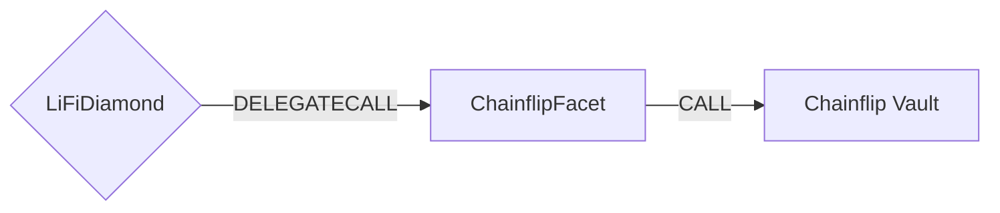

# Chainflip Facet

## How it works

The Chainflip Facet enables cross-chain token transfers using Chainflip's protocol. It supports both EVM chains and non-EVM chains as destinations.



## Public Methods

- `function startBridgeTokensViaChainflip(BridgeData calldata _bridgeData, ChainflipData calldata _chainflipData)`
  - Bridges tokens using Chainflip without performing any swaps
- `swapAndStartBridgeTokensViaChainflip(BridgeData memory _bridgeData, LibSwap.SwapData[] calldata _swapData, ChainflipData memory _chainflipData)`
  - Performs swap(s) before bridging tokens using Chainflip

## Chainflip Specific Parameters

The methods listed above take a variable labeled `_chainflipData`. This data is specific to Chainflip and is represented as the following struct type:

```solidity
struct ChainflipData {
  bytes32 nonEVMReceiver; // Destination address for non-EVM chains (Solana, Bitcoin)
  uint32 dstToken; // Chainflip specific token identifier on the destination chain
  bytes message; // Message that is passed to the destination address for cross-chain messaging
  uint256 gasAmount; // Gas budget for the call on the destination chain
  bytes cfParameters; // Additional parameters for future features
}
```

For non-EVM destinations (i.e. Solana, Bitcoin), set the `receiver` in `BridgeData` to `LibAsset.NON_EVM_ADDRESS` and provide the destination address in `nonEVMReceiver`.

## Supported Chains

The facet supports the following chains with their respective IDs:

[Reference](https://docs.chainflip.io/swapping/integrations/advanced/vault-swaps#supported-chains)

## Swap Data

Some methods accept a `SwapData _swapData` parameter.

Swapping is performed by a swap specific library that expects an array of calldata that can be run on various DEXs (i.e. Uniswap) to make one or multiple swaps before performing another action.

The swap library can be found [here](../src/Libraries/LibSwap.sol).

## LiFi Data

Some methods accept a `BridgeData _bridgeData` parameter.

This parameter is strictly for analytics purposes. It's used to emit events that we can later track and index in our subgraphs and provide data on how our contracts are being used. `BridgeData` and the events we can emit can be found [here](../src/Interfaces/ILiFi.sol).

## Getting Sample Calls to interact with the Facet

In the following some sample calls are shown that allow you to retrieve a populated transaction that can be sent to our contract via your wallet.

All examples use our [/quote endpoint](https://apidocs.li.fi/reference/get_quote) to retrieve a quote which contains a `transactionRequest`. This request can directly be sent to your wallet to trigger the transaction.

The quote result looks like the following:

```javascript
const quoteResult = {
  id: '0x...', // quote id
  type: 'lifi', // the type of the quote (all lifi contract calls have the type "lifi")
  tool: 'chainflip', // the bridge tool used for the transaction
  action: {}, // information about what is going to happen
  estimate: {}, // information about the estimated outcome of the call
  includedSteps: [], // steps that are executed by the contract as part of this transaction, e.g. a swap step and a cross step
  transactionRequest: {
    // the transaction that can be sent using a wallet
    data: '0x...',
    to: '0x...',
    value: '0x00',
    from: '{YOUR_WALLET_ADDRESS}',
    chainId: 100,
    gasLimit: '0x...',
    gasPrice: '0x...',
  },
}
```

A detailed explanation on how to use the /quote endpoint and how to trigger the transaction can be found [here](https://docs.li.fi/products/more-integration-options/li.fi-api/transferring-tokens-example).

**Hint**: Don't forget to replace `{YOUR_WALLET_ADDRESS}` with your real wallet address in the examples.

### Cross Only

To get a transaction for a transfer from USDC on Ethereum to USDC on Arbitrum you can execute the following request:

```shell
curl 'https://li.quest/v1/quote?fromChain=ETH&fromAmount=1000000&fromToken=USDC&toChain=ARB&toToken=USDC&slippage=0.03&allowBridges=chainflip&fromAddress={YOUR_WALLET_ADDRESS}'
```

### Swap & Cross

To get a transaction for a transfer from USDT on Ethereum to USDC on Arbitrum you can execute the following request:

```shell
curl 'https://li.quest/v1/quote?fromChain=ETH&fromAmount=1000000&fromToken=USDT&toChain=ARB&toToken=USDC&slippage=0.03&allowBridges=chainflip&fromAddress={YOUR_WALLET_ADDRESS}'
```
