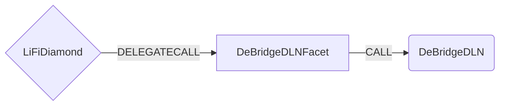

# DeBridgeDLN Facet

## How it works

DLN is a high-performance cross-chain trading infrastructure that consists of two layers:

- Protocol layer: on-chain smart contracts
- Infrastructure layer: Takers that perform off-chain matching and on-chain settlement of trades

The DLN protocol layer is represented by a set of smart contracts that can be called by any on-chain address (named a Maker) to create limit orders for cross-chain trades. When an order is created, the Maker provides a specific amount of an input token on the source chain and specifies the parameters of the order, such as the token address and the amount he accepts to receive in the destination chain. The given amount is then temporarily locked by the DLN smart contract on the source chain, and any on-chain address (named a Taker) with sufficient liquidity in the destination chain can attempt to fulfill the order by calling the corresponding method of DLN smart contract and supplying the liquidity as requested by the maker in the DLN order parameters. After the order is fulfilled, Taker initiates a cross-chain message to be sent by the DLN smart contract to the source chain via the deBridge messaging infrastructure. When the message is delivered, it unlocks the funds on the source chain to the taker’s address, effectively completing the order.

The DeBridgeDLN Facet works by calling the DeBridgeDLN smart contract to bridge tokens using the DLN protocol layer. The DeBridgeDLN smart contract is a wrapper around the DLN protocol.



## Public Methods

- `function startBridgeTokensViaDeBridgeDLN(BridgeData calldata _bridgeData, DeBridgeDLNData calldata _deBridgeDlnData)`
  - Simply bridges tokens using deBridgeDln
- `swapAndStartBridgeTokensViadeBridgeDln(BridgeData memory _bridgeData, LibSwap.SwapData[] calldata _swapData, deBridgeDlnData memory _deBridgeDlnData)`
  - Performs swap(s) before bridging tokens using deBridgeDln

## deBridgeDln Specific Parameters

The methods listed above take a variable labeled `_deBridgeDlnData`. This data is specific to deBridgeDln and is represented as the following struct type:

```solidity
/// @param example Example parameter.
struct DeBridgeDlnData {
  address receivingAssetId;
  bytes receiver;
  uint256 minAmountOut;
}
```

## Swap Data

Some methods accept a `SwapData _swapData` parameter.

Swapping is performed by a swap specific library that expects an array of calldata to can be run on variaous DEXs (i.e. Uniswap) to make one or multiple swaps before performing another action.

The swap library can be found [here](../src/Libraries/LibSwap.sol).

## LiFi Data

Some methods accept a `BridgeData _bridgeData` parameter.

This parameter is strictly for analytics purposes. It's used to emit events that we can later track and index in our subgraphs and provide data on how our contracts are being used. `BridgeData` and the events we can emit can be found [here](../src/Interfaces/ILiFi.sol).

## Getting Sample Calls to interact with the Facet

In the following some sample calls are shown that allow you to retrieve a populated transaction that can be sent to our contract via your wallet.

All examples use our [/quote endpoint](https://apidocs.li.fi/reference/get_quote) to retrieve a quote which contains a `transactionRequest`. This request can directly be sent to your wallet to trigger the transaction.

The quote result looks like the following:

```javascript
const quoteResult = {
  id: '0x...', // quote id
  type: 'lifi', // the type of the quote (all lifi contract calls have the type "lifi")
  tool: 'deBridgeDln', // the bridge tool used for the transaction
  action: {}, // information about what is going to happen
  estimate: {}, // information about the estimated outcome of the call
  includedSteps: [], // steps that are executed by the contract as part of this transaction, e.g. a swap step and a cross step
  transactionRequest: {
    // the transaction that can be sent using a wallet
    data: '0x...',
    to: '0x...',
    value: '0x00',
    from: '{YOUR_WALLET_ADDRESS}',
    chainId: 100,
    gasLimit: '0x...',
    gasPrice: '0x...',
  },
}
```

A detailed explanation on how to use the /quote endpoint and how to trigger the transaction can be found [here](https://docs.li.fi/products/more-integration-options/li.fi-api/transferring-tokens-example).

**Hint**: Don't forget to replace `{YOUR_WALLET_ADDRESS}` with your real wallet address in the examples.

### Cross Only

To get a transaction for a transfer from 30 USDC.e on Avalanche to USDC on Binance you can execute the following request:

```shell
curl 'https://li.quest/v1/quote?fromChain=AVA&fromAmount=30000000&fromToken=USDC&toChain=BSC&toToken=USDC&slippage=0.03&allowBridges=deBridgeDln&fromAddress={YOUR_WALLET_ADDRESS}'
```

### Swap & Cross

To get a transaction for a transfer from 30 USDT on Avalanche to USDC on Binance you can execute the following request:

```shell
curl 'https://li.quest/v1/quote?fromChain=AVA&fromAmount=30000000&fromToken=USDT&toChain=BSC&toToken=USDC&slippage=0.03&allowBridges=deBridgeDln&fromAddress={YOUR_WALLET_ADDRESS}'
```
