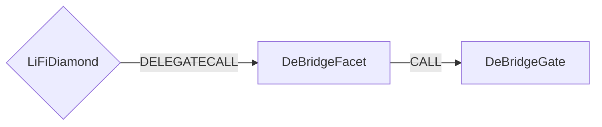

# DeBridge Facet

## How it works

The DeBridge Facet works by forwarding DeBridge specific calls to a DeBridgeGate [contracts](https://docs.debridge.finance/contracts/mainnet-addresses). DeBridge is a secure interoperability layer for Web3 that enables decentralized transfers of arbitrary messages and value between various blockchains.



## Public Methods

- `function startBridgeTokensViaDeBridge(BridgeData calldata _bridgeData, DeBridgeData calldata _deBridgeData)`
  - Simply bridges tokens using DeBridge
- `function swapAndStartBridgeTokensViaDeBridge(BridgeData memory _bridgeData, LibSwap.SwapData[] calldata _swapData, DeBridgeData calldata _deBridgeData)`
  - Performs swap(s) before bridging tokens using DeBridge

## DeBridge Specific Parameters

Some of the methods listed above take a variable labeled `_deBridgeData`.

To populate `_deBridgeData` you will need to get the `nativeFee`. Also you should calculate and specify `executionFee`.
- `nativeFee`
  Native fee is a protocol fee and it's a payment in the native token of the base blockchain.
  It can be get from `getChainToConfig(uint256 chainId)` and `globalFixedNativeFee` of `DeBridgeGate` contract. When the `fixedNativeFee` of the config is zero, you should use the `globalFixedNativeFee`.
- `executionFee`
   The execution fee is a small amount of the intermediary token that incentivizes anyone to execute the transaction on the destination chain. In other words, the execution fee must cover the cost of gas needed to execute the transaction. Execution fee is payed with the bridged assets.

You will need to send additional amount of native asset for the native fee.
If you do not desire immediate redemption, you can leave `executionFee` as 0. If you do desire immediate execution, you should provide `executionFee`.

This data is specific to DeBridge and is represented as the following struct type:

```solidity
/// @param executionFee Fee paid to the transaction executor.
/// @param flags Flags set specific flows for call data execution.
/// @param fallbackAddress Receiver of the tokens if the call fails.
/// @param data Message/Call data to be passed to the receiver
///             on the destination chain during the external call execution.
struct SubmissionAutoParamsTo {
    uint256 executionFee;
    uint256 flags;
    bytes fallbackAddress;
    bytes data;
}

/// @param permit deadline + signature for approving the spender by signature.
/// @param useAssetFee Use assets fee for pay protocol fix (work only for specials token)
/// @param nativeFee Native fee for the bridging when useAssetFee is false.
/// @param referralCode Referral code.
/// @param autoParams Structure that enables passing arbitrary messages and call data.
struct DeBridgeData {
    bytes permit;
    bool useAssetFee;
    uint256 nativeFee;
    uint32 referralCode;
    SubmissionAutoParamsTo autoParams;
}

```

## Swap Data

Some methods accept a `SwapData _swapData` parameter.

Swapping is performed by a swap specific library that expects an array of calldata to can be run on variaous DEXs (i.e. Uniswap) to make one or multiple swaps before performing another action.

The swap library can be found [here](../src/Libraries/LibSwap.sol).

## LiFi Data

Some methods accept a `BridgeData _bridgeData` parameter.

This parameter is strictly for analytics purposes. It's used to emit events that we can later track and index in our subgraphs and provide data on how our contracts are being used. `BridgeData` and the events we can emit can be found [here](../src/Interfaces/ILiFi.sol).

The receiving asset id can be get from `gatewayRouter.calculateL2TokenAddress(assetId)`.

## Getting Sample Calls to interact with the Facet

In the following some sample calls are shown that allow you to retrieve a populated transaction that can be sent to our contract via your wallet.

All examples use our [/quote endpoint](https://apidocs.li.finance/reference/get_quote-1) to retrieve a quote which contains a `transactionRequest`. This request can directly be sent to your wallet to trigger the transaction.

The quote result looks like the following:

```javascript
const quoteResult = {
  id: '0x...', // quote id
  type: 'lifi', // the type of the quote (all lifi contract calls have the type "lifi")
  tool: 'hop', // the bridge tool used for the transaction
  action: {}, // information about what is going to happen
  estimate: {}, // information about the estimated outcome of the call
  includedSteps: [], // steps that are executed by the contract as part of this transaction, e.g. a swap step and a cross step
  transactionRequest: {
    // the transaction that can be sent using a wallet
    data: '0x...',
    to: '0x...',
    value: '0x00',
    from: '{YOUR_WALLET_ADDRESS}',
    chainId: 100,
    gasLimit: '0x...',
    gasPrice: '0x...',
  },
}
```

A detailed explanation on how to use the /quote endpoint and how to trigger the transaction can be found [here](https://apidocs.li.finance/reference/how-to-transfer-tokens).

**Hint**: Don't forget to replace `{YOUR_WALLET_ADDRESS}` with your real wallet address in the examples.

### Cross Only

To get a transaction for a transfer from 20 DAI on Ethereum to deDAI on Polygon you can execute the following request:

```shell
curl 'https://li.quest/v1/quote?fromChain=ETH&fromAmount=20000000000000000000&fromToken=DAI&toChain=ARB&toToken=deDAI&slippage=0.03&allowBridges=polygon&fromAddress={YOUR_WALLET_ADDRESS}'
```

### Swap & Cross

To get a transaction for a transfer from 10 USDC on Ethereum to deDAI on polygon you can execute the following request:

```shell
curl 'https://li.quest/v1/quote?fromChain=ETH&fromAmount=10000000000000000000&fromToken=USDC&toChain=ARB&toToken=deDAI&slippage=0.03&allowBridges=polygon&fromAddress={YOUR_WALLET_ADDRESS}'
```
