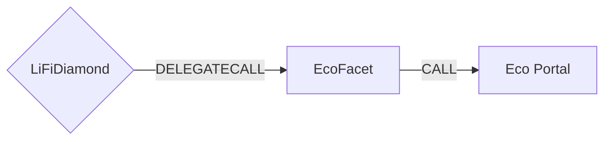

# Eco Facet

## How it works

The Eco Facet enables cross-chain token transfers using the Eco Protocol's intent-based bridging system. It creates an intent that specifies the desired outcome on the destination chain, which solvers then fulfill in exchange for a reward. The facet supports both EVM and non-EVM destination chains through encoded route data.



## Public Methods

- `function startBridgeTokensViaEco(BridgeData memory _bridgeData, EcoData calldata _ecoData)`
  - Bridges tokens using Eco Protocol without performing any swaps
- `function swapAndStartBridgeTokensViaEco(BridgeData memory _bridgeData, LibSwap.SwapData[] calldata _swapData, EcoData calldata _ecoData)`
  - Performs swap(s) before bridging tokens using Eco Protocol

## Eco Specific Parameters

The methods listed above take a variable labeled `_ecoData`. This data is specific to Eco Protocol and is represented as the following struct type:

```solidity
/// @dev Eco specific parameters
/// @param nonEVMReceiver Destination address for non-EVM chains (bytes format)
/// @param prover Address of the prover contract for validation
/// @param rewardDeadline Timestamp for reward claim eligibility
/// @param encodedRoute Encoded route data containing destination chain routing information
/// @param solanaATA Associated Token Account address for Solana bridging (bytes32)
struct EcoData {
  bytes nonEVMReceiver;
  address prover;
  uint64 rewardDeadline;
  bytes encodedRoute;
  bytes32 solanaATA;
}
```

### Address Parameters Usage

The receiver address is specified differently depending on the destination chain type:

- **For EVM destination chains** (Ethereum, Optimism, Arbitrum, Base, Polygon, etc.):

  - Set `bridgeData.receiver` to the actual EVM receiver address
  - Leave `nonEVMReceiver` empty (`""`)
  - Leave `solanaATA` as `bytes32(0)`
  - The contract validates that the receiver in the encoded route matches `bridgeData.receiver`

- **For Solana destination chain**:
  - Set `bridgeData.receiver` to `NON_EVM_ADDRESS` constant (`0x11f111f111f111F111f111f111F111f111f111F1`)
  - Provide the Solana address in `nonEVMReceiver` as bytes (base58 address encoded as bytes)
  - Provide the Associated Token Account (ATA) address in `solanaATA` as bytes32
  - The contract validates that `solanaATA` matches the ATA encoded in the route

Examples:

```solidity
// EVM to EVM bridge (e.g., Optimism to Base)
bridgeData.receiver = 0x123...;      // Actual EVM receiver address
ecoData.nonEVMReceiver = "";         // Empty bytes
ecoData.solanaATA = bytes32(0);      // Zero for EVM chains

// EVM to Solana bridge
bridgeData.receiver = NON_EVM_ADDRESS;           // Special constant
ecoData.nonEVMReceiver = solanaAddressBytes;     // Solana address as bytes
ecoData.solanaATA = 0x8f37c499ccbb92...;         // Solana ATA as bytes32
```

### Important Notes

- **Native Token Bridging**: The EcoFacet contract does not support native token bridging. Only ERC20 token transfers are supported. Transactions will revert if native tokens are specified as the sending asset.

- **Fee Model**: Eco uses a fee-inclusive model where the fee is already deducted from the source amount:

  - The Eco API returns `sourceAmount` (fee-inclusive amount user sends) and `destinationAmount` (amount received after fee deduction)
  - The total fee is `sourceAmount - destinationAmount`
  - `bridgeData.minAmount` should be set to `sourceAmount` (fee-inclusive)
  - User approves exactly `minAmount`
  - The contract deposits exactly `minAmount` and passes it to the Eco Portal

  **Example**: To bridge 5 USDC with a 0.03 USDC fee:

  - Eco quote: `sourceAmount = 5,000,000`, `destinationAmount = 4,970,000`, fee = 30,000
  - User approves: 5,000,000 USDC (the `sourceAmount`)
  - Contract deposits: 5,000,000 USDC
  - Solver receives: 30,000 USDC
  - Destination receives: 4,970,000 USDC

- **ERC20 Token Bridging**: For ERC20 tokens, the facet automatically approves the Eco Portal to spend `minAmount` (the fee-inclusive amount).

- **Encoded Route**: The `encodedRoute` parameter is provided by the Eco API and contains all necessary routing information for the destination chain. It is used as-is by the facet and is required for all bridge operations. The contract validates that the receiver address in the encoded route matches the specified receiver.

- **Chain ID Mapping**: The facet automatically maps LiFi chain IDs to Eco protocol chain IDs for non-EVM chains (Tron: 728126428, Solana: 1399811149).

- **TRON Compatibility**: TRON is treated as EVM-compatible in the smart contract validation logic since it uses the same Route struct encoding as EVM chains. Only Solana requires special non-EVM handling with `nonEVMReceiver` and `solanaATA` parameters.

## Swap Data

Some methods accept a `SwapData _swapData` parameter.

Swapping is performed by a swap specific library that expects an array of calldata to can be run on various DEXs (i.e. Uniswap) to make one or multiple swaps before performing another action.

The swap library can be found [here](../src/Libraries/LibSwap.sol).

## LiFi Data

Some methods accept a `BridgeData _bridgeData` parameter.

This parameter is strictly for analytics purposes. It's used to emit events that we can later track and index in our subgraphs and provide data on how our contracts are being used. `BridgeData` and the events we can emit can be found [here](../src/Interfaces/ILiFi.sol).

## Getting Sample Calls to interact with the Facet

In the following some sample calls are shown that allow you to retrieve a populated transaction that can be sent to our contract via your wallet.

All examples use our [/quote endpoint](https://apidocs.li.fi/reference/get_quote) to retrieve a quote which contains a `transactionRequest`. This request can directly be sent to your wallet to trigger the transaction.

The quote result looks like the following:

```javascript
const quoteResult = {
  id: '0x...', // quote id
  type: 'lifi', // the type of the quote (all lifi contract calls have the type "lifi")
  tool: 'eco', // the bridge tool used for the transaction
  action: {}, // information about what is going to happen
  estimate: {}, // information about the estimated outcome of the call
  includedSteps: [], // steps that are executed by the contract as part of this transaction, e.g. a swap step and a cross step
  transactionRequest: {
    // the transaction that can be sent using a wallet
    data: '0x...',
    to: '0x...',
    value: '0x00',
    from: '{YOUR_WALLET_ADDRESS}',
    chainId: 100,
    gasLimit: '0x...',
    gasPrice: '0x...',
  },
}
```

A detailed explanation on how to use the /quote endpoint and how to trigger the transaction can be found [here](https://docs.li.fi/products/more-integration-options/li.fi-api/transferring-tokens-example).

**Hint**: Don't forget to replace `{YOUR_WALLET_ADDRESS}` with your real wallet address in the examples.

### Cross Only

To get a transaction for a transfer from 5 USDC on Optimism to USDC on Base you can execute the following request:

```shell
curl 'https://li.quest/v1/quote?fromChain=OPT&fromAmount=5000000&fromToken=USDC&toChain=BAS&toToken=USDC&slippage=0.03&allowBridges=eco&fromAddress={YOUR_WALLET_ADDRESS}'
```

### Swap & Cross

To get a transaction for a transfer from 5 USDT on Optimism to USDC on Base you can execute the following request:

```shell
curl 'https://li.quest/v1/quote?fromChain=OPT&fromAmount=5000000&fromToken=USDT&toChain=BAS&toToken=USDC&slippage=0.03&allowBridges=eco&fromAddress={YOUR_WALLET_ADDRESS}'
```
