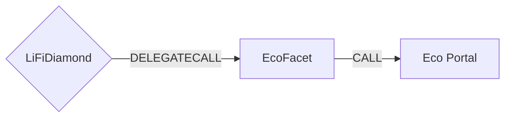

# Eco Facet

## How it works

The Eco Facet enables cross-chain token transfers using the Eco Protocol's intent-based bridging system. It creates an intent that specifies the desired outcome on the destination chain, which solvers then fulfill in exchange for a reward. The facet supports both EVM and non-EVM destination chains through encoded route data.



## Public Methods

- `function startBridgeTokensViaEco(BridgeData memory _bridgeData, EcoData calldata _ecoData)`
  - Bridges tokens using Eco Protocol without performing any swaps
- `function swapAndStartBridgeTokensViaEco(BridgeData memory _bridgeData, LibSwap.SwapData[] calldata _swapData, EcoData calldata _ecoData)`
  - Performs swap(s) before bridging tokens using Eco Protocol

## Eco Specific Parameters

The methods listed above take a variable labeled `_ecoData`. This data is specific to Eco Protocol and is represented as the following struct type:

```solidity
/// @dev Eco specific parameters
/// @param receiverAddress Address that will receive tokens on destination chain
/// @param nonEVMReceiver Destination address for non-EVM chains (bytes format)
/// @param prover Address of the prover contract for validation
/// @param rewardDeadline Timestamp for reward claim eligibility
/// @param solverReward Reward amount for the solver (native or ERC20 depending on sendingAssetId)
/// @param encodedRoute Encoded route data containing destination chain routing information
struct EcoData {
  address receiverAddress;
  bytes nonEVMReceiver;
  address prover;
  uint64 rewardDeadline;
  uint256 solverReward;
  bytes encodedRoute;
}
```

### Address Parameters Usage

The `receiverAddress` and `nonEVMReceiver` parameters serve different purposes:

- **For EVM destination chains**: Use `receiverAddress` (standard Ethereum address format). Leave `nonEVMReceiver` empty.
- **For non-EVM destination chains** (Solana, Tron, etc.):
  - Set `receiverAddress` to `address(0)` or leave unchanged
  - Set `bridgeData.receiver` to `NON_EVM_ADDRESS` constant
  - Provide the destination address in `nonEVMReceiver` as bytes

**Important**: Only one of these should be used per transaction. Never provide both values simultaneously.

Examples:

```solidity
// EVM to EVM bridge
ecoData.receiverAddress = 0x123...;  // Actual receiver address
ecoData.nonEVMReceiver = "";         // Empty bytes

// EVM to Solana bridge
bridgeData.receiver = NON_EVM_ADDRESS;  // Special constant
ecoData.receiverAddress = address(0);   // Not used
ecoData.nonEVMReceiver = solanaAddressBytes;  // Actual Solana address
```

### Important Notes

- **Native Token Bridging**: Native token bridging is not currently supported and is not in the immediate roadmap. Only ERC20 token bridging is available.
- **Solver Reward**:
  - For ERC20 transfers: The solver reward is included in the deposited/swapped amount and the Eco router handles the split internally
- **Non-EVM Destinations**: For non-EVM chains (like Tron or Solana), set `receiver` in `BridgeData` to `NON_EVM_ADDRESS` (constant from src/Helpers/LiFiData.sol) and provide the destination address in `nonEVMReceiver`.
- **ERC20 Token Bridging**: For ERC20 tokens, the facet will automatically approve the Eco Portal to spend the total amount (bridge amount + solver reward).
- **Encoded Route**: The `encodedRoute` parameter contains all necessary routing information for the destination chain and is required for all bridge operations.
- **Chain ID Mapping**: The facet automatically maps LiFi chain IDs to Eco protocol chain IDs for non-EVM chains (Tron: 728126428, Solana: 1399811149).

## Swap Data

Some methods accept a `SwapData _swapData` parameter.

Swapping is performed by a swap specific library that expects an array of calldata to can be run on various DEXs (i.e. Uniswap) to make one or multiple swaps before performing another action.

The swap library can be found [here](../src/Libraries/LibSwap.sol).

## LiFi Data

Some methods accept a `BridgeData _bridgeData` parameter.

This parameter is strictly for analytics purposes. It's used to emit events that we can later track and index in our subgraphs and provide data on how our contracts are being used. `BridgeData` and the events we can emit can be found [here](../src/Interfaces/ILiFi.sol).

## Getting Sample Calls to interact with the Facet

In the following some sample calls are shown that allow you to retrieve a populated transaction that can be sent to our contract via your wallet.

All examples use our [/quote endpoint](https://apidocs.li.fi/reference/get_quote) to retrieve a quote which contains a `transactionRequest`. This request can directly be sent to your wallet to trigger the transaction.

The quote result looks like the following:

```javascript
const quoteResult = {
  id: '0x...', // quote id
  type: 'lifi', // the type of the quote (all lifi contract calls have the type "lifi")
  tool: 'eco', // the bridge tool used for the transaction
  action: {}, // information about what is going to happen
  estimate: {}, // information about the estimated outcome of the call
  includedSteps: [], // steps that are executed by the contract as part of this transaction, e.g. a swap step and a cross step
  transactionRequest: {
    // the transaction that can be sent using a wallet
    data: '0x...',
    to: '0x...',
    value: '0x00',
    from: '{YOUR_WALLET_ADDRESS}',
    chainId: 100,
    gasLimit: '0x...',
    gasPrice: '0x...',
  },
}
```

A detailed explanation on how to use the /quote endpoint and how to trigger the transaction can be found [here](https://docs.li.fi/products/more-integration-options/li.fi-api/transferring-tokens-example).

**Hint**: Don't forget to replace `{YOUR_WALLET_ADDRESS}` with your real wallet address in the examples.

### Cross Only

To get a transaction for a transfer from 5 USDC on Optimism to USDC on Base you can execute the following request:

```shell
curl 'https://li.quest/v1/quote?fromChain=OPT&fromAmount=5000000&fromToken=USDC&toChain=BAS&toToken=USDC&slippage=0.03&allowBridges=eco&fromAddress={YOUR_WALLET_ADDRESS}'
```

### Swap & Cross

To get a transaction for a transfer from 5 USDT on Optimism to USDC on Base you can execute the following request:

```shell
curl 'https://li.quest/v1/quote?fromChain=OPT&fromAmount=5000000&fromToken=USDT&toChain=BAS&toToken=USDC&slippage=0.03&allowBridges=eco&fromAddress={YOUR_WALLET_ADDRESS}'
```
