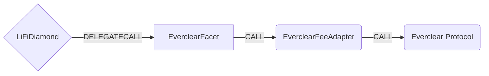

# Everclear Facet

## How it works

The Everclear Facet enables cross-chain token bridging through the Everclear protocol, which uses a Spoke and Hub model to transport intents and settlements between supported domains. The facet interacts with an EverclearFeeAdapter contract that handles fee collection and signature verification before forwarding intents to the Everclear protocol.

Everclear uses an intent-based architecture where users create intents that specify their desired cross-chain transfers. These intents are then matched and settled through a netting mechanism that optimizes liquidity across chains. The protocol supports both EVM and non-EVM destination chains.



## Public Methods

- `function startBridgeTokensViaEverclear(BridgeData calldata _bridgeData, EverclearData calldata _everclearData)`
  - Simply bridges tokens using everclear
- `swapAndStartBridgeTokensViaEverclear(BridgeData memory _bridgeData, LibSwap.SwapData[] calldata _swapData, everclearData memory _everclearData)`
  - Performs swap(s) before bridging tokens using everclear

## Everclear Specific Parameters

The methods listed above take a variable labeled `_everclearData`. This data is specific to Everclear and is represented as the following struct type:

```solidity
/// @param receiverAddress The address of the receiver (bytes32 for non-EVM chains)
/// @param nativeFee The native fee amount (in native tokens, e.g., ETH)
/// @param outputAsset The address of the output asset on destination chain (bytes32 format)
/// @param amountOutMin The minimum amount out on destination chain
/// @param ttl The time to live for the intent (in seconds)
/// @param data Additional data for the intent (typically empty)
/// @param fee The protocol fee amount (in input token units)
/// @param deadline The deadline timestamp for the fee signature
/// @param sig The signature from the fee signer authorizing the fee
/// @param refundReceiver Address that will receive refunds from positive slippage
struct EverclearData {
  bytes32 receiverAddress;
  uint256 nativeFee;
  bytes32 outputAsset;
  uint256 amountOutMin;
  uint48 ttl;
  bytes data;
  uint256 fee;
  uint256 deadline;
  bytes sig;
  address refundReceiver;
}
```

### Fee Structure

The Everclear protocol uses a signed fee mechanism where:

- The `fee` is deducted from the bridge amount and collected separately
- The `nativeFee` (if non-zero) must be sent as msg.value and is used for cross-chain messaging costs
- The `sig` parameter contains an EIP-191 signature over the four parameters: `abi.encode(fee, nativeFee, inputAsset, deadline)`
- The signature must be created by the authorized fee signer in the EverclearFeeAdapter
- The `deadline` must be greater than or equal to the current block timestamp

### V2 Changes

- **Parameter Change**: `maxFee` (uint24) has been replaced with `amountOutMin` (uint256)
- **Native Fee Support**: Added `nativeFee` parameter for cross-chain messaging costs

### Chain Support

- **EVM Chains**: For EVM destination chains, `receiverAddress` must match `bridgeData.receiver` when converted to bytes32
- **Non-EVM Chains**: Set `bridgeData.receiver` to `NON_EVM_ADDRESS` and provide the actual receiver in `receiverAddress`

### Refund Receiver

The `refundReceiver` parameter specifies the address that will receive any positive slippage from source swaps. When using `swapAndStartBridgeTokensViaEverclear`, if the swap results in more tokens than expected, the excess amount is sent to the `refundReceiver` instead of being included in the bridge. This is necessary because Everclear's signature validation includes the original bridge amount, preventing adjustment of the amount sent to the protocol.

## Error Conditions

The facet will revert with specific errors in the following cases:

- `InvalidConfig()`: Constructor called with zero address for fee adapter
- `InvalidCallData()`: `outputAsset` is bytes32(0), `refundReceiver` is address(0), or bridge amount is less than or equal to fee
- `InvalidNonEVMReceiver()`: Non-EVM bridging with `receiverAddress` as bytes32(0)
- `InvalidReceiver()`: EVM bridging where `bridgeData.receiver` doesn't match `everclearData.receiverAddress`
- Standard LiFi validation errors for invalid bridge data

## Swap Data

Some methods accept a `SwapData _swapData` parameter.

Swapping is performed by a swap specific library that expects an array of calldata to can be run on various DEXs (i.e. Uniswap) to make one or multiple swaps before performing another action.

The swap library can be found [here](../src/Libraries/LibSwap.sol).

## LiFi Data

Some methods accept a `BridgeData _bridgeData` parameter.

This parameter is strictly for analytics purposes. It's used to emit events that we can later track and index in our subgraphs and provide data on how our contracts are being used. `BridgeData` and the events we can emit can be found [here](../src/Interfaces/ILiFi.sol).

## Getting Sample Calls to interact with the Facet

In the following some sample calls are shown that allow you to retrieve a populated transaction that can be sent to our contract via your wallet.

All examples use our [/quote endpoint](https://apidocs.li.fi/reference/get_quote) to retrieve a quote which contains a `transactionRequest`. This request can directly be sent to your wallet to trigger the transaction.

The quote result looks like the following:

```javascript
const quoteResult = {
  id: '0x...', // quote id
  type: 'lifi', // the type of the quote (all lifi contract calls have the type "lifi")
  tool: 'everclear', // the bridge tool used for the transaction
  action: {}, // information about what is going to happen
  estimate: {}, // information about the estimated outcome of the call
  includedSteps: [], // steps that are executed by the contract as part of this transaction, e.g. a swap step and a cross step
  transactionRequest: {
    // the transaction that can be sent using a wallet
    data: '0x...',
    to: '0x...',
    value: '0x00',
    from: '{YOUR_WALLET_ADDRESS}',
    chainId: 100,
    gasLimit: '0x...',
    gasPrice: '0x...',
  },
}
```

A detailed explanation on how to use the /quote endpoint and how to trigger the transaction can be found [here](https://docs.li.fi/products/more-integration-options/li.fi-api/transferring-tokens-example).

**Hint**: Don't forget to replace `{YOUR_WALLET_ADDRESS}` with your real wallet address in the examples.

### Cross Only

To get a transaction for a transfer from 30 USDC.e on Avalanche to USDC on Binance you can execute the following request:

```shell
curl 'https://li.quest/v1/quote?fromChain=AVA&fromAmount=30000000&fromToken=USDC&toChain=BSC&toToken=USDC&slippage=0.03&allowBridges=everclear&fromAddress={YOUR_WALLET_ADDRESS}'
```

### Swap & Cross

To get a transaction for a transfer from 30 USDT on Avalanche to USDC on Binance you can execute the following request:

```shell
curl 'https://li.quest/v1/quote?fromChain=AVA&fromAmount=30000000&fromToken=USDT&toChain=BSC&toToken=USDC&slippage=0.03&allowBridges=everclear&fromAddress={YOUR_WALLET_ADDRESS}'
```

## Additional Resources

- [Everclear Protocol Documentation](https://docs.everclear.org/developers/fundamentals)
- [Everclear API Reference](https://docs.everclear.org/developers/api)
