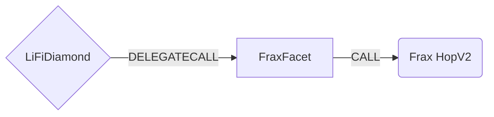

# FraxFacet

## How it works

The FraxFacet bridges tokens through **Frax HopV2**, a LayerZero V2 OFT
hub-and-spoke bridge. **Fraxtal** (chainId `252`) is the hub; every other chain
is a spoke, and all spokes share a single CREATE2 address for the HopV2 contract.
The facet pulls the sending asset into the Diamond and calls
`HOP.sendOFT(oft, dstEid, recipient, amountLd, dstGas=0, data="")` on the local
HopV2 contract. Routes are resolved by the hub-and-spoke topology:

- **spoke ↔ hub** is a single hop.
- **spoke → spoke** is composed as two hops, relayed via Fraxtal.

Supported tokens are the Frax OFTs — `frxUSD`, `sfrxUSD`, `WFRAX`, `frxETH`,
`sfrxETH`, and `FPI` (all 18 decimals, 6 shared decimals).

This facet performs **plain transfers only** — it does **not** support
destination calls (`bridgeData.hasDestinationCall` must be `false`, enforced by
the `doesNotContainDestinationCalls` modifier), and `dstGas`/`data` are always
`0`/empty in the `sendOFT` call.



## Public Methods

- `function startBridgeTokensViaFrax(BridgeData memory _bridgeData, FraxData calldata _fraxData)`
  - Simply bridges tokens using Frax HopV2 without performing any swaps
- `function swapAndStartBridgeTokensViaFrax(BridgeData memory _bridgeData, LibSwap.SwapData[] calldata _swapData, FraxData calldata _fraxData)`
  - Performs swap(s) before bridging tokens using Frax HopV2

## Frax Specific Parameters

The methods listed above take a variable labeled `_fraxData`. This data is
specific to Frax HopV2 and is represented as the following struct type:

```solidity
/// @param oft The OFT messenger for the token on the source chain (its token() is the
///        ERC20 that HopV2 pulls and that must equal bridgeData.sendingAssetId)
/// @param dstEid The LayerZero endpoint ID of the destination chain
/// @param nativeFee The native LayerZero fee forwarded to HopV2 as msg.value on standard
///        chains; ignored on Tempo (fee is paid in the TIP20 gas token)
/// @param refundRecipient Address that receives pre-bridge swap leftovers, the dust
///        remainder that HopV2 does not bridge, and any excess native that HopV2 refunds
///        to the diamond mid-call. Must accept plain native transfers.
struct FraxData {
    address oft;
    uint32 dstEid;
    uint256 nativeFee;
    address refundRecipient;
}
```

Both entrypoints validate `_fraxData` up front (reverting `InvalidCallData` on a
zero `refundRecipient`, `oft`, or `dstEid`) and verify that the OFT's underlying
token matches `bridgeData.sendingAssetId` (reverting `InformationMismatch`
otherwise).

- `nativeFee` is the native LayerZero messaging fee. It is `0` on Tempo, where the
  fee is charged in an ERC20 gas token instead (see below).
- `refundRecipient` receives everything belonging to the user that does not get
  bridged: pre-bridge swap leftovers, the dust remainder HopV2 floors off, and any
  excess native / fee refund that HopV2 returns to the Diamond mid-call.

## Fund flow and safety

- **Fee overage refund.** The LI.FI backend/API
  (`https://lz-route-api.ext.frax.com/lifi/quote`) provides the `nativeFee` with a
  ~10% buffer. HopV2 refunds the excess synchronously to the caller (the Diamond),
  and the `refundExcessNative` modifier then forwards that overage to
  `refundRecipient`.
- **Dust.** HopV2 floors the amount to the OFT's `decimalConversionRate` multiple
  and only bridges the floored amount. The facet floors the amount up front (via
  `HOP.removeDust`), approves and bridges exactly that, and transfers the dust
  remainder to `refundRecipient` **in the same transaction** — nothing is stranded
  in the Diamond. It reverts `InvalidCallData` if the floored amount is `0`.
- **No positive slippage / intent semantics.** `minAmountLD == amountLD`: HopV2
  delivers destination funds directly to the recipient. No funds ever sit in a
  LI.FI contract on the destination chain.
- **Destination validation (`destinationChainId` ↔ `dstEid`).** The facet holds an
  owner-governed `chainId → LayerZero EID` mapping (see below) and requires
  `getChainIdToEid(bridgeData.destinationChainId) == fraxData.dstEid`, reverting
  `UnsupportedChainId` if the destination chain is not configured and
  `InformationMismatch` if the supplied `dstEid` does not match. This binds the
  actual LayerZero routing target (`dstEid`) to the chain that analytics/accounting
  index on (`destinationChainId`), so a caller cannot route funds to one chain while
  the transfer is recorded as another. The mapping must be seeded (see below) for
  every destination a route targets before that route can be used. This is stricter
  than the pure analytics-only model of `AcrossFacetV4` / `PaxosTransitFacet`, and
  mirrors `SupersetFacet`.
- **HopV2 trust surface.** The HopV2 contract is an **upgradeable proxy** with an
  admin `recover()` function. The facet grants it an ERC20 allowance via the
  standard LI.FI `maxApproveERC20` pattern (scoped to the bridged amount). This is
  a trust surface worth noting.

## ChainId → LayerZero EID mapping

`bridgeData.destinationChainId` is an EVM chain ID while `fraxData.dstEid` is a
LayerZero endpoint ID; the two numbering systems are unrelated, so the facet keeps
an on-chain `chainId → EID` mapping in diamond storage (namespace
`com.lifi.facets.frax`) to cross-check them (see the destination-validation note
above). This follows the `SupersetFacet` pattern.

- `initFrax(ChainIdConfig[])` — **owner-only**, one-shot seeding. During a facet
  deployment/upgrade it is executed as the `diamondCut` init call (the
  `UpdateFraxFacet` script reads the `mappings` array from `config/frax.json`), so
  it is **not** registered as a diamond method.
- `setChainIdToEid(ChainIdConfig[])` — **owner-only**, add/update entries after the
  initial seeding (requires a prior `initFrax`, else reverts `NotInitialized`).
- `getChainIdToEid(uint256 chainId)` — returns the configured EID, reverting
  `UnsupportedChainId` when unset. `chainId == 0` and `lzEid == 0` are rejected on
  write (EID `0` is the "unset" sentinel).

**EID source of truth.** LayerZero EIDs live once in
[`config/layerzero.json`](../config/layerzero.json) (shared across LZ facets). The
`mappings` array in `config/frax.json` is **generated** from it by
`tasks/syncLayerZeroEids.ts` (subset = the networks in `frax.json` `hop`) and
verified in CI (`script/tasks/layerZeroEids.test.ts`) — do not hand-edit it; add or
correct an EID in `config/layerzero.json`. New EIDs are checked against
[the LayerZero deployments list](https://docs.layerzero.network/v2/deployments/deployed-contracts).

**Operational requirement:** every destination chain a route targets **must** be
present in `config/layerzero.json` (hence in the generated `frax.json` `mappings`)
and seeded on each diamond (via `initFrax` on first deploy, or `setChainIdToEid` for
later additions) before that route is usable — an unseeded destination reverts
`UnsupportedChainId`.

## Tempo (EndpointV2Alt) special case

On **Tempo** (chainId `4217`), LayerZero uses **EndpointV2Alt**, which rejects
native `msg.value`; the messaging fee is paid in a **TIP20 ERC20 gas token**, not
native gas.

- The facet selects this path via a constructor immutable, `TIP_FEE_MANAGER`,
  which is non-zero **only on Tempo** (`PATH_USD` is the default gas token). One
  FraxFacet source serves every chain — the fee mode is chosen at **deploy time**
  from `config/frax.json`, not by a separate contract.
- The fee token is resolved as `TIP_FEE_MANAGER.userTokens(diamond)`, falling back
  to `PATH_USD` when the Diamond has not opted into a specific token. Its amount is
  quoted in-token via `HOP.quoteStatic`. The facet pulls the fee token from the
  caller, approves it to HopV2, and sends with `msg.value == 0` (both entrypoints
  revert `InvalidCallData` if any native is sent on Tempo). The unused-fee refund is
  computed from a fee-token balance delta, so the fee token must differ from the
  bridged asset; the facet reverts `InformationMismatch` on that collision (a Frax
  gas token is never itself a bridged Frax OFT).
- **BE-integration requirement (EXP-514 — to be confirmed).** On Tempo the Diamond
  must be **funded with the fee token**: the caller must approve/transfer the TIP20
  fee token to the Diamond so HopV2's `transferFrom` pull succeeds. This differs
  from every other chain (where the fee is native `msg.value`) and **MUST be
  confirmed with the BE integration**.

## Swap Data

Some methods accept a `SwapData _swapData` parameter.

Swapping is performed by a swap-specific library that expects an array of calldata
that can be run on various DEXs (i.e. Uniswap) to make one or multiple swaps before
performing another action.

The swap library can be found [here](../src/Libraries/LibSwap.sol).

## LiFi Data

Some methods accept a `BridgeData _bridgeData` parameter.

This parameter carries both analytics metadata and enforced fields. The metadata
(`transactionId`, `integrator`, `referrer`, and — for FraxFacet — `destinationChainId`)
is used to emit events that we can later track and index in our subgraphs. The
remaining fields are load-bearing: FraxFacet validates and acts on `sendingAssetId`
(the OFT token pulled and bridged), `receiver` (encoded as the destination recipient),
and `minAmount` (the amount deposited and bridged). `BridgeData` and the events we can
emit can be found [here](../src/Interfaces/ILiFi.sol).

## Getting Sample Calls to interact with the Facet

In the following some sample calls are shown that allow you to retrieve a populated
transaction that can be sent to our contract via your wallet.

All examples use our [/quote endpoint](https://apidocs.li.fi/reference/get_quote) to
retrieve a quote which contains a `transactionRequest`. This request can directly be
sent to your wallet to trigger the transaction.

The quote result looks like the following:

```javascript
const quoteResult = {
  id: '0x...', // quote id
  type: 'lifi', // the type of the quote (all lifi contract calls have the type "lifi")
  tool: 'frax', // the bridge tool used for the transaction
  action: {}, // information about what is going to happen
  estimate: {}, // information about the estimated outcome of the call
  includedSteps: [], // steps that are executed by the contract as part of this transaction, e.g. a swap step and a cross step
  transactionRequest: {
    // the transaction that can be sent using a wallet
    data: '0x...',
    to: '0x...',
    value: '0x00',
    from: '{YOUR_WALLET_ADDRESS}',
    chainId: 252,
    gasLimit: '0x...',
    gasPrice: '0x...',
  },
}
```

A detailed explanation on how to use the /quote endpoint and how to trigger the
transaction can be found
[here](https://docs.li.fi/products/more-integration-options/li.fi-api/transferring-tokens-example).

> **Note:** the `tool: 'frax'` / `allowBridges=frax` slug and token symbols in the
> examples below are placeholders pending the BE integration (EXP-514) — confirm the
> actual bridge slug and supported symbols with the backend team before relying on them.

**Hint**: Don't forget to replace `{YOUR_WALLET_ADDRESS}` with your real wallet
address in the examples.

### Cross Only

To get a transaction for a transfer from 100 frxUSD on Ethereum to frxUSD on
Fraxtal you can execute the following request:

```shell
curl 'https://li.quest/v1/quote?fromChain=ETH&fromAmount=100000000000000000000&fromToken=frxUSD&toChain=FRAX&toToken=frxUSD&slippage=0.03&allowBridges=frax&fromAddress={YOUR_WALLET_ADDRESS}'
```

### Swap & Cross

To get a transaction for a transfer from 100 USDC on Ethereum to frxUSD on Fraxtal
you can execute the following request:

```shell
curl 'https://li.quest/v1/quote?fromChain=ETH&fromAmount=100000000&fromToken=USDC&toChain=FRAX&toToken=frxUSD&slippage=0.03&allowBridges=frax&fromAddress={YOUR_WALLET_ADDRESS}'
```
