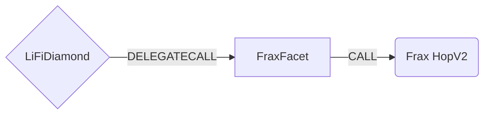

# FraxFacet

## How it works

The FraxFacet bridges tokens through **Frax HopV2**, a LayerZero V2 OFT
hub-and-spoke bridge. **Fraxtal** (chainId `252`) is the hub; every other chain
is a spoke, and all spokes share a single CREATE2 address for the HopV2 contract.
The facet pulls the sending asset into the Diamond and calls
`FRAX_HOP.sendOFT(oft, dstEid, recipient, amountLd, dstGas=0, data="")` on the local
HopV2 contract. Routes are resolved by the hub-and-spoke topology:

- **spoke ↔ hub** is a single hop.
- **spoke → spoke** is composed as two hops, relayed via Fraxtal.

Supported tokens are the Frax OFTs — `frxUSD`, `sfrxUSD`, `WFRAX`, `frxETH`,
`sfrxETH`, and `FPI` (all 18 decimals, 6 shared decimals).

This facet performs **plain transfers only** — it does **not** support
destination calls (`bridgeData.hasDestinationCall` must be `false`, enforced by
the `doesNotContainDestinationCalls` modifier), and `dstGas`/`data` are always
`0`/empty in the `sendOFT` call.


```mermaid
graph LR;
    D{LiFiDiamond}-- DELEGATECALL -->A[FraxFacet]
    A -- CALL --> B(Frax HopV2)
```

## Public Methods

- `function startBridgeTokensViaFrax(BridgeData memory _bridgeData, FraxData calldata _fraxData)`
  - Simply bridges tokens using Frax HopV2 without performing any swaps
- `function swapAndStartBridgeTokensViaFrax(BridgeData memory _bridgeData, LibSwap.SwapData[] calldata _swapData, FraxData calldata _fraxData)`
  - Performs swap(s) before bridging tokens using Frax HopV2

## Frax Specific Parameters

The methods listed above take a variable labeled `_fraxData`. This data is
specific to Frax HopV2 and is represented as the following struct type:

```solidity
/// @param oft The OFT messenger for the token on the source chain (its token() is the
///        ERC20 that HopV2 pulls and that must equal bridgeData.sendingAssetId)
/// @param dstEid The LayerZero endpoint ID of the destination chain
/// @param nativeFee The native LayerZero fee forwarded to HopV2 as msg.value on standard
///        chains; ignored on Tempo (fee is paid in the TIP20 gas token)
/// @param refundRecipient Address that receives pre-bridge swap leftovers, the dust
///        remainder that HopV2 does not bridge, and any excess native that HopV2 refunds
///        to the diamond mid-call. Must accept plain native transfers.
/// @param nonEVMReceiver The bytes32 recipient on a non-EVM destination (e.g. a Solana
///        pubkey). Required when bridgeData.receiver is NON_EVM_ADDRESS; must be
///        bytes32(0) for EVM destinations.
struct FraxData {
    address oft;
    uint32 dstEid;
    uint256 nativeFee;
    address refundRecipient;
    bytes32 nonEVMReceiver;
}
```

Both entrypoints validate `_fraxData` up front — **before any deposit or swap** — so an
invalid route costs the caller nothing but gas:

- `InvalidCallData` on a zero `refundRecipient`, `oft`, or `dstEid` — or on a non-zero
  `nonEVMReceiver` for an EVM destination.
- `InvalidReceiver` when the `NON_EVM_ADDRESS` sentinel and the destination kind disagree
  (sentinel on an EVM destination, or a 20-byte receiver on a non-EVM one).
- `InvalidNonEVMReceiver` when a non-EVM destination has a zero `nonEVMReceiver`.
- `UnsupportedChainId` / `InformationMismatch` on the `destinationChainId` ↔ `dstEid`
  cross-check.
- `TokenNotSupported` when `FRAX_HOP.approvedOft(oft)` is `false`.
- `InformationMismatch` when the OFT's underlying `token()` is not
  `bridgeData.sendingAssetId`.

The `approvedOft` check runs **before** `oft.token()` deliberately: `oft` is caller-supplied,
so the only external call this facet makes into it happens after the hop has allowlisted it.

- `nativeFee` is the native LayerZero messaging fee. It is `0` on Tempo, where the
  fee is charged in an ERC20 gas token instead (see below).
- `refundRecipient` receives everything belonging to the user that does not get
  bridged: pre-bridge swap leftovers, the dust remainder HopV2 floors off, and any
  excess native / fee refund that HopV2 returns to the Diamond mid-call.

## Fund flow and safety

- **Fee overage refund.** The LI.FI backend/API
  (`https://lz-route-api.ext.frax.com/lifi/quote`) provides the `nativeFee` with a
  ~10% buffer. HopV2 refunds the excess synchronously to the caller (the Diamond),
  and the `refundExcessNative` modifier then forwards that overage to
  `refundRecipient`.
- **Dust.** HopV2 floors the amount to the OFT's `decimalConversionRate` multiple
  and only bridges the floored amount. The facet floors the amount up front (via
  `FRAX_HOP.removeDust`), approves and bridges exactly that, and transfers the dust
  remainder to `refundRecipient` **in the same transaction** — nothing is stranded
  in the Diamond. It reverts `InvalidCallData` if the floored amount is `0`.
- **No positive slippage / intent semantics.** `minAmountLD == amountLD`: HopV2
  delivers destination funds directly to the recipient. No funds ever sit in a
  LI.FI contract on the destination chain.
- **Destination validation (`destinationChainId` ↔ `dstEid`).** The facet holds an
  owner-governed `chainId → LayerZero EID` mapping (see below) and requires
  `getFraxChainIdToEid(bridgeData.destinationChainId) == fraxData.dstEid`, reverting
  `UnsupportedChainId` if the destination chain is not configured and
  `InformationMismatch` if the supplied `dstEid` does not match. This binds the
  actual LayerZero routing target (`dstEid`) to the chain that analytics/accounting
  index on (`destinationChainId`), so a caller cannot route funds to one chain while
  the transfer is recorded as another. The mapping must be seeded (see below) for
  every destination a route targets before that route can be used. This is stricter
  than the pure analytics-only model of `AcrossFacetV4` / `PaxosTransitFacet`, and
  mirrors `SupersetFacet`.
- **HopV2 trust surface / standing approval (explicit trust assumption).** The HopV2
  contract is an **upgradeable proxy** with an admin `recover()` function, and the facet
  approves it via the standard LI.FI `LibAsset.maxApproveERC20` pattern. Note what that
  pattern actually does: the `amount` argument is only the *required-allowance
  threshold* — when the current allowance is insufficient the allowance is set to
  **`type(uint256).max`**. So after the first bridge of a given token, the Diamond
  carries a **standing unlimited allowance** to HopV2 for that token, and HopV2 can be
  upgraded by its admin to arbitrary logic. This is identical to how every other LI.FI
  facet approves its bridge, and the residual risk is bounded by the "Diamond holds
  nothing between transactions" invariant above (tokens are pulled, forwarded, and any
  remainder refunded within the same call), but the trust assumption is explicit:
  **an upgraded, malicious HopV2 could spend any balance the Diamond happens to hold in
  an approved token at that moment.**
- **OFT support pre-check.** HopV2 only routes OFTs it has been configured with
  (`FRAX_HOP.approvedOft(oft)`). The facet checks this **before** any deposit or swap, so an
  unapproved OFT reverts `TokenNotSupported` up front instead of failing deep inside
  `sendOFT` after `_depositAndSwap` has already executed the caller's swap. The whole
  transaction reverts either way, so this is a gas / error-clarity guarantee rather than a
  fund-safety one.
- **Non-EVM destinations (Solana).** HopV2's recipient is a `bytes32`, and Frax routes to
  Solana (LayerZero EID `30168`) via the Fraxtal hub, so the facet supports both address
  formats:
  - **EVM destination** — recipient is the left-padded `bridgeData.receiver`;
    `nonEVMReceiver` must be `bytes32(0)`.
  - **Non-EVM destination** — `bridgeData.receiver` must be the `NON_EVM_ADDRESS` sentinel
    and the real recipient travels as `fraxData.nonEVMReceiver`, which is passed to
    `sendOFT` verbatim. The facet emits `BridgeToNonEVMChainBytes32` alongside
    `LiFiTransferStarted`.

  The two are cross-checked **in both directions**, because each mismatch loses funds: a
  20-byte receiver on a non-EVM route would be left-padded into an unspendable Solana
  account, and the sentinel on an EVM route would deliver the funds to `NON_EVM_ADDRESS`
  itself. A non-EVM `nonEVMReceiver` is only checked for non-zero — a Solana pubkey cannot
  be validated further on-chain.

  Which destinations are non-EVM is decided by `_isNonEVMDestination`, currently
  `LIFI_CHAIN_ID_SOLANA` (Frax's only non-EVM spoke). **Add further LI.FI non-EVM chain IDs
  there as Frax adds spokes** — seeding a non-EVM chain ID in `mappings` without listing it
  in `_isNonEVMDestination` would let an EVM-shaped receiver through.

## ChainId → LayerZero EID mapping

`bridgeData.destinationChainId` is an EVM chain ID while `fraxData.dstEid` is a
LayerZero endpoint ID; the two numbering systems are unrelated, so the facet keeps
an on-chain `chainId → EID` mapping in diamond storage (namespace
`com.lifi.facets.frax`) to cross-check them (see the destination-validation note
above). This follows the `SupersetFacet` pattern.

- `initFrax(ChainIdConfig[])` — **owner-only**, one-shot seeding. During a facet
  deployment/upgrade it is executed as the `diamondCut` init call (the
  `UpdateFraxFacet` script reads the `mappings` array from `config/frax.json`), so
  it is **not** registered as a diamond method.
- `setFraxChainIdToEid(ChainIdConfig[])` — **owner-only**, add/update entries after the
  initial seeding (requires a prior `initFrax`, else reverts `NotInitialized`).
- `unsetFraxChainIdToEid(uint256[])` — **owner-only**, deletes entries so those
  destinations revert `UnsupportedChainId` again. Reverts `UnsupportedChainId` on a chain ID
  that is not set, so a mistyped removal fails loudly instead of silently doing nothing.
- `getFraxChainIdToEid(uint256 chainId)` — returns the configured EID, reverting
  `UnsupportedChainId` when unset. `chainId == 0` and `lzEid == 0` are rejected on
  write (EID `0` is the "unset" sentinel).

**Operational requirement:** every destination chain a route targets **must** be
present in `config/frax.json` `mappings` and seeded on each diamond (via `initFrax`
on first deploy, or `setFraxChainIdToEid` for later additions) before that route is
usable — an unseeded destination reverts `UnsupportedChainId`. LayerZero EIDs are
sourced from
[the LayerZero deployments list](https://docs.layerzero.network/v2/deployments/deployed-contracts).

**Deprecated spokes.** `berachain`, `mode` and `scroll` are deliberately absent from both
the `hop` address map and `mappings` in `config/frax.json`: Frax is removing them from the
hop mesh (confirmed by the Frax team on PR #2048). Do not re-add them.

> **Removing a chain from config is not enough.** `initFrax` copies `mappings` into diamond
> storage, so any diamond **already seeded** with a chain keeps routing to it regardless of
> what the config file says. Retiring a spoke is a two-step operation: drop it from
> `config/frax.json` (so future deployments never seed it) **and** call
> `unsetFraxChainIdToEid([chainId])` on every diamond that already has it. As of this
> change the Arbitrum staging diamond still has `mode` (34443) and `scroll` (534352) seeded
> from the pre-deprecation config and needs the removal call.

**Propagating a new destination.** A chain added to `mappings` only becomes routable on
diamonds that are seeded with it: `initFrax` runs once, as the init call of the facet's
first `diamondCut` on a chain, so a mapping added afterwards never reaches an already-live
diamond. Propagate it to every chain where `FraxFacet` is deployed with

```bash
bunx tsx script/tasks/proposeFraxChainIdMappings.ts --environment production
```

which diffs config against each diamond's storage and proposes a timelock-wrapped
`setFraxChainIdToEid` only where an entry is missing or stale. `--dryRun` previews the
diff without proposing.

> Re-run only once the scheduled ops have **executed**. The diff is read from diamond
> storage, which a merely scheduled timelock op has not yet changed, and each proposal
> carries a fresh salt — so re-running during the delay window re-proposes the same
> mappings and burns a Safe nonce on every chain.

## Tempo (EndpointV2Alt) special case

On **Tempo** (chainId `4217`), LayerZero uses **EndpointV2Alt**, which rejects
native `msg.value`; the messaging fee is paid in a **TIP20 ERC20 gas token**, not
native gas.

- The facet selects this path via a constructor immutable, `FRAX_TIP_FEE_MANAGER`,
  which is non-zero **only on Tempo** (`FRAX_PATH_USD` is the default gas token). One
  FraxFacet source serves every chain — the fee mode is chosen at **deploy time**
  from `config/frax.json`, not by a separate contract.
- The fee token is resolved as `FRAX_TIP_FEE_MANAGER.userTokens(diamond)`, falling back
  to `FRAX_PATH_USD` when the Diamond has not opted into a specific token. Like the native
  path, the facet does **not** quote the fee on-chain: it pulls `FraxData.nativeFee` of the
  fee token from the caller, approves HopV2, and HopV2 requotes and pulls its actual fee on
  `sendOFT` with `msg.value == 0` (both entrypoints revert `InvalidCallData` if any native
  is sent on Tempo). Since `depositAsset` pulls exactly `nativeFee` from the caller, that is
  the most the caller can be charged. The unused-fee refund is computed from a fee-token
  balance delta, so the fee token must differ from the bridged asset; the facet reverts
  `InformationMismatch` on that collision (a Frax gas token is never itself a bridged Frax OFT).
- **Fee-token funding (Tempo only).** The effective caller (`msg.sender`) must hold the
  TIP20 fee token and **approve `nativeFee` to the Diamond**, in addition to the
  bridged-token approval. BE populates `FraxData.nativeFee` with the quoted fee-token amount
  (the value carries Frax's headroom via the quote's `requiredApprovals`). This differs from
  every other chain, where the fee is native `msg.value`. Provisioning this token in the
  relayer/BE flow is tracked in EXP-514.

## Swap Data

Some methods accept a `SwapData _swapData` parameter.

Swapping is performed by a swap-specific library that expects an array of calldata
that can be run on various DEXs (i.e. Uniswap) to make one or multiple swaps before
performing another action.

The swap library can be found [here](../src/Libraries/LibSwap.sol).

## LiFi Data

Some methods accept a `BridgeData _bridgeData` parameter.

This parameter carries both analytics metadata and enforced fields. The metadata
(`transactionId`, `integrator`, `referrer`) is used to emit events that we can later
track and index in our subgraphs. The remaining fields are load-bearing: FraxFacet
validates and acts on `sendingAssetId` (the OFT token pulled and bridged), `receiver`
(encoded as the destination recipient), `minAmount` (the amount deposited and bridged),
and `destinationChainId` (cross-checked against `fraxData.dstEid` via the seeded
chainId → EID mapping). `BridgeData` and the events we can emit can be found
[here](../src/Interfaces/ILiFi.sol).

## Getting Sample Calls to interact with the Facet

In the following some sample calls are shown that allow you to retrieve a populated
transaction that can be sent to our contract via your wallet.

All examples use our [/quote endpoint](https://apidocs.li.fi/reference/get_quote) to
retrieve a quote which contains a `transactionRequest`. This request can directly be
sent to your wallet to trigger the transaction.

The quote result looks like the following:

```javascript
const quoteResult = {
  id: '0x...', // quote id
  type: 'lifi', // the type of the quote (all lifi contract calls have the type "lifi")
  tool: 'frax', // the bridge tool used for the transaction
  action: {}, // information about what is going to happen
  estimate: {}, // information about the estimated outcome of the call
  includedSteps: [], // steps that are executed by the contract as part of this transaction, e.g. a swap step and a cross step
  transactionRequest: {
    // the transaction that can be sent using a wallet
    data: '0x...',
    to: '0x...',
    value: '0x00',
    from: '{YOUR_WALLET_ADDRESS}',
    chainId: 252,
    gasLimit: '0x...',
    gasPrice: '0x...',
  },
}
```

A detailed explanation on how to use the /quote endpoint and how to trigger the
transaction can be found
[here](https://docs.li.fi/products/more-integration-options/li.fi-api/transferring-tokens-example).

> **Note:** the `tool: 'frax'` / `allowBridges=frax` slug and token symbols in the
> examples below are placeholders pending the BE integration (EXP-514) — confirm the
> actual bridge slug and supported symbols with the backend team before relying on them.

**Hint**: Don't forget to replace `{YOUR_WALLET_ADDRESS}` with your real wallet
address in the examples.

### Cross Only

To get a transaction for a transfer from 100 frxUSD on Ethereum to frxUSD on
Fraxtal you can execute the following request:

```shell
curl 'https://li.quest/v1/quote?fromChain=ETH&fromAmount=100000000000000000000&fromToken=frxUSD&toChain=FRAX&toToken=frxUSD&slippage=0.03&allowBridges=frax&fromAddress={YOUR_WALLET_ADDRESS}'
```

### Swap & Cross

To get a transaction for a transfer from 100 USDC on Ethereum to frxUSD on Fraxtal
you can execute the following request:

```shell
curl 'https://li.quest/v1/quote?fromChain=ETH&fromAmount=100000000&fromToken=USDC&toChain=FRAX&toToken=frxUSD&slippage=0.03&allowBridges=frax&fromAddress={YOUR_WALLET_ADDRESS}'
```
