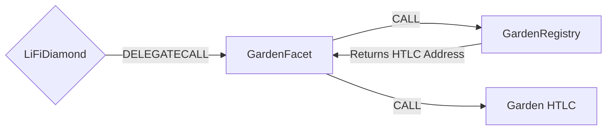

# Garden Facet

## How it works

The Garden Facet enables cross-chain token transfers using the Garden protocol's HTLC (Hash Time Locked Contracts) mechanism. It interfaces with Garden's registry to find the appropriate HTLC contract for each asset and initiates atomic swaps that can be redeemed on the destination chain using a secret.

The facet supports both native tokens and ERC20 tokens. For native tokens, it uses the NULL_ADDRESS as the asset key in the registry lookup. For ERC20 tokens, it uses the token address directly. The facet then calls the `initiateOnBehalf` function on the appropriate HTLC contract to lock the funds.

In Garden's cross-chain model:

- On the source chain: The user initiates the HTLC, and a solver/filler (redeemer) will claim the locked funds with the secret
- On the destination chain: The solver/filler initiates an HTLC, and the user (redeemer) claims the funds with the same secret
- If the HTLC expires without being redeemed, the initiator receives a refund



## Public Methods

- `function startBridgeTokensViaGarden(BridgeData memory _bridgeData, GardenData calldata _gardenData)`
  - Simply bridges tokens using Garden without performing any swaps
- `function swapAndStartBridgeTokensViaGarden(BridgeData memory _bridgeData, LibSwap.SwapData[] calldata _swapData, GardenData calldata _gardenData)`
  - Performs swap(s) before bridging tokens using Garden

## Garden Specific Parameters

The methods listed above take a variable labeled `_gardenData`. This data is specific to Garden and is represented as the following struct type:

```solidity
/// @param redeemer Address that will receive the funds (solver/filler address on source chain)
/// @param timelock Block number after which refund is possible
/// @param secretHash SHA256 hash of the secret for the HTLC
struct GardenData {
  address redeemer;
  uint256 timelock;
  bytes32 secretHash;
}
```

## Swap Data

Some methods accept a `SwapData _swapData` parameter.

Swapping is performed by a swap specific library that expects an array of calldata to can be run on various DEXs (i.e. Uniswap) to make one or multiple swaps before performing another action.

The swap library can be found [here](../src/Libraries/LibSwap.sol).

## LiFi Data

Some methods accept a `BridgeData _bridgeData` parameter.

This parameter is strictly for analytics purposes. It's used to emit events that we can later track and index in our subgraphs and provide data on how our contracts are being used. `BridgeData` and the events we can emit can be found [here](../src/Interfaces/ILiFi.sol).

## Contract Details

### Constructor

The GardenFacet requires a registry address to be provided during deployment:

- `_htlcRegistry`: Address of the Garden HTLC registry contract that maps assets to their HTLC contracts

### Error Handling

The facet includes the following custom error:

- `AssetNotSupported()`: Thrown when attempting to bridge an asset that doesn't have a corresponding HTLC contract in the registry

### Internal Logic

The `_startBridge` function:

1. Determines if the asset is native or ERC20
2. Looks up the appropriate HTLC contract address from the registry
3. For ERC20 tokens: approves the HTLC contract to spend tokens
4. For native tokens: sends value directly with the transaction
5. Calls `initiateOnBehalf` on the HTLC contract with the bridge parameters
6. Emits the `LiFiTransferStarted` event

## Getting Sample Calls to interact with the Facet

In the following some sample calls are shown that allow you to retrieve a populated transaction that can be sent to our contract via your wallet.

All examples use our [/quote endpoint](https://apidocs.li.fi/reference/get_quote) to retrieve a quote which contains a `transactionRequest`. This request can directly be sent to your wallet to trigger the transaction.

The quote result looks like the following:

```javascript
const quoteResult = {
  id: '0x...', // quote id
  type: 'lifi', // the type of the quote (all lifi contract calls have the type "lifi")
  tool: 'garden', // the bridge tool used for the transaction
  action: {}, // information about what is going to happen
  estimate: {}, // information about the estimated outcome of the call
  includedSteps: [], // steps that are executed by the contract as part of this transaction, e.g. a swap step and a cross step
  transactionRequest: {
    // the transaction that can be sent using a wallet
    data: '0x...',
    to: '0x...',
    value: '0x00',
    from: '{YOUR_WALLET_ADDRESS}',
    chainId: 100,
    gasLimit: '0x...',
    gasPrice: '0x...',
  },
}
```

A detailed explanation on how to use the /quote endpoint and how to trigger the transaction can be found [here](https://docs.li.fi/products/more-integration-options/li.fi-api/transferring-tokens-example).

**Hint**: Don't forget to replace `{YOUR_WALLET_ADDRESS}` with your real wallet address in the examples.

### Cross Only

To get a transaction for a transfer from 30 USDC.e on Avalanche to USDC on Binance you can execute the following request:

```shell
curl 'https://li.quest/v1/quote?fromChain=AVA&fromAmount=30000000&fromToken=USDC&toChain=BSC&toToken=USDC&slippage=0.03&allowBridges=garden&fromAddress={YOUR_WALLET_ADDRESS}'
```

### Swap & Cross

To get a transaction for a transfer from 30 USDT on Avalanche to USDC on Binance you can execute the following request:

```shell
curl 'https://li.quest/v1/quote?fromChain=AVA&fromAmount=30000000&fromToken=USDT&toChain=BSC&toToken=USDC&slippage=0.03&allowBridges=garden&fromAddress={YOUR_WALLET_ADDRESS}'
```
