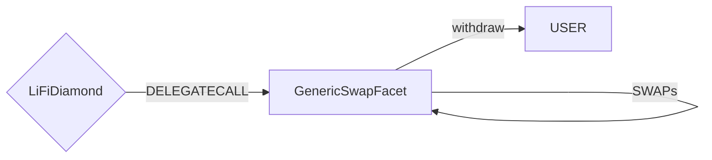

# Generic Swap Facet

## How it works

The Generic Swap Facet is used to make single swaps or multiple same-chain swaps in a single transaction. It will send the result of the (final) swap to the receiver.

It does this by using the [LibSwap](./LibSwap.md) library.

## Public Methods

- `function swapTokensGeneric(bytes32 _transactionId, string calldata _integrator, string calldata _referrer, address payable _receiver, uint256 _minAmount, SwapData[] calldata _swapData)`
  - Performs a single or multiple swap(s) before withdrawing the final token to the user

## Swap Data

Some methods accept a `SwapData _swapData` parameter.

Swapping is performed by a swap specific library that expects an array of calldata to can be run on various DEXs (i.e. Uniswap) to make one or multiple swaps before performing another action.

The swap library can be found [here](../src/Libraries/LibSwap.sol).
