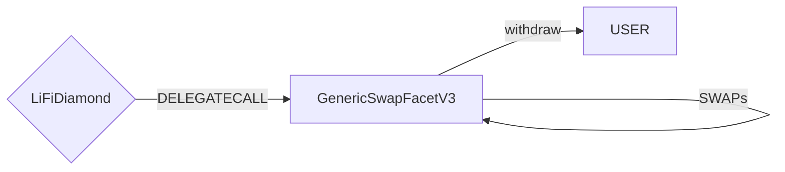

# GenericSwapFacetV3

## How it works

The GenericSwapFacetV3 is a gas-optimized new version of the GenericSwapFacet and offers the same functionality as its predecessor: executing single swaps or multiple same-chain swaps in a single transaction.
It will send the result of the (final) swap to the specified receiver address.
New in this version is that in cases where a DEX does not pull/use all of the inputTokens for a swap (positive slippage), these tokens will be sent to the receiver address.

## Public Methods

- `function swapTokensSingleERC20ToERC20(bytes32 _transactionId,string calldata _integrator,string calldata _referrer,address payable _receive,uint256 _minAmountOut,LibSwap.SwapData calldata _swapData)`

  - Performs a single swap from an ERC20 to another ERC20 token

- `function swapTokensSingleERC20ToNative(bytes32 _transactionId,string calldata _integrator,string calldata _referrer,address payable _receive,uint256 _minAmountOut,LibSwap.SwapData calldata _swapData)`

  - Performs a single swap from an ERC20 to the network's native token

- `function swapTokensSingleNativeToERC20(bytes32 _transactionId,string calldata _integrator,string calldata _referrer,address payable _receive,uint256 _minAmountOut,LibSwap.SwapData calldata _swapData)`

  - Performs a single swap from the network's native token to an ERC20 token

- `function swapTokensGenericV3FromNative(bytes32 _transactionId, string calldata _integrator, string calldata _referrer, address payable _receiver, uint256 _minAmount, SwapData[] calldata _swapData)`

  - Performs multiple swap(s) with the native token as initial input token before withdrawing the final token to the user

- `function swapTokensGenericV3FromERC20(bytes32 _transactionId, string calldata _integrator, string calldata _referrer, address payable _receiver, uint256 _minAmount, SwapData[] calldata _swapData)`
  - Performs multiple swap(s) with any ERC20 token as initial input token before withdrawing the final token to the user

## Swap Data

Some methods accept a `SwapData _swapData` parameter.

This parameter is defined in the following library:

The swap library can be found [here](../src/Libraries/LibSwap.sol).
