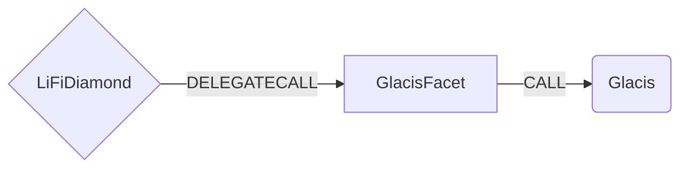

# Glacis Facet

## Version

Current version: 1.2.0  
Glacis Airlift Interface version: 1.1.0

## How it works

The Glacis Facet works by forwarding calls to the [GlacisAirlift](https://github.com/glacislabs/airlift-evm/blob/main/src/facets/GlacisAirliftFacet.sol) core contract on the source chain. Glacis Airlift serves as a unified interface for facilitating token bridging across various native token bridging standards, such as those employed by Axelar, LayerZero, and Wormhole.

With Glacis Airlift v1.1.0+, the facet now supports multibridge routing through the `outputToken` parameter. This enables:

- **Multibridge transfers** for tokens like USDT and LBTC that have multiple bridge implementations
- **HyperLiquid transport** support
- **Backwards compatibility** when using default routing (outputToken = bytes32(0))



## Public Methods

- `function startBridgeTokensViaGlacis(BridgeData calldata _bridgeData, GlacisData calldata _glacisData)`
  - Simply bridges tokens using glacis
- `swapAndStartBridgeTokensViaGlacis(BridgeData memory _bridgeData, LibSwap.SwapData[] calldata _swapData, glacisData memory _glacisData)`
  - Performs swap(s) before bridging tokens using glacis

## glacis Specific Parameters

The methods listed above take a variable labeled `_glacisData`. This data is specific to glacis and is represented as the following struct type:

```solidity
/// @param receiverAddress The address that would receive the tokens on the destination chain
/// @param refundAddress The address that would receive potential refunds on source chain
/// @param nativeFee The fee amount in native token required by the Glacis Airlift
/// @param outputToken The address of the token to receive on the destination chain (use bytes32(0) for default routing)
struct GlacisData {
  bytes32 receiverAddress;
  address refundAddress;
  uint256 nativeFee;
  bytes32 outputToken;
}
```

### Understanding the outputToken Parameter

The `outputToken` parameter enables advanced routing capabilities:

- **Default Routing (`bytes32(0)`)**: When set to `bytes32(0)`, Glacis uses its default routing logic to determine the best bridge and output token. This maintains backwards compatibility with the previous behavior.

- **Specific Token Routing**: When set to a specific token address (padded to bytes32), Glacis will route through a bridge that supports outputting that specific token on the destination chain. This is particularly useful for:
  - **Multibridge tokens**: Tokens like USDT and LBTC that have multiple bridge implementations
  - **HyperLiquid transport**: Enabling transfers to HyperLiquid with specific token requirements
  - **Bridge selection**: Controlling which bridge is used when multiple options are available

#### Examples

```solidity
// Default routing - let Glacis choose the best route
glacisData.outputToken = bytes32(0);

// Specific USDC routing on destination chain
glacisData.outputToken = bytes32(uint160(uint256(0xA0b86991c6218b36c1d19D4a2e9Eb0cE3606eB48)));

// Specific USDT routing (multibridge scenario)
glacisData.outputToken = bytes32(uint160(uint256(0xdAC17F958D2ee523a2206206994597C13D831ec7)));
```

## Swap Data

Some methods accept a `SwapData _swapData` parameter.

Swapping is performed by a swap specific library that expects an array of calldata to can be run on various DEXs (i.e. Uniswap) to make one or multiple swaps before performing another action.

The swap library can be found [here](../src/Libraries/LibSwap.sol).

## LiFi Data

Some methods accept a `BridgeData _bridgeData` parameter.

This parameter is strictly for analytics purposes. It's used to emit events that we can later track and index in our subgraphs and provide data on how our contracts are being used. `BridgeData` and the events we can emit can be found [here](../src/Interfaces/ILiFi.sol).

## Breaking Change Notice

⚠️ **Breaking Change in v1.2.0**: The `GlacisData` struct has been extended with an `outputToken` field. All integrators must update their calldata to include this new field. For backwards compatibility, set `outputToken` to `bytes32(0)` to maintain the default routing behavior.

## Getting Sample Calls to interact with the Facet

In the following some sample calls are shown that allow you to retrieve a populated transaction that can be sent to our contract via your wallet.

All examples use our [/quote endpoint](https://apidocs.li.fi/reference/get_quote) to retrieve a quote which contains a `transactionRequest`. This request can directly be sent to your wallet to trigger the transaction.

The quote result looks like the following:

```javascript
const quoteResult = {
  id: '0x...', // quote id
  type: 'lifi', // the type of the quote (all lifi contract calls have the type "lifi")
  tool: 'glacis', // the bridge tool used for the transaction
  action: {}, // information about what is going to happen
  estimate: {}, // information about the estimated outcome of the call
  includedSteps: [], // steps that are executed by the contract as part of this transaction, e.g. a swap step and a cross step
  transactionRequest: {
    // the transaction that can be sent using a wallet
    data: '0x...',
    to: '0x...',
    value: '0x00',
    from: '{YOUR_WALLET_ADDRESS}',
    chainId: 100,
    gasLimit: '0x...',
    gasPrice: '0x...',
  },
}
```

A detailed explanation on how to use the /quote endpoint and how to trigger the transaction can be found [here](https://docs.li.fi/products/more-integration-options/li.fi-api/transferring-tokens-example).

**Hint**: Don't forget to replace `{YOUR_WALLET_ADDRESS}` with your real wallet address in the examples.

### Cross Only

To get a transaction for a transfer from 30 USDC.e on Avalanche to USDC on Binance you can execute the following request:

```shell
curl 'https://li.quest/v1/quote?fromChain=AVA&fromAmount=30000000&fromToken=USDC&toChain=BSC&toToken=USDC&slippage=0.03&allowBridges=glacis&fromAddress={YOUR_WALLET_ADDRESS}'
```

### Swap & Cross

To get a transaction for a transfer from 30 USDT on Avalanche to USDC on Binance you can execute the following request:

```shell
curl 'https://li.quest/v1/quote?fromChain=AVA&fromAmount=30000000&fromToken=USDT&toChain=BSC&toToken=USDC&slippage=0.03&allowBridges=glacis&fromAddress={YOUR_WALLET_ADDRESS}'
```
