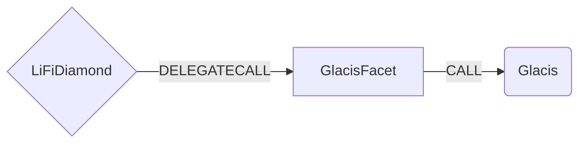

# Glacis Facet

## How it works

The Glacis Facet works by forwarding calls to the [GlacisAirlift](https://github.com/glacislabs/airlift-evm/blob/main/src/facets/GlacisAirliftFacet.sol) core contract on the source chain. Glacis Airlift streamlines diverse mechanisms of General Message Passing protocols (GMPs) like Axelar, LayerZero, Wormhole by integrating interchain transfer adapters for each standard and maintaining a registry of curated addresses associated with the respective interchain tokens. This design allows users to simply specify a token address for bridging. Glacis Airlift automatically forwards the request, along with the necessary bridging data, to the appropriate adapter, ensuring seamless execution of the bridging process.

Bridge doesn’t support stablecoins like **USDT** or **USDC**. They are custom tokens focused. We can find possible routes in [`routes.ts`](https://github.com/glacislabs/airlift-evm/blob/main/node-scripts/src/tests/routes.ts).

The [`send`](https://github.com/glacislabs/airlift-evm/blob/main/src/facets/GlacisAirliftFacet.sol#L94) function is used to execute the cross-chain transfer. 
Before calling [`send`](https://github.com/glacislabs/airlift-evm/blob/main/src/facets/GlacisAirliftFacet.sol#L94), the tokens must first be sent to the contract, as the function assumes the tokens are already in place. This function is preferred over [`sendAfterApproval`](https://github.com/glacislabs/airlift-evm/blob/af935df67c3fff873edea9758ef73cd46e1908c7/src/facets/GlacisAirliftFacet.sol#L112) because it eliminates the need for redundant token transfer steps, as tokens are already transferred to the contract beforehand.



## Public Methods

- `function startBridgeTokensViaGlacis(BridgeData calldata _bridgeData, GlacisData calldata _glacisData)`
  - Simply bridges tokens using glacis
- `swapAndStartBridgeTokensViaGlacis(BridgeData memory _bridgeData, LibSwap.SwapData[] calldata _swapData, glacisData memory _glacisData)`
  - Performs swap(s) before bridging tokens using glacis

## glacis Specific Parameters

The methods listed above take a variable labeled `_glacisData`. This data is specific to glacis and is represented as the following struct type:

```solidity
/// @param refundAddress Refund address
/// @param nativeFee The fee amount in native token required by the Glacis Airlift.
struct GlacisData {
    address refundAddress;
    uint256 nativeFee;
}
```

## Swap Data

Some methods accept a `SwapData _swapData` parameter.

Swapping is performed by a swap specific library that expects an array of calldata to can be run on various DEXs (i.e. Uniswap) to make one or multiple swaps before performing another action.

The swap library can be found [here](../src/Libraries/LibSwap.sol).

## LiFi Data

Some methods accept a `BridgeData _bridgeData` parameter.

This parameter is strictly for analytics purposes. It's used to emit events that we can later track and index in our subgraphs and provide data on how our contracts are being used. `BridgeData` and the events we can emit can be found [here](../src/Interfaces/ILiFi.sol).

## Getting Sample Calls to interact with the Facet

In the following some sample calls are shown that allow you to retrieve a populated transaction that can be sent to our contract via your wallet.

All examples use our [/quote endpoint](https://apidocs.li.fi/reference/get_quote) to retrieve a quote which contains a `transactionRequest`. This request can directly be sent to your wallet to trigger the transaction.

The quote result looks like the following:

```javascript
const quoteResult = {
  id: '0x...', // quote id
  type: 'lifi', // the type of the quote (all lifi contract calls have the type "lifi")
  tool: 'glacis', // the bridge tool used for the transaction
  action: {}, // information about what is going to happen
  estimate: {}, // information about the estimated outcome of the call
  includedSteps: [], // steps that are executed by the contract as part of this transaction, e.g. a swap step and a cross step
  transactionRequest: {
    // the transaction that can be sent using a wallet
    data: '0x...',
    to: '0x...',
    value: '0x00',
    from: '{YOUR_WALLET_ADDRESS}',
    chainId: 100,
    gasLimit: '0x...',
    gasPrice: '0x...',
  },
}
```

A detailed explanation on how to use the /quote endpoint and how to trigger the transaction can be found [here](https://docs.li.fi/products/more-integration-options/li.fi-api/transferring-tokens-example).

**Hint**: Don't forget to replace `{YOUR_WALLET_ADDRESS}` with your real wallet address in the examples.

### Cross Only

To get a transaction for a transfer from 30 USDC.e on Avalanche to USDC on Binance you can execute the following request:

```shell
curl 'https://li.quest/v1/quote?fromChain=AVA&fromAmount=30000000&fromToken=USDC&toChain=BSC&toToken=USDC&slippage=0.03&allowBridges=glacis&fromAddress={YOUR_WALLET_ADDRESS}'
```

### Swap & Cross

To get a transaction for a transfer from 30 USDT on Avalanche to USDC on Binance you can execute the following request:

```shell
curl 'https://li.quest/v1/quote?fromChain=AVA&fromAmount=30000000&fromToken=USDT&toChain=BSC&toToken=USDC&slippage=0.03&allowBridges=glacis&fromAddress={YOUR_WALLET_ADDRESS}'
```
