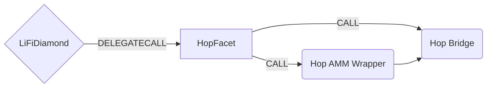

# Hop Facet

## How it works

The Hop Facet works by forwarding Hop specific calls to the Hop Bridge contract. Hop works by swapping tokens into intermediate h tokens before bridging. For example to send USDC from one chain to another, we need to swap USDC for hUSDC and then send them to the Hop bridge contract. Hop provides a useful wrapper contract to do this for us so we only need to worry about sending USDC and calling `swapAndSend` on the wrapper. Native tokens like `ETH` can be sent directly to the bridge.



## Public Methods

- `function initHop( string[] memory _tokens, IHopBridge.BridgeConfig[] memory _bridgeConfigs, uint256 _chainId)`
  - Initializer method. Sets chainId,Hop bridge and Hop wrapper contracts for the specific chain
- `function startBridgeTokensViaHop(LiFiData memory _lifiData, HopData calldata _hopData)`
  - Simply bridges tokens using Hop
- `function swapAndStartBridgeTokensViaHop( LiFiData memory _lifiData, LibSwap.SwapData[] calldata _swapData, HopData memory _hopData)`
  - Performs swap(s) before bridging tokens using Hop

## NXTP Specific Parameters

Some of the methods listed above take a variable labeled `_hopData`. This data is specific to Hop and is represented as the following struct type:

```solidity
/**
 * @param asset The symbol of the asset token being bridged. E.g. USDC.
 * @param recipient The address of the token recipient after bridging.
 * @param chainId The chainId of the chain to bridge to.
 * @param amount The amount of tokens to bridge.
 * @param bonderFee The amount to pay bonders for facilitating the bridge.
 * @param amountOutMin The minimum acceptable amount of hTokens to receive after swapping via the wrapper.
 * @param deadline The time the transaction must be completed or revert.
 * @param destinationAmountOutMin The minimum acceptable amount of tokens to receive after bridging.
 * @param destinationDeadline The time the transaction must be completed or revert.
 */
struct HopData {
  string asset;
  address recipient;
  uint256 chainId;
  uint256 amount;
  uint256 bonderFee;
  uint256 amountOutMin;
  uint256 deadline;
  uint256 destinationAmountOutMin;
  uint256 destinationDeadline;
}

```
