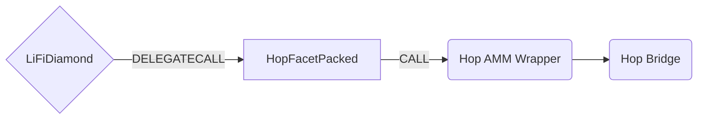

# Hop Facet Packed

## How it works

The Hop Facet Packed works by forwarding Hop specific calls to the [Hop Bridge contract](https://github.com/hop-protocol/contracts/blob/master/contracts/bridges/L2_Bridge.sol). Hop works by swapping tokens into intermediate **h** tokens before bridging. For example to send **USDC** from one chain to another, we need to swap **USDC** for **hUSDC** and then send them to the Hop bridge contract. Hop provides a useful [wrapper contract](https://github.com/hop-protocol/contracts/blob/master/contracts/bridges/L2_AmmWrapper.sol#L40) to do this for us so we only need to worry about sending **USDC** and calling [`swapAndSend`](https://github.com/hop-protocol/contracts/blob/3747b0b41defddc5b3c8ca328057847cd987c2c8/contracts/bridges/L2_AmmWrapper.sol#L40-L78) on the wrapper.



## Public Methods

- `function startBridgeTokensViaHopL2NativePacked()`
  - Bridge native assets by passing custom encoded callData
- `function startBridgeTokensViaHopL2NativeMin(bytes8 transactionId, address receiver, uint256 destinationChainId, uint256 bonderFee, uint256 amountOutMin, uint256 destinationAmountOutMin, uint256 destinationDeadline, address hopBridge)`
  - Bridge native assets by passing minimal required parameters
- `function encode_startBridgeTokensViaHopL2NativePacked(bytes8 transactionId, address receiver, uint256 destinationChainId, uint256 bonderFee, uint256 amountOutMin)`
  - Generate packed transaction data based on minimal required parameters for native asset transfers
- `function startBridgeTokensViaHopL2ERC20Packed()`
  - Bridge ERC20 tokens by passing custom encoded callData
- `function startBridgeTokensViaHopL2ERC20Min(bytes8 transactionId, address receiver, uint256 destinationChainId, address sendingAssetId, uint256 minAmount, uint256 bonderFee, uint256 amountOutMin, uint256 destinationAmountOutMin, uint256 destinationDeadline, address hopBridge)`
  - Bridge ERC20 tokens by passing minimal required parameters
- `function encode_startBridgeTokensViaHopL2ERC20Packed(bytes32 transactionId, address receiver, uint256 destinationChainId, address sendingAssetId, uint256 minAmount, uint256 bonderFee, uint256 amountOutMin, uint256 destinationAmountOutMin, uint256 destinationDeadline, address wrapper)`
  - Generate packed transaction data based on minimal required parameters for ERC20 token transfers
- `startBridgeTokensViaHopL1NativeMin(bytes8 transactionId, address receiver, uint256 destinationChainId, uint256 destinationAmountOutMin, address relayer, uint256 relayerFee, address hopBridge)`
  - Bridge native assets from ethereum by passing minimal required parameters
- `function startBridgeTokensViaHopL1ERC20Min(bytes8 transactionId, address receiver, uint256 destinationChainId, address sendingAssetId, uint256 minAmount, uint256 destinationAmountOutMin, address relayer, uint256 relayerFee, address hopBridge)`
  - Bridge ERC20 tokens from ethereum by passing minimal required parameters

## Parameters

Most parameters are specific for how the hop protocol works.
- `receiver`: Receiving wallet address
- `bonderFee`: Fees payed to hop bonder
- `amountOutMin`: Source swap minimal accepted amount
- `destinationChainId`: Receiving chain
- `destinationAmountOutMin`: Destination swap minimal accepted amount
- `destinationDeadline`: Destination swap maximal time
- `hopBridge`: Address of the Hop L2_AmmWrapper or L1_Bridge
- `sendingAssetId`: Address of the source asset to bridge (only needed when passing ERC20 tokens)
- `amount`: Amount of the source asset to bridge (only needed when passing ERC20 tokens)
- `wrapper`: Address of the Hop L2_AmmWrapper

Additional parameters are passed to track transfers on chain:
- `transactionId`: Custom transaction ID for tracking
- `integrator`: LI.FI partner name

## Packed Parameters

In order to pass as little data as possible when calling the `*Packed` methods, the parameters are restricted in length and concatenated manually to avoid any additional padding. The contract expects them to have those fixed lengths to be able to extract data from the passed callData. When generating the parameter the backend has to check that the values fit into the restricted length to ensure a lossless compression.

Most parameters are specific for how the hop protocol works.
- `transactionId`: `bytes8`
- `integrator`: `bytes16` = 16 characters
- `receiver`: `bytes20` = lossless length of EVM addresses
- `bonderFee`: `uint128 > bytes16` = restricted value range*
- `amountOutMin`: `uint128 > bytes16` = restricted value range*
- `destinationChainId`: `uint32 > bytes4` = big enough to include all major chains
- `destinationAmountOutMin`: `uint128 > bytes16` = restricted value range*
- `destinationDeadline`: `uint32 > bytes4` = restricted value range*
- `hopBridge`: `bytes20` = lossless length of EVM addresses
- `sendingAssetId`: `bytes20` = lossless length of EVM addresses
- `amount`: `uint128 > bytes16` = restricted value range*
- `wrapper`:`bytes20` = lossless length of EVM addresses

*restricted value range: Considering a token with 18 decimals `uint128` still allows to pass 340 Quintillion (`10**18`) tokens, which will be more than the available liquidity of all tokens supported by Hop.

Solidity based example to manually generate the callData:
```solidity
bytes memory packedNative = bytes.concat(
   HopFacetPacked.startBridgeTokensViaHopL2NativePacked.selector,
    bytes8("someID"), // transactionId
    bytes20(RECEIVER_ADDRESS), // receiver
    bytes4(uint32(137)), // destinationChainId
    bytes16(uint128(amountBonderFeeNative)), // bonderFee
    bytes16(uint128(amountOutMinNative)) // amountOutMin
);
```

The contract offers a pure helper method to does this work for you:
```solidity
bytes memory encodedNative = hopFacetPacked.encode_startBridgeTokensViaHopL2NativePacked(
    "someID",
    RECEIVER_ADDRESS,
    137,
    amountBonderFeeNative,
    amountOutMinNative
);
```

To execute the call just pass the encoded bytes and the required amount to the contract:
```
(bool success, ) = address(diamond).call{value: amountNative}(packedNative);
```

## Getting Sample Calls to interact with the Facet

In order to interact with this optimized facet it is best to only use requests directly returned by the LI.FI API to ensure the packed parameters are formatted right.

Will be available on the API soon.
