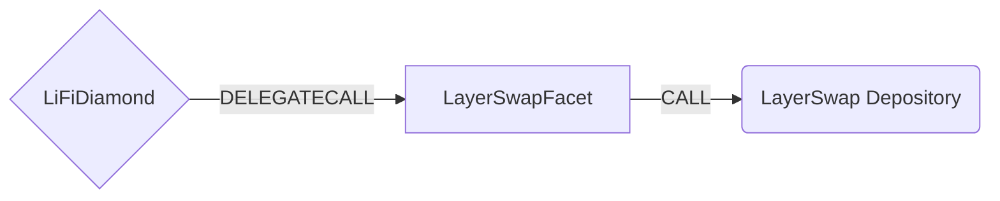

# LayerSwap Facet

## How it works

The LayerSwap Facet bridges tokens by depositing them into the LayerSwap
Depository contract on the source chain. The depository forwards the deposited
funds to a whitelisted receiver controlled by LayerSwap, and LayerSwap
completes the bridge on the destination chain off-chain using the `requestId`
correlated with an order created via the LayerSwap API.



## Public Methods

- `function startBridgeTokensViaLayerSwap(BridgeData calldata _bridgeData, LayerSwapData calldata _layerSwapData)`
  - Simply bridges tokens using LayerSwap
- `swapAndStartBridgeTokensViaLayerSwap(BridgeData memory _bridgeData, LibSwap.SwapData[] calldata _swapData, LayerSwapData memory _layerSwapData)`
  - Performs swap(s) before bridging tokens using LayerSwap

## LayerSwap Specific Parameters

The methods listed above take a variable labeled `_layerSwapData`. This data
is specific to LayerSwap and is represented as the following struct type:

```solidity
/// @param requestId LayerSwap swap id (from POST /api/v2/swaps), passed as
///        the `id` argument to the depository
/// @param depositoryReceiver Whitelisted address that the LayerSwap
///        Depository forwards the deposited funds to on the source chain;
///        supplied by the LI.FI backend per call. Distinct from
///        `bridgeData.receiver`, which is the final recipient on the
///        destination chain.
/// @param nonEVMReceiver set only if bridging to non-EVM chain
/// @param signature EIP-712 signature from the backend signer
/// @param deadline signature expiration timestamp
struct LayerSwapData {
  bytes32 requestId;
  address depositoryReceiver;
  bytes32 nonEVMReceiver;
  bytes signature;
  uint256 deadline;
}
```

The depository address is configured at deploy time as an immutable
constructor argument. The `depositoryReceiver` is supplied by the LI.FI
backend in `_layerSwapData` per call, so LayerSwap can rotate or use
different receivers without redeploying the facet.

## EIP-712 Signature Verification

Every call requires an EIP-712 signature from the authorized backend signer
to cryptographically bind the `requestId` to the destination `receiver`
(and `nonEVMReceiver` for non-EVM chains). This prevents an attacker from
funding a LayerSwap order created for a different destination.

The signed payload (`LayerSwapPayload`) covers:

| Field | Source |
|-------|--------|
| `transactionId` | `bridgeData` |
| `minAmount` | `bridgeData` |
| `receiver` | `bridgeData` |
| `requestId` | `layerSwapData` |
| `depositoryReceiver` | `layerSwapData` |
| `nonEVMReceiver` | `layerSwapData` |
| `destinationChainId` | `bridgeData` |
| `sendingAssetId` | `bridgeData` |
| `deadline` | `layerSwapData` |

**EIP-712 domain:**
- Name: `LI.FI LayerSwap Facet`
- Version: `1`
- Chain ID: source chain
- Verifying contract: diamond proxy address

**Error conditions:**
- `InvalidSignature()` — signature verification failed
- `SignatureExpired()` — `block.timestamp > deadline`
- `RequestAlreadyProcessed()` — `requestId` already used (replay protection)

## Swap Data

Some methods accept a `SwapData _swapData` parameter.

Swapping is performed by a swap specific library that expects an array of
calldata to can be run on various DEXs (i.e. Uniswap) to make one or multiple
swaps before performing another action.

The swap library can be found [here](../src/Libraries/LibSwap.sol).

## LiFi Data

Some methods accept a `BridgeData _bridgeData` parameter.

This parameter is strictly for analytics purposes. It's used to emit events
that we can later track and index in our subgraphs and provide data on how our
contracts are being used. `BridgeData` and the events we can emit can be found
[here](../src/Interfaces/ILiFi.sol).

## Getting Sample Calls to interact with the Facet

In the following some sample calls are shown that allow you to retrieve a populated transaction that can be sent to our contract via your wallet.

All examples use our [/quote endpoint](https://apidocs.li.fi/reference/get_quote) to retrieve a quote which contains a `transactionRequest`. This request can directly be sent to your wallet to trigger the transaction.

The quote result looks like the following:

```javascript
const quoteResult = {
  id: '0x...', // quote id
  type: 'lifi', // the type of the quote (all lifi contract calls have the type "lifi")
  tool: 'layerSwap', // the bridge tool used for the transaction
  action: {}, // information about what is going to happen
  estimate: {}, // information about the estimated outcome of the call
  includedSteps: [], // steps that are executed by the contract as part of this transaction, e.g. a swap step and a cross step
  transactionRequest: {
    // the transaction that can be sent using a wallet
    data: '0x...',
    to: '0x...',
    value: '0x00',
    from: '{YOUR_WALLET_ADDRESS}',
    chainId: 100,
    gasLimit: '0x...',
    gasPrice: '0x...',
  },
}
```

A detailed explanation on how to use the /quote endpoint and how to trigger the transaction can be found [here](https://docs.li.fi/products/more-integration-options/li.fi-api/transferring-tokens-example).

**Hint**: Don't forget to replace `{YOUR_WALLET_ADDRESS}` with your real wallet address in the examples.

### Cross Only

To get a transaction for a transfer from 30 USDC.e on Avalanche to USDC on Binance you can execute the following request:

```shell
curl 'https://li.quest/v1/quote?fromChain=AVA&fromAmount=30000000&fromToken=USDC&toChain=BSC&toToken=USDC&slippage=0.03&allowBridges=layerSwap&fromAddress={YOUR_WALLET_ADDRESS}'
```

### Swap & Cross

To get a transaction for a transfer from 30 USDT on Avalanche to USDC on Binance you can execute the following request:

```shell
curl 'https://li.quest/v1/quote?fromChain=AVA&fromAmount=30000000&fromToken=USDT&toChain=BSC&toToken=USDC&slippage=0.03&allowBridges=layerSwap&fromAddress={YOUR_WALLET_ADDRESS}'
```
