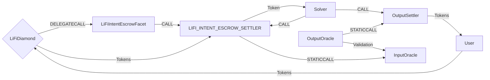

# LIFIIntent Facet

## How it works

LI.FI Intent Escrow uses a built-in escrow as a deposit mechanism for its intents. The LI.FI Intent Escrow Facet deposits into the Escrow Input Settler, which will release the deposited funds to the solver when the fill has been proven. The system is self-serve, with the facet wrapping the deposit logic to ensure the appropriate parameters are called for the user to receive their output.



## Public Methods

- `function startBridgeTokensViaLiFiIntentEscrow(BridgeData calldata _bridgeData, LiFiIntentEscrowData calldata _lifiIntentData)`
  - Simply bridges tokens using LIFIIntent
- `swapAndStartBridgeTokensViaLiFiIntentEscrow(BridgeData memory _bridgeData, LibSwap.SwapData[] calldata _swapData, LiFiIntentEscrowData memory _lifiIntentData)`
  - Performs swap(s) before bridging tokens using LIFIIntent

## Destination Calls

The LI.FI intent facet supports destination swaps using the periphery contract `ReceiverOIF`.
Destination swaps require configuring `.dstCallReceiver` to an instance of `ReceiverOIF` and `dstCallSwapData` as a list of SwapData. When `dstCallSwapData.length` > 0, the recipient will be replaced with `.dstCallReceiver` and instead encoded in data to be executed by `ReceiverOIF`. The `BridgeData.hasDestinationCall` flag must be set to `true`.

## LIFIIntent Specific Parameters

The methods listed above take a variable labeled `_lifiIntentData`. This data is specific to LIFIIntent and is represented as the following struct type:

```solidity
/// @param dstCallReceiver If dstCallSwapData.length > 0, has to be provided as a deployment of `ReceiverOIF`. Otherwise ignored.
/// @param recipient The end recipient of the swap. If no calldata is included, will be a simple recipient, otherwise it will be encoded as the end destination for the swaps.
/// @param depositAndRefundAddress The deposit and claim registration will be made for. If any refund is made, it will be sent to this address
/// @param nonce OrderId mixer. Used within the intent system to generate unique orderIds for each user. Should not be reused for `depositAndRefundAddress`
/// @param expires If the proof for the fill does not arrive before this time, the claim expires
/// @param fillDeadline The fill has to happen before this time
/// @param inputOracle Address of the validation layer used on the input chain
/// @param outputOracle Address of the validation layer used on the output chain
/// @param outputSettler Address of the output settlement contract containing the fill logic
/// @param outputToken The desired destination token
/// @param outputAmount The amount of the desired token
/// @param dstCallSwapData List of swaps to be executed on the destination chain. Is called on dstCallReceiver. If empty no call is made.
/// @param outputContext Context for the outputSettler to identify the order type
struct LiFiIntentEscrowData {
  // Goes into StandardOrder.outputs.recipient if .dstCallSwapData.length > 0
  bytes32 dstCallReceiver;
  // Goes into StandardOrder.outputs.recipient if .dstCallSwapData.length == 0
  bytes32 recipient;
  /// BatchClaim
  address depositAndRefundAddress; // StandardOrder.user
  uint256 nonce; // StandardOrder.nonce
  uint32 expires; // StandardOrder.expiry
  uint32 fillDeadline; // StandardOrder.fillDeadline
  address inputOracle; // StandardOrder.inputOracle
  bytes32 outputOracle; // StandardOrder.outputs.oracle
  bytes32 outputSettler; // StandardOrder.outputs.settler
  bytes32 outputToken; // StandardOrder.outputs.token
  uint256 outputAmount; // StandardOrder.outputs.amount
  LibSwap.SwapData[] dstCallSwapData; // Goes into StandardOrder.outputs.callbackData
  bytes outputContext; // StandardOrder.outputs.context
}
```

## Swap Data

Some methods accept a `SwapData _swapData` parameter.

Swapping is performed by a swap specific library that expects an array of calldata to can be run on various DEXs (i.e. Uniswap) to make one or multiple swaps before performing another action.

The swap library can be found [here](../src/Libraries/LibSwap.sol).

## LiFi Data

Some methods accept a `BridgeData _bridgeData` parameter.

This parameter is strictly for analytics purposes. It's used to emit events that we can later track and index in our subgraphs and provide data on how our contracts are being used. `BridgeData` and the events we can emit can be found [here](../src/Interfaces/ILiFi.sol).

## Getting Sample Calls to interact with the Facet

In the following some sample calls are shown that allow you to retrieve a populated transaction that can be sent to our contract via your wallet.

All examples use our [/quote endpoint](https://apidocs.li.fi/reference/get_quote) to retrieve a quote which contains a `transactionRequest`. This request can directly be sent to your wallet to trigger the transaction.

The quote result looks like the following:

```javascript
const quoteResult = {
  id: '0x...', // quote id
  type: 'lifi', // the type of the quote (all lifi contract calls have the type "lifi")
  tool: 'LIFIIntent', // the bridge tool used for the transaction
  action: {}, // information about what is going to happen
  estimate: {}, // information about the estimated outcome of the call
  includedSteps: [], // steps that are executed by the contract as part of this transaction, e.g. a swap step and a cross step
  transactionRequest: {
    // the transaction that can be sent using a wallet
    data: '0x...',
    to: '0x...',
    value: '0x00',
    from: '{YOUR_WALLET_ADDRESS}',
    chainId: 100,
    gasLimit: '0x...',
    gasPrice: '0x...',
  },
}
```

A detailed explanation on how to use the /quote endpoint and how to trigger the transaction can be found [here](https://docs.li.fi/products/more-integration-options/li.fi-api/transferring-tokens-example).

**Hint**: Don't forget to replace `{YOUR_WALLET_ADDRESS}` with your real wallet address in the examples.

### Cross Only

To get a transaction for a transfer from 30 USDC.e on Avalanche to USDC on Binance you can execute the following request:

```shell
curl 'https://li.quest/v1/quote?fromChain=AVA&fromAmount=30000000&fromToken=USDC&toChain=BSC&toToken=USDC&slippage=0.03&allowBridges=LIFIIntent&fromAddress={YOUR_WALLET_ADDRESS}'
```

### Swap & Cross

To get a transaction for a transfer from 30 USDT on Avalanche to USDC on Binance you can execute the following request:

```shell
curl 'https://li.quest/v1/quote?fromChain=AVA&fromAmount=30000000&fromToken=USDT&toChain=BSC&toToken=USDC&slippage=0.03&allowBridges=LIFIIntent&fromAddress={YOUR_WALLET_ADDRESS}'
```
