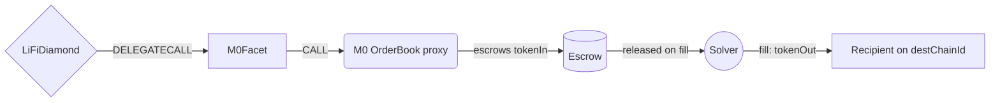

# M0 Facet

## How it works

The M0 Facet bridges tokens by opening an escrowed limit order on the M0 `OrderBook`.
The OrderBook is not a bridge in the usual sense: `openOrder` pulls the sending asset
into escrow and returns immediately, and a **solver** settles the order later by
delivering `tokenOut` to the recipient on the destination chain. Nothing about the
destination leg happens inside the LI.FI transaction.

Because an order is escrow plus a limit price, the same mechanism covers three route
shapes with one entrypoint pair:

| Route | `bridgeData.destinationChainId` | Settled by |
| --- | --- | --- |
| Cross-chain EVM → EVM | destination chain id | Solver on the destination chain |
| Cross-chain EVM → Solana | `LIFI_CHAIN_ID_SOLANA`, translated to `1399811149` | Solver on Solana |
| Same-chain | the source chain id | Solver on the source chain |



The facet validates only the **bindings** between `bridgeData` and `M0Data` and forwards
everything else. The reasoning is in "Trust model" below.

## Money flow and refund flow

### Step 0 — before the call

The caller (`msg.sender`) holds `bridgeData.minAmount` of `bridgeData.sendingAssetId`
(or, on the swap path, the swap input asset) and has approved the LiFiDiamond. The caller
may be the end user, a relayer, or the `Permit2Proxy` — the facet never assumes it is the
user, which is why every value sink is an explicit field (`refundRecipient`, `orderOwner`)
rather than `msg.sender`.

### Who holds the funds, step by step

`startBridgeTokensViaM0` (non-payable):

1. `LibAsset.depositAsset` pulls `minAmount` from `msg.sender`. **The diamond holds the
   tokens.**
2. `LibAsset.maxApproveERC20` raises the diamond's allowance for the OrderBook to
   `type(uint256).max` if the current allowance is short.
3. `openOrder` pulls exactly `amountIn` from the diamond. **The OrderBook escrow holds the
   tokens**; the diamond's balance returns to zero.
4. `BridgeToNonEVMChainBytes32` (non-EVM only) and `LiFiTransferStarted` are emitted and
   the call returns. No native value moves on this path.

`swapAndStartBridgeTokensViaM0` (payable) inserts a swap before step 1:

1. `_depositAndSwap` pulls the swap input, runs the swap(s), and sweeps leftover **input**
   and **intermediate** assets to `refundRecipient`. `SwapperV2._refundLeftovers` never
   sweeps the final receiving asset, so positive slippage on it is not swept: **the
   diamond holds the whole swap output, surplus included.**
2. `amountOut` is scaled to the realized output (see "`amountOut` is a limit price").
3. Escrow proceeds exactly as above, with `bridgeData.minAmount` set to the realized swap
   output.
4. The `refundExcessNative(refundRecipient)` modifier returns unspent `msg.value` to
   `refundRecipient` as the call unwinds.

The diamond is **never** intended to custody funds: it holds the sending asset only
between the deposit/swap and `openOrder`, within a single transaction.

### Where value goes on every failure branch

Everything up to and including `openOrder` is one atomic transaction, so every revert in
that window leaves the caller with their funds and no residual state — including the max
allowance from step 2, which is rolled back with the rest of the transaction.

| Failure | Where the value ends up |
| --- | --- |
| Facet validation (`InvalidCallData`, `InformationMismatch`, `InvalidNonEVMReceiver`, `InvalidReceiver`, `InvalidAmount`) | Revert before any transfer — caller keeps everything |
| `depositAsset` (missing balance or allowance) | Revert — caller keeps everything |
| Swap fails, or its output is below `bridgeData.minAmount` | `_depositAndSwap` reverts — caller keeps everything |
| Scaled `amountOut` rounds to `0` (`InvalidAmount`) | Revert, swap rolled back — caller keeps everything |
| `destinationChainId` does not fit in `uint32` — the large LI.FI non-EVM ids (Aptos, Sui, Tron, …); `LIFI_CHAIN_ID_SOLANA` is translated first and `LIFI_CHAIN_ID_HYPERCORE` (1337) already fits, so neither reverts here. `_toM0ChainId` narrows the rest with `SafeCastLib.toUint32` | Revert with solady's `Overflow()`, not a LI.FI error — caller keeps everything |
| `bridgeData.minAmount` does not fit in `uint128` (`SafeCastLib.toUint128` on `amountIn`) | Revert with solady's `Overflow()` — caller keeps everything, swap rolled back on the swap path |
| Scaled `amountOut` does not fit in `uint128` (`SafeCastLib.toUint128`) | Revert with solady's `Overflow()` — caller keeps everything, swap rolled back |
| `openOrder` reverts (paused, unsupported destination, zero amount, deadline in the past, `solver == recipient`, same-token order) | Revert — caller keeps everything, escrow never funded |
| `refundRecipient` rejects native on the swap path | `refundExcessNative` reverts the whole call — self-inflicted, caller keeps everything |
| **Order opened, solver fills** | `amountOut` of `tokenOut` to `receiverAddress` on `destChainId`; escrowed `tokenIn` released to the solver. A partial fill releases `tokenIn` pro rata at the order's exchange rate |
| **Order opened, nobody fills** | `tokenIn` stays in escrow until the order is cancelled; the refund is paid to `orderOwner` on the **origin** chain (see "Cancellation") |

After `openOrder` returns, the funds are in M0's escrow and outside LI.FI's control. No
LI.FI contract can recover, cancel, or re-route them.

## Trust model: an upgradeable, pausable OrderBook

The OrderBook is a **transparent upgradeable proxy** with `AccessControl` + `Pausable`
and ERC-7201 storage, deployed deterministically at
`0xe39B012AB3b20E94a9beEa557eB0DE4171D4D3E4` (verified on Ethereum, Base and Arbitrum).
The diamond grants it a **max ERC20 allowance** for the sending asset, and that allowance
outlives the transaction. Two consequences follow, and integrators should understand
both:

- The allowance is only ever drawn against a balance the diamond holds transiently inside
  a single call. The diamond holds no idle inventory, so a max allowance to an upgradeable
  spender does not put resting funds at risk — this is the same approval pattern every
  LI.FI bridge facet uses.
- What the OrderBook does with an order **can change by upgrade**, and orders can be
  paused. Mirroring its protocol rules in the facet would bake in assumptions that an
  upgrade can silently invalidate: a rule the facet re-implements can drift from the rule
  the OrderBook enforces, and the failure mode of drift is a facet that rejects valid
  orders — or that admits orders the OrderBook has since redefined.

That is why the facet validates only what it is the authority on — the bindings between
the analytics/event data (`bridgeData`) and the order it actually opens — and delegates
every protocol rule:

| Checked by the facet | Delegated to the OrderBook |
| --- | --- |
| `refundRecipient != address(0)` → `InvalidCallData` | `fillDeadline` sanity |
| `orderOwner != address(0)` → `InvalidCallData` | `amountIn` / `amountOut` non-zero |
| `tokenOut != bytes32(0)` → `InvalidCallData` (the OrderBook never checks it, and a zero `tokenOut` escrows funds into an order no solver can fill) | `solver == recipient` collision |
| EVM: `receiverAddress == bridgeData.receiver` → `InformationMismatch` | `isDestinationSupported(destChainId)` |
| Non-EVM: `receiverAddress != bytes32(0)` → `InvalidNonEVMReceiver` | Same-token orders |
| Swap path: last swap's `receivingAssetId == bridgeData.sendingAssetId` → `InformationMismatch` | Pause state |
| `bridgeData.receiver != address(0)` and `minAmount != 0` (custom `validateBridgeDataM0` modifier) | Solver allowlisting and settlement |

## Cancellation

This is the part that differs most from the bridges LI.FI usually integrates, and the
part worth reading before wiring up a UI.

Most bridges refund on the **origin** chain with no user action: the relayer or the
protocol returns the funds to the sender when the transfer expires, and the user does
nothing. M0 does not. The OrderBook accepts a cancellation only on the chain the order
names as its destination (it requires `block.chainid == destChainId`), and everything
else about the flow follows from whether that chain is remote or local.

One thing is constant: the refund is always paid on the **origin** chain to `orderOwner`
(`OrderParams.sender`) — not to the diamond, not to the `msg.sender` of the original
bridge call, and not to `refundRecipient`.

| Cancellation | Cross-chain order | Same-chain order |
| --- | --- | --- |
| Sent on | The destination chain | The single chain involved |
| Who may cancel before `fillDeadline` | `receiverAddress` (the order's `recipient`) only | `receiverAddress` **or** `orderOwner` |
| Who may cancel after `fillDeadline` | Anyone | Anyone |
| `msg.value` | Pays for the Portal message back to the origin chain | Must be `0`; a non-zero value reverts `InvalidMsgValue` |
| Refund to `orderOwner` | On the origin chain, once the Portal message arrives | Immediately, inside the cancelling transaction |

The asymmetry before `fillDeadline` comes from a single authorisation rule: the OrderBook
admits the `recipient`, or the order's `sender` when `originChainId == block.chainid`. On
a cross-chain order the cancellation runs on the destination chain, where that second
branch can never hold, so `orderOwner` has no pre-deadline right. On a same-chain order
origin and destination are the same chain, both branches are live, and there is no Portal
message to pay for — which is why a UI that reuses the cross-chain call here, attaching a
fee as `msg.value`, reverts `InvalidMsgValue` every time.

Practical implications:

- `orderOwner` must be an address the end user controls **on the origin chain** — that is
  where the refund lands in both cases.
- For a cross-chain order, `receiverAddress` is best an address the user can transact from
  on the destination chain, holding native gas there. That is a convenience, not a
  recovery precondition: before `fillDeadline` the recipient can instead sign an EIP-712
  cancellation and let a relayer submit it through `cancelOrderFor`, and after
  `fillDeadline` cancellation is permissionless, so anyone — including a LI.FI relayer —
  can send it.
- An unfilled order is not self-healing. A UI or backend that treats "no fill by
  `fillDeadline`" as "funds are on their way back" will be wrong: someone still has to
  send the cancellation, and on a cross-chain order pay for it.
- `orderOwner` is deliberately a separate field from `refundRecipient`: the OrderBook
  refund is issued by the protocol long after this transaction returns, while
  `refundRecipient` is paid within it.

## Same-chain orders are asynchronous escrow, not atomic swaps

`validateBridgeDataM0` omits `Validatable.validateBridgeData`'s
`CannotBridgeToSameNetwork` guard, and the OrderBook's `isDestinationSupported()`
short-circuits to `true` when `destChainId == block.chainid`. A same-chain order is
therefore a first-class route.

It is **not** a same-chain swap. When `startBridgeTokensViaM0` returns, the user holds
nothing: the sending asset is escrowed, and the output arrives only when a solver fills
the order, in a later transaction. If nobody fills it, the escrow is unwound by a
cancellation — but a local one, which `orderOwner` can send itself before `fillDeadline`
and which must carry `msg.value == 0`, not the destination-chain, Portal-paid cancellation
a cross-chain order needs (see "Cancellation").

That is why both entrypoints emit `LiFiTransferStarted` and never `GenericSwapCompleted`.
`GenericSwapCompleted` asserts a completed, atomic same-chain swap; emitting it here would
tell every downstream indexer that the user already has their tokens when the fill may be
minutes away, or may never happen.

## `amountOut` is a limit price, not a slippage floor

`M0Data.amountOut` is the amount of `tokenOut` the order asks for. The OrderBook treats it
as an **exchange rate**: a partial fill releases `tokenIn` pro rata at that rate. It is not
a minimum-received guard on a single settlement, and there is no separate `amountOutMin`
to set.

### Scaling on the swap path

`swapAndStartBridgeTokensViaM0` quotes `amountOut` against the **pre-swap**
`bridgeData.minAmount` and then scales it by the realized swap output:

```text
scaledAmountOut = amountOut * receivedAmount / quotedAmountIn
```

where `quotedAmountIn` is `bridgeData.minAmount` as passed in (the swap floor) and
`receivedAmount` is what `_depositAndSwap` actually produced. `_depositAndSwap` reverts
below the floor, so the ratio is always `>= 1`: the scaling either leaves `amountOut`
untouched or raises it in proportion to positive swap slippage. A scaled value of `0`
reverts with `InvalidAmount`.

Forwarding the unscaled quote instead would hand the swap's positive slippage to the
solver as a better exchange rate. Scaling buys proportionally more `tokenOut` for the
user.

### Example

```text
backend quote:
  bridgeData.minAmount:  1,000 USDT   (swap floor)
  m0Data.amountOut:        999 USDC   (limit price at the quoted rate)

execution — actual swap output = 1,010 USDT:
  scaledAmountOut   = 999 * 1,010 / 1,000 = 1,008 USDC
  amountIn escrowed = 1,010 USDT          ← same rate, larger order
```

## Fee-on-transfer tokens are not supported

The OrderBook pulls `tokenIn` with an **exact-balance transfer**: the balance it receives
must equal `amountIn`. A fee-on-transfer (or rebasing-on-transfer) `sendingAssetId`
delivers less than `amountIn` and reverts the whole call. This is a protocol-level
constraint, not a facet check — the transaction fails atomically and the caller keeps
their funds, but such tokens must not be routed through this facet.

## Public Methods

- `function startBridgeTokensViaM0(BridgeData memory _bridgeData, M0Data calldata _m0Data)`
  - Opens an M0 order for the sending asset without performing any swaps. **Not payable**:
    the OrderBook charges no native fee at open time — the destination leg is paid for by
    the solver on fill, or, on a cross-chain order, by whoever sends the cancellation.
- `function swapAndStartBridgeTokensViaM0(BridgeData memory _bridgeData, LibSwap.SwapData[] calldata _swapData, M0Data calldata _m0Data)`
  - Performs swap(s) before opening the order. `payable`, so native-input swaps are
    possible; any unspent native is returned to `refundRecipient`. The last swap's
    `receivingAssetId` must equal `bridgeData.sendingAssetId` (`InformationMismatch`
    otherwise), because the escrow acts on `sendingAssetId` while the measured swap output
    is denominated in the last swap's receiving asset.
- `function M0_ORDER_BOOK()`
  - Public immutable getter returning the OrderBook this facet was deployed against.

## M0 Specific Parameters

The methods listed above take a variable labeled `_m0Data`. This data is specific to M0
and is represented as the following struct type:

```solidity
/// @param receiverAddress Destination-chain receiver as bytes32. For EVM destinations it
///        must equal `bridgeData.receiver`; for non-EVM destinations `bridgeData.receiver`
///        is the `NON_EVM_ADDRESS` sentinel and this carries the real receiver.
/// @param refundRecipient Source-chain address that receives leftover swap input and
///        intermediate assets swept by the swap helper, plus excess native. Must accept
///        plain native transfers. Note this is not where positive slippage goes: surplus
///        on the final receiving asset stays in the diamond and is escrowed, which is
///        what `amountOut` scaling below prices in.
/// @param orderOwner Becomes `OrderParams.sender`: the order owner on the OrderBook. It
///        always receives the origin-chain refund when the order is cancelled, but it
///        only holds a pre-deadline cancellation right on same-chain orders — the
///        OrderBook processes a cancellation on the destination chain, where a
///        cross-chain order's origin is remote and only `recipient` may cancel before
///        `fillDeadline`. After `fillDeadline` cancellation is permissionless either way.
///        This is deliberately separate from `refundRecipient` because the OrderBook
///        refund is issued by the protocol long after this call returns, while
///        `refundRecipient` is paid within it.
/// @param tokenOut Destination-chain token as bytes32.
/// @param solver Solver exclusively allowed to fill the order; `bytes32(0)` opens it to all.
/// @param amountOut Amount of `tokenOut` requested. Acts as a limit price.
/// @param fillDeadline Unix timestamp after which the order can no longer be filled.
struct M0Data {
  bytes32 receiverAddress;
  address refundRecipient;
  address orderOwner;
  bytes32 tokenOut;
  bytes32 solver;
  uint128 amountOut;
  uint32 fillDeadline;
}
```

### Address Parameters Usage

- **For EVM destination chains** (including same-chain orders):

  - Set `bridgeData.receiver` to the actual EVM receiver address
  - Set `receiverAddress` to that same address, left-padded to bytes32; any other value
    reverts `InformationMismatch`
  - Set `tokenOut` to the destination token address, left-padded to bytes32
  - Set `orderOwner` to the user's origin-chain address (refund on cancellation; also
    pre-deadline cancellation rights, but only on same-chain orders)
  - Set `refundRecipient` to the user's origin-chain address (leftover swap input and
    intermediate assets + excess native)

- **For Solana**:

  - Set `bridgeData.receiver` to the `NON_EVM_ADDRESS` constant
    (`0x11f111f111f111F111f111f111F111f111f111F1`)
  - Set `bridgeData.destinationChainId` to `LIFI_CHAIN_ID_SOLANA`
    (`1151111081099710`); the facet translates it to M0's Solana chain id `1399811149`
  - Set `receiverAddress` to the Solana recipient's 32-byte public key — non-zero, or the
    call reverts `InvalidNonEVMReceiver`
  - Set `tokenOut` to the SPL mint as bytes32
  - `orderOwner` and `refundRecipient` stay EVM addresses — they live on the origin chain
  - A `BridgeToNonEVMChainBytes32` event is emitted alongside `LiFiTransferStarted`

```solidity
// EVM -> EVM (or same-chain)
bridgeData.receiver = 0x123...;
m0Data.receiverAddress = bytes32(uint256(uint160(0x123...)));
m0Data.tokenOut = bytes32(uint256(uint160(destinationToken)));

// EVM -> Solana
bridgeData.receiver = NON_EVM_ADDRESS;
bridgeData.destinationChainId = 1151111081099710;
m0Data.receiverAddress = 0x...; // Solana pubkey as bytes32
m0Data.tokenOut = 0x...; // SPL mint as bytes32
```

### Solver

`solver == bytes32(0)` opens the order to any solver. A non-zero value restricts filling
to that solver exclusively — the order then sits in escrow until `fillDeadline` if that
solver does not act, so only set it when the backend has a reason to.

## Native Source Asset

M0 orders escrow an ERC20, so both entrypoints apply the shared `noNativeAsset` modifier
and reject a native `sendingAssetId`. The swap entrypoint is still `payable`, so a
native → ERC20 pre-swap is supported; the ERC20 output is what gets escrowed.

## Destination Calldata

The OrderBook delivers tokens to `recipient`; it relays no arbitrary destination calldata.
Both entrypoints reject `bridgeData.hasDestinationCall == true` via the
`doesNotContainDestinationCalls` modifier.

## Swap Data

Some methods accept a `SwapData _swapData` parameter.

Swapping is performed by a swap-specific library that expects an array of calldata that
can be run on various DEXs (i.e. Uniswap) to make one or multiple swaps before performing
another action.

The swap library can be found [here](../src/Libraries/LibSwap.sol).

## LiFi Data

Some methods accept a `BridgeData _bridgeData` parameter.

This parameter is strictly for analytics purposes. It's used to emit events that we can
later track and index in our subgraphs and provide data on how our contracts are being
used. `BridgeData` and the events we can emit can be found
[here](../src/Interfaces/ILiFi.sol).

## Getting Sample Calls to interact with the Facet

In the following some sample calls are shown that allow you to retrieve a populated
transaction that can be sent to our contract via your wallet.

All examples use our [/quote endpoint](https://apidocs.li.fi/reference/get_quote) to
retrieve a quote which contains a `transactionRequest`. This request can directly be sent
to your wallet to trigger the transaction.

The quote result looks like the following:

```javascript
const quoteResult = {
  id: '0x...', // quote id
  type: 'lifi', // the type of the quote (all lifi contract calls have the type "lifi")
  tool: 'm0', // the bridge tool used for the transaction
  action: {}, // information about what is going to happen
  estimate: {}, // information about the estimated outcome of the call
  includedSteps: [], // steps that are executed by the contract as part of this transaction, e.g. a swap step and a cross step
  transactionRequest: {
    // the transaction that can be sent using a wallet
    data: '0x...',
    to: '0x...',
    value: '0x00',
    from: '{YOUR_WALLET_ADDRESS}',
    chainId: 1,
    gasLimit: '0x...',
    gasPrice: '0x...',
  },
}
```

A detailed explanation on how to use the /quote endpoint and how to trigger the
transaction can be found
[here](https://docs.li.fi/products/more-integration-options/li.fi-api/transferring-tokens-example).

**Hint**: Don't forget to replace `{YOUR_WALLET_ADDRESS}` with your real wallet address in
the examples.

### Cross Only

To get a transaction for a transfer from 100 USDC on Ethereum to USDC on Base you can
execute the following request:

```shell
curl 'https://li.quest/v1/quote?fromChain=ETH&fromAmount=100000000&fromToken=USDC&toChain=BAS&toToken=USDC&slippage=0.03&allowBridges=m0&fromAddress={YOUR_WALLET_ADDRESS}'
```

### Swap & Cross

To get a transaction for a transfer from 100 USDT on Ethereum to USDC on Base you can
execute the following request:

```shell
curl 'https://li.quest/v1/quote?fromChain=ETH&fromAmount=100000000&fromToken=USDT&toChain=BAS&toToken=USDC&slippage=0.03&allowBridges=m0&fromAddress={YOUR_WALLET_ADDRESS}'
```

### Same Chain

Same-chain orders use matching `fromChain` / `toChain`. Contract-side that maps to
`bridgeData.destinationChainId == block.chainid`, which this facet allows on purpose —
remember that it settles asynchronously (see "Same-chain orders are asynchronous escrow").

```shell
curl 'https://li.quest/v1/quote?fromChain=ETH&fromAmount=100000000&fromToken=USDC&toChain=ETH&toToken=USDT&slippage=0.03&allowBridges=m0&fromAddress={YOUR_WALLET_ADDRESS}'
```

Demo scenarios for the cross-chain, same-chain, swap and Solana routes live in
`script/demoScripts/demoM0.ts`.
