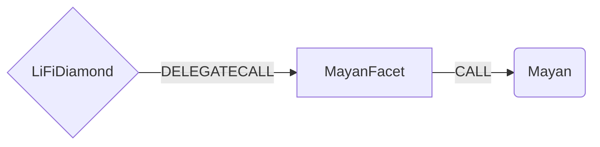

# Mayan Facet

## How it works

The Mayan Facet works by forwarding Mayan specific calls to the Mayan Token Bridge [contract](https://docs.mayan.finance/integration/contracts).



## Public Methods

- `function startBridgeTokensViaMayan(BridgeData calldata _bridgeData, MayanData calldata _mayanData)`
  - Simply bridges tokens using mayan
- `swapAndStartBridgeTokensViamayan(BridgeData memory _bridgeData, LibSwap.SwapData[] calldata _swapData, mayanData memory _mayanData)`
  - Performs swap(s) before bridging tokens using mayan

## mayan Specific Parameters

The methods listed above take a variable labeled `_mayanData`. This data is specific to mayan and is represented as the following struct type:

```solidity
/// @dev Optional bridge specific struct
/// @param mayanAddr The address of the Mayan
/// @param referrer The referrer address
/// @param tokenOutAddr The address of the token to be received
/// @param receiver The address of the receiver
/// @param swapFee The swap fee
/// @param redeemFee The redeem fee
/// @param refundFee The refund fee
/// @param transferDeadline The transfer deadline
/// @param swapDeadline The swap deadline
/// @param amountOutMin The minimum amount out
/// @param unwrap Whether to unwrap the asset
/// @param gasDrop The gas drop
struct MayanData {
  bytes32 mayanAddr;
  bytes32 referrer;
  bytes32 tokenOutAddr;
  bytes32 receiver;
  uint64 swapFee;
  uint64 redeemFee;
  uint64 refundFee;
  uint256 transferDeadline;
  uint64 swapDeadline;
  uint64 amountOutMin;
  bool unwrap;
  uint64 gasDrop;
}
```

## Swap Data

Some methods accept a `SwapData _swapData` parameter.

Swapping is performed by a swap specific library that expects an array of calldata to can be run on variaous DEXs (i.e. Uniswap) to make one or multiple swaps before performing another action.

The swap library can be found [here](../src/Libraries/LibSwap.sol).

## LiFi Data

Some methods accept a `BridgeData _bridgeData` parameter.

This parameter is strictly for analytics purposes. It's used to emit events that we can later track and index in our subgraphs and provide data on how our contracts are being used. `BridgeData` and the events we can emit can be found [here](../src/Interfaces/ILiFi.sol).

## Getting Sample Calls to interact with the Facet

In the following some sample calls are shown that allow you to retrieve a populated transaction that can be sent to our contract via your wallet.

All examples use our [/quote endpoint](https://apidocs.li.fi/reference/get_quote) to retrieve a quote which contains a `transactionRequest`. This request can directly be sent to your wallet to trigger the transaction.

The quote result looks like the following:

```javascript
const quoteResult = {
  id: '0x...', // quote id
  type: 'lifi', // the type of the quote (all lifi contract calls have the type "lifi")
  tool: 'mayan', // the bridge tool used for the transaction
  action: {}, // information about what is going to happen
  estimate: {}, // information about the estimated outcome of the call
  includedSteps: [], // steps that are executed by the contract as part of this transaction, e.g. a swap step and a cross step
  transactionRequest: {
    // the transaction that can be sent using a wallet
    data: '0x...',
    to: '0x...',
    value: '0x00',
    from: '{YOUR_WALLET_ADDRESS}',
    chainId: 100,
    gasLimit: '0x...',
    gasPrice: '0x...',
  },
}
```

A detailed explanation on how to use the /quote endpoint and how to trigger the transaction can be found [here](https://docs.li.fi/products/more-integration-options/li.fi-api/transferring-tokens-example).

**Hint**: Don't forget to replace `{YOUR_WALLET_ADDRESS}` with your real wallet address in the examples.

### Cross Only

To get a transaction for a transfer from 30 USDC.e on Avalanche to USDC on Binance you can execute the following request:

```shell
curl 'https://li.quest/v1/quote?fromChain=AVA&fromAmount=30000000&fromToken=USDC&toChain=BSC&toToken=USDC&slippage=0.03&allowBridges=mayan&fromAddress={YOUR_WALLET_ADDRESS}'
```

### Swap & Cross

To get a transaction for a transfer from 30 USDT on Avalanche to USDC on Binance you can execute the following request:

```shell
curl 'https://li.quest/v1/quote?fromChain=AVA&fromAmount=30000000&fromToken=USDT&toChain=BSC&toToken=USDC&slippage=0.03&allowBridges=mayan&fromAddress={YOUR_WALLET_ADDRESS}'
```
