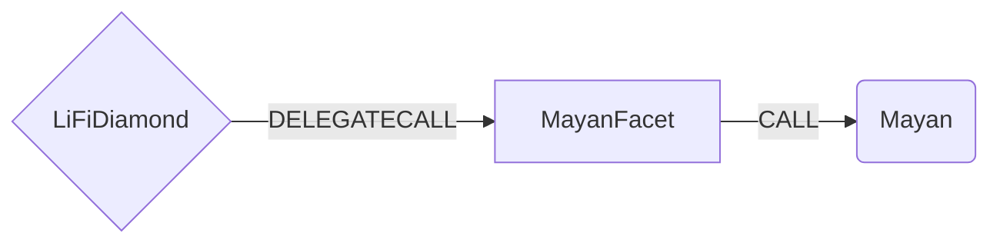

# Mayan Facet

## How it works

The Mayan Facet works by forwarding Mayan specific calls to the Mayan Token Bridge [contract](https://docs.mayan.finance/integration/contracts).


```mermaid
graph LR;
    D{LiFiDiamond}-- DELEGATECALL -->MayanFacet;
    MayanFacet -- CALL --> C(Mayan)
```

## Receiver validation

Before forwarding to Mayan, the facet validates that the order's destination receiver matches `BridgeData.receiver`:

- **EVM destinations:** the receiver parsed from the Mayan protocol data (`destAddr`) must equal `BridgeData.receiver`.
- **Non-EVM destinations** (`BridgeData.receiver == NON_EVM_ADDRESS`): the receiver parsed from the protocol data must equal `MayanData.nonEVMReceiver` (full 32-byte comparison).

### HyperCore deposits

For direct deposits to Hyperliquid HyperCore, Mayan crafts a Swift order (`createOrderWithToken` / `createOrderWithSig`, `payloadType == 2`) whose `destAddr` is **Mayan's `HCDepositor` handler contract**, not the end user. The real receiver is encoded as a left-aligned 20-byte address in `customPayload[0:20]` (`HCDepositor.parseCustomPayload`: `userWallet = customPayload[0:20]`).

These orders are routed into the `customPayload` path by `BridgeData.destinationChainId == 1337`, which is **LI.FI's internal identifier** for HyperCore as a destination — it does not appear anywhere in Mayan's calldata, so it is only a routing hint, not a security gate. The actual trust decision is made entirely from the order calldata: the facet reads the receiver from `customPayload` instead of `destAddr` **only after verifying all three of the fields Mayan recommends** —

- `destAddr` equals the hardcoded `MAYAN_HYPERCORE_DEPOSITOR` handler (`0x56032241C0AdAb58A29b13E94fb595a4bc414e33`),
- `payloadType == 2`, and
- `destChainId == 47` (Mayan's chain id for HyperEVM, where the handler lives).

If any gate fails, the order falls through to the standard `destAddr` validation, so the `customPayload` receiver is trusted only for genuine `HCDepositor` deposit orders and `LiFiTransferStarted.receiver` is the real user. Because the gate is calldata-based rather than dependent on the caller-supplied `1337`, a mistagged or spoofed order fails closed regardless of the `destinationChainId` it claims.

To stay consistent with how Mayan/`HCDepositor` actually decode the order, the facet follows the dynamic `customPayload` offset pointer (head word 16) rather than a fixed slot, so it reads the exact bytes the handler will use as the receiver.

### Trust assumptions

On-chain, the facet enforces `customPayload[0:20] == BridgeData.receiver`, so a caller cannot make the emitted/validated receiver differ from the address encoded in the order. Two assumptions are **not** enforceable on-chain and are inherited from Mayan:

- **The handler is single-purpose.** `0x56032241C0AdAb58A29b13E94fb595a4bc414e33` is only ever used as the `HCDepositor` handler for HyperCore deposits — never as a `destAddr` for another order type that interprets `customPayload` differently. If it were reused, a `destinationChainId == 1337` order could pass the receiver check while the handler routed funds elsewhere.
- **The handler's decode is stable.** It always treats `customPayload[0:20]` as the user wallet and is not an upgradeable proxy that could silently change that decode under the same address.

Mayan has confirmed (Jun 2026): this is the **sole** `HCDepositor` handler; the receiver is **always** `customPayload[0:20]` (followed by a 4-byte destination dex and an 8-byte relayer fee); `payloadType` is **always** `2` for HyperCore deposits; `destChainId` is `47` (HyperEVM); and they will announce any change to the handler in advance. Because the handler address is hardcoded, rotating it requires a facet upgrade.

## Public Methods

- `function startBridgeTokensViaMayan(BridgeData calldata _bridgeData, MayanData calldata _mayanData)`
  - Simply bridges tokens using Mayan
- `function swapAndStartBridgeTokensViaMayan(BridgeData memory _bridgeData, LibSwap.SwapData[] calldata _swapData, MayanData memory _mayanData)`
  - Performs swap(s) before bridging tokens using Mayan

## Mayan Specific Parameters

The methods listed above take a variable labeled `_mayanData`. This data is specific to Mayan and is represented as the following struct type:

```solidity
/// @dev Mayan specific bridge data
/// @param nonEVMReceiver The address of the non-EVM receiver if applicable
/// @param mayanProtocol The address of the Mayan protocol final contract
/// @param protocolData The protocol data for the Mayan protocol
struct MayanData {
  bytes32 nonEVMReceiver;
  address mayanProtocol;
  bytes protocolData;
}
```

`protocolData` is the opaque calldata forwarded to `mayanProtocol`. The facet parses
the receiver out of it (see [Receiver validation](#receiver-validation)) and validates
it against `BridgeData.receiver` before forwarding; it is not otherwise interpreted.

## Swap Data

Some methods accept a `SwapData _swapData` parameter.

Swapping is performed by a swap specific library that expects an array of calldata to can be run on variaous DEXs (i.e. Uniswap) to make one or multiple swaps before performing another action.

The swap library can be found [here](../src/Libraries/LibSwap.sol).

## LiFi Data

Some methods accept a `BridgeData _bridgeData` parameter.

This parameter is strictly for analytics purposes. It's used to emit events that we can later track and index in our subgraphs and provide data on how our contracts are being used. `BridgeData` and the events we can emit can be found [here](../src/Interfaces/ILiFi.sol).

## Getting Sample Calls to interact with the Facet

In the following some sample calls are shown that allow you to retrieve a populated transaction that can be sent to our contract via your wallet.

All examples use our [/quote endpoint](https://apidocs.li.fi/reference/get_quote) to retrieve a quote which contains a `transactionRequest`. This request can directly be sent to your wallet to trigger the transaction.

The quote result looks like the following:

```javascript
const quoteResult = {
  id: '0x...', // quote id
  type: 'lifi', // the type of the quote (all lifi contract calls have the type "lifi")
  tool: 'mayan', // the bridge tool used for the transaction
  action: {}, // information about what is going to happen
  estimate: {}, // information about the estimated outcome of the call
  includedSteps: [], // steps that are executed by the contract as part of this transaction, e.g. a swap step and a cross step
  transactionRequest: {
    // the transaction that can be sent using a wallet
    data: '0x...',
    to: '0x...',
    value: '0x00',
    from: '{YOUR_WALLET_ADDRESS}',
    chainId: 100,
    gasLimit: '0x...',
    gasPrice: '0x...',
  },
}
```

A detailed explanation on how to use the /quote endpoint and how to trigger the transaction can be found [here](https://docs.li.fi/products/more-integration-options/li.fi-api/transferring-tokens-example).

**Hint**: Don't forget to replace `{YOUR_WALLET_ADDRESS}` with your real wallet address in the examples.

### Cross Only

To get a transaction for a transfer from 30 USDC.e on Avalanche to USDC on Binance you can execute the following request:

```shell
curl 'https://li.quest/v1/quote?fromChain=AVA&fromAmount=30000000&fromToken=USDC&toChain=BSC&toToken=USDC&slippage=0.03&allowBridges=mayan&fromAddress={YOUR_WALLET_ADDRESS}'
```

### Swap & Cross

To get a transaction for a transfer from 30 USDT on Avalanche to USDC on Binance you can execute the following request:

```shell
curl 'https://li.quest/v1/quote?fromChain=AVA&fromAmount=30000000&fromToken=USDT&toChain=BSC&toToken=USDC&slippage=0.03&allowBridges=mayan&fromAddress={YOUR_WALLET_ADDRESS}'
```
