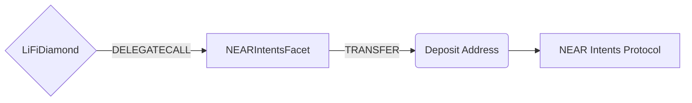

# NEARIntentsFacet

## How it works

The NEARIntentsFacet enables bridging tokens through the [NEAR Intents Protocol](https://hyperunit.xyz/). Unlike traditional bridge protocols, NEAR Intents uses an intent-based settlement system where users specify desired outcomes and solvers compete to fulfill them efficiently.

The facet validates backend-signed quotes (to prevent deposit address spoofing), transfers tokens to deposit addresses generated by the NEAR Intents Bridge API, and emits events for off-chain tracking. All intent settlement and verification is performed on NEAR mainnet.



## Public Methods

- `function startBridgeTokensViaNEARIntents(BridgeData calldata _bridgeData, NEARIntentsData calldata _nearData)`
  - Bridges tokens using NEAR Intents without performing any swaps
- `function swapAndStartBridgeTokensViaNEARIntents(BridgeData memory _bridgeData, SwapData[] calldata _swapData, NEARIntentsData calldata _nearData)`
  - Performs swap(s) before bridging tokens using NEAR Intents

## NEAR Intents Specific Parameters

The methods listed above take a variable labeled `_nearData`. This data is specific to NEAR Intents and is represented as the following struct type:

```solidity
struct NEARIntentsData {
  bytes32 nonEVMReceiver; // Set only for non-EVM chains (e.g., Solana address as bytes32) - receiver field per convention
  address depositAddress; // EVM address to send tokens (generated by Bridge API) - receiver field per convention
  bytes32 quoteId; // Unique identifier from 1Click API (hash of deposit address)
  uint256 deadline; // Unix timestamp when quote expires
  uint256 minAmountOut; // Minimum output amount on destination
  address refundRecipient; // Address that will receive positive slippage from swaps
  bytes signature; // EIP-712 signature from backend signer
}
```

For non-EVM destinations (i.e. Solana, NEAR), set the `receiver` in `BridgeData` to `NON_EVM_ADDRESS` (inherit from src/Helpers/LiFiData.sol) and provide the destination address in `nonEVMReceiver` as bytes32.

The backend signature is an EIP-712 signature over the quote parameters (transactionId, minAmount, receiver, depositAddress, destinationChainId, sendingAssetId, deadline, quoteId, minAmountOut) to ensure the deposit address was genuinely generated by the NEAR Intents Bridge API.

## Swap Data

Some methods accept a `SwapData[] _swapData` parameter.

Swapping is performed by a swap specific library that expects an array of calldata that can be run on various DEXs (i.e. Uniswap) to make one or multiple swaps before performing another action.

The swap library can be found [here](../src/Libraries/LibSwap.sol).

## LiFi Data

Some methods accept a `BridgeData _bridgeData` parameter.

This parameter is strictly for analytics purposes. It's used to emit events that we can later track and index in our subgraphs and provide data on how our contracts are being used. `BridgeData` and the events we can emit can be found [here](../src/Interfaces/ILiFi.sol).

## Getting Sample Calls to interact with the Facet

In the following some sample calls are shown that allow you to retrieve a populated transaction that can be sent to our contract via your wallet.

All examples use our [/quote endpoint](https://apidocs.li.fi/reference/get_quote) to retrieve a quote which contains a `transactionRequest`. This request can directly be sent to your wallet to trigger the transaction.

The quote result looks like the following:

```javascript
const quoteResult = {
  id: '0x...', // quote id
  type: 'lifi', // the type of the quote (all lifi contract calls have the type "lifi")
  tool: 'near-intents', // the bridge tool used for the transaction
  action: {}, // information about what is going to happen
  estimate: {}, // information about the estimated outcome of the call
  includedSteps: [], // steps that are executed by the contract as part of this transaction, e.g. a swap step and a cross step
  transactionRequest: {
    // the transaction that can be sent using a wallet
    data: '0x...',
    to: '0x...',
    value: '0x00',
    from: '{YOUR_WALLET_ADDRESS}',
    chainId: 42161,
    gasLimit: '0x...',
    gasPrice: '0x...',
  },
}
```

A detailed explanation on how to use the /quote endpoint and how to trigger the transaction can be found [here](https://docs.li.fi/products/more-integration-options/li.fi-api/transferring-tokens-example).

**Hint**: Don't forget to replace `{YOUR_WALLET_ADDRESS}` with your real wallet address in the examples.

### Cross Only

To get a transaction for a transfer from USDC on Arbitrum to USDC on Base you can execute the following request:

```shell
curl 'https://li.quest/v1/quote?fromChain=ARB&fromAmount=1000000&fromToken=USDC&toChain=BAS&toToken=USDC&slippage=0.03&allowBridges=near-intents&fromAddress={YOUR_WALLET_ADDRESS}'
```

### Swap & Cross

To get a transaction for a transfer from USDT on Arbitrum to USDC on Base you can execute the following request:

```shell
curl 'https://li.quest/v1/quote?fromChain=ARB&fromAmount=1000000&fromToken=USDT&toChain=BAS&toToken=USDC&slippage=0.03&allowBridges=near-intents&fromAddress={YOUR_WALLET_ADDRESS}'
```
