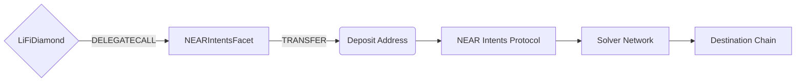

# NEARIntentsFacet

## How it works

The NEARIntentsFacet enables bridging tokens through the [NEAR Intents Protocol](https://hyperunit.xyz/). Unlike traditional bridge protocols, NEAR Intents uses an intent-based settlement system where users specify desired outcomes and solvers compete to fulfill them efficiently.

The facet validates backend-signed quotes (to prevent deposit address spoofing), transfers tokens to deposit addresses generated by the NEAR Intents Bridge API, and emits events for off-chain tracking. All intent settlement and verification is performed on NEAR mainnet via the `intents.near` contract.



## Public Methods

- `function startBridgeTokensViaNEARIntents(BridgeData calldata _bridgeData, NEARIntentsData calldata _nearData)`
  - Simply bridges tokens using NEAR Intents
- `function swapAndStartBridgeTokensViaNEARIntents(BridgeData memory _bridgeData, SwapData[] calldata _swapData, NEARIntentsData calldata _nearData)`
  - Performs swap(s) before bridging tokens using NEAR Intents
- `function isQuoteConsumed(bytes32 _quoteId) external view returns (bool consumed)`
  - Check if a quote has already been used (replay protection)

## NEAR Intents Specific Parameters

The methods listed above take a variable labeled `_nearData`. This data is specific to NEAR Intents and is represented as the following struct type:

```solidity
/// @param quoteId Unique identifier from 1Click API quote response (hashed from deposit address)
/// @param depositAddress EVM address to send tokens (generated by Bridge API)
/// @param deadline Unix timestamp when quote expires (refunds begin if unfulfilled)
/// @param minAmountOut Minimum output amount on destination (slippage protection)
/// @param nonEVMReceiver Set only if bridging to non-EVM chain (e.g., Solana address as bytes32)
/// @param signature EIP-712 signature from backend signer authorizing the quote
struct NEARIntentsData {
  bytes32 quoteId;
  address depositAddress;
  uint256 deadline;
  uint256 minAmountOut;
  bytes32 nonEVMReceiver;
  bytes signature;
}
```

### Non-EVM Bridging

When bridging to non-EVM chains (e.g., Solana, NEAR):
- Set `bridgeData.receiver` to `NON_EVM_ADDRESS` (`0x11f111f111f111F111f111f111F111f111f111F1`)
- Provide the destination address as `bytes32` in `nonEVMReceiver` field
- For Solana: Convert the base58 address to bytes32 (see demo script for example)

### Backend Signature

The backend signer creates an EIP-712 signature over the quote parameters:

**Domain:**
```solidity
{
  name: "LI.FI NEAR Intents Facet",
  version: "1",
  chainId: <source chain ID>,
  verifyingContract: <LiFi Diamond address>
}
```

**Type:**
```solidity
struct NEARIntentsPayload {
  bytes32 transactionId;
  uint256 minAmount;
  bytes32 receiver;        // bytes32, not address! Supports both EVM and non-EVM
  address depositAddress;
  uint256 destinationChainId;
  address sendingAssetId;
  uint256 deadline;
  bytes32 quoteId;
  uint256 minAmountOut;
}
```

The signature ensures that the quote parameters (especially the deposit address) were genuinely generated by the NEAR Intents Bridge API and prevents malicious actors from substituting fake addresses.

## Swap Data

Some methods accept a `SwapData[] _swapData` parameter.

Swapping is performed by a swap specific library that expects an array of calldata to can be run on various DEXs (i.e. Uniswap) to make one or multiple swaps before performing another action.

The swap library can be found [here](../src/Libraries/LibSwap.sol).

## LiFi Data

Some methods accept a `BridgeData _bridgeData` parameter.

This parameter is strictly for analytics purposes. It's used to emit events that we can later track and index in our subgraphs and provide data on how our contracts are being used. `BridgeData` and the events we can emit can be found [here](../src/Interfaces/ILiFi.sol).

## Events

### NEARIntentsBridgeStarted

Emitted when a bridge transaction starts via NEAR Intents.

```solidity
event NEARIntentsBridgeStarted(
  bytes32 indexed transactionId,
  bytes32 indexed quoteId,
  address indexed depositAddress,
  address sendingAssetId,
  uint256 amount,
  uint256 deadline
);
```

### BridgeToNonEVMChainBytes32

Emitted when bridging to a non-EVM chain (alongside `NEARIntentsBridgeStarted`).

```solidity
event BridgeToNonEVMChainBytes32(
  bytes32 indexed transactionId,
  uint256 indexed destinationChainId,
  bytes32 receiver
);
```

### LiFiTransferStarted

Standard LiFi event emitted for all bridge transactions.

```solidity
event LiFiTransferStarted(ILiFi.BridgeData bridgeData);
```

## Custom Errors

| Error                         | Description                                              |
| ----------------------------- | -------------------------------------------------------- |
| `QuoteAlreadyConsumed()`      | The quote ID has already been used                       |
| `QuoteExpired()`              | The quote deadline has passed                            |
| `InvalidDepositAddress()`     | The deposit address is zero                              |
| `NativeTransferFailed()`      | Native token transfer to deposit address failed          |
| `InvalidSignature()`          | The backend signature is invalid or doesn't match        |
| `SignatureExpired()`          | The signature deadline has passed                        |
| `InvalidNonEVMReceiver()`     | Bridging to non-EVM chain but nonEVMReceiver is empty    |
| `InvalidConfig()`             | Constructor called with zero backend signer address      |

## Integration Flow

1. **Get Quote**: Call NEAR Intents 1Click API (`https://1click.chaindefuser.com/v0/quote`) with bridge parameters
   - API returns `depositAddress`, `deadline`, `minAmountOut`, and other quote details
2. **Generate Quote ID**: Hash the deposit address to create a unique quote identifier
   ```javascript
   const quoteId = keccak256(depositAddress)
   ```
3. **Get Backend Signature**: Backend signs the quote parameters using EIP-712
   - For production: Backend signer is configured in `config/nearintents.json`
   - For development: Can use wallet to self-sign (see demo script)
4. **Execute Bridge**: Call `startBridgeTokensViaNEARIntents` or `swapAndStartBridgeTokensViaNEARIntents`
5. **Track Status**: Monitor via 1Click API status endpoint:
   ```bash
   curl "https://1click.chaindefuser.com/v0/status?depositAddress=<DEPOSIT_ADDRESS>"
   ```

## Getting Sample Calls to interact with the Facet

A demo script is available that shows how to bridge USDC from Arbitrum to either Solana or Base using NEAR Intents:

```bash
# Bridge USDC from Arbitrum to Solana (default: 1 USDC)
bun script/demoScripts/demoNEARIntents.ts --mode evm-to-solana --amount 1

# Bridge USDC from Arbitrum to Base
bun script/demoScripts/demoNEARIntents.ts --mode evm-to-evm --amount 1

# Swap USDT to USDC and bridge to Solana
bun script/demoScripts/demoNEARIntents.ts --mode evm-to-solana --amount 1 --swap
```

The demo script (`script/demoScripts/demoNEARIntents.ts`) demonstrates:
- Fetching quotes from NEAR Intents 1Click API
- Generating EIP-712 signatures for quote authorization
- Handling both EVM-to-EVM and EVM-to-Solana bridging
- Deriving Solana addresses from EVM private keys
- Converting Solana addresses to bytes32 format
- Executing bridge transactions with proper token approvals

### Example: Bridge to Solana

```typescript
// 1. Fetch quote from NEAR Intents API
const quoteResponse = await fetch('https://1click.chaindefuser.com/v0/quote', {
  method: 'POST',
  body: JSON.stringify({
    originAsset: 'nep141:arb-0xaf88d065e77c8cc2239327c5edb3a432268e5831.omft.near', // Arbitrum USDC
    destinationAsset: 'nep141:sol-5ce3bf3a31af18be40ba30f721101b4341690186.omft.near', // Solana USDC
    amount: '1000000', // 1 USDC (6 decimals)
    recipient: '<solana-address-base58>',
    // ... other parameters
  })
});

// 2. Generate quote ID
const quoteId = keccak256(quote.depositAddress);

// 3. Convert Solana address to bytes32
const solanaAddressBytes32 = toHex(decodeBase58(solanaAddress));

// 4. Get backend signature (EIP-712)
const signature = await walletAccount.signTypedData({
  domain: {
    name: 'LI.FI NEAR Intents Facet',
    version: '1',
    chainId: 42161, // Arbitrum
    verifyingContract: lifiDiamondAddress,
  },
  types: {
    NEARIntentsPayload: [
      { name: 'transactionId', type: 'bytes32' },
      { name: 'minAmount', type: 'uint256' },
      { name: 'receiver', type: 'bytes32' },
      { name: 'depositAddress', type: 'address' },
      { name: 'destinationChainId', type: 'uint256' },
      { name: 'sendingAssetId', type: 'address' },
      { name: 'deadline', type: 'uint256' },
      { name: 'quoteId', type: 'bytes32' },
      { name: 'minAmountOut', type: 'uint256' },
    ],
  },
  primaryType: 'NEARIntentsPayload',
  message: {
    transactionId,
    minAmount,
    receiver: solanaAddressBytes32,
    depositAddress: quote.depositAddress,
    destinationChainId: LIFI_CHAIN_ID_SOLANA,
    sendingAssetId: USDC_ADDRESS,
    deadline,
    quoteId,
    minAmountOut: quote.minAmountOut,
  },
});

// 5. Execute bridge
await diamond.startBridgeTokensViaNEARIntents(bridgeData, nearData);
```

## Supported Chains

Origin chains (where you can bridge from):
- Ethereum Mainnet
- Arbitrum
- Base
- Polygon
- Optimism
- BNB Chain
- Avalanche
- And more (check NEAR Intents API for full list)

Destination chains (where you can bridge to):
- All EVM chains supported by NEAR Intents
- Solana (via non-EVM bridging)
- NEAR Protocol (via non-EVM bridging)

## Refunds

Refunds are handled automatically by the NEAR Intents protocol:
- If the deadline passes without fulfillment, assets are automatically refunded
- Refund destination is specified in the original quote (`refundTo` parameter)
- Refunds are processed on the origin chain
- Monitor refund status via the 1Click API status endpoint

## Security Considerations

### Quote Replay Protection

Each `quoteId` can only be used once, enforced by diamond storage mapping. This prevents replay attacks where an attacker tries to reuse a valid quote.

### Deadline Validation

Quotes are validated on-chain to ensure they haven't expired. Both:
1. Quote deadline: Checked in `_validateQuote` modifier
2. Signature deadline: Checked in `_verifySignature` to prevent using expired signatures

### Backend Signature Verification

Only quotes signed by the authorized backend signer are accepted. The backend signer address is:
- Immutable (set at deployment time)
- Configured per environment (staging/production) in `config/nearintents.json`
- Cannot be changed after deployment without redeploying the facet

### Signature Security

The facet uses EIP-712 structured data signing which:
- Prevents signature phishing across different domains
- Ties signatures to specific contract addresses and chain IDs
- Uses the Solady ECDSA library with built-in malleability protection

### Deposit Address Trust Model

The deposit addresses are generated by the NEAR Intents Bridge API. The backend signature ensures:
- The deposit address is authentic and not spoofed
- The quote terms match what was provided by the API
- The user is bridging to the intended destination

## Gas Estimates

| Operation                                     | Estimated Gas  |
| --------------------------------------------- | -------------- |
| `startBridgeTokensViaNEARIntents` (ERC20)     | ~100,000       |
| `startBridgeTokensViaNEARIntents` (Native)    | ~60,000        |
| `swapAndStartBridgeTokensViaNEARIntents`      | Varies by swap |

The facet is gas-efficient because:
- Minimal on-chain verification (intent settlement happens on NEAR)
- Simple storage operations (only quote ID replay protection)
- Direct token transfers to deposit address (no bridge contract calls)

## Development

### Testing

Run the test suite:

```bash
forge test --match-contract NEARIntentsFacetTest -vv
```

### Deployment

The facet requires a backend signer address at deployment. Configure it in `config/nearintents.json`:

```json
{
  "staging": {
    "backendSigner": "0x..."
  },
  "production": {
    "backendSigner": "0x..."
  }
}
```

Deploy using:

```bash
# Production
./script/deploy.sh NEARIntentsFacet <network>

# Staging
./script/deploy.sh NEARIntentsFacet <network> staging
```

## Version History

- **1.0.0**: Initial release
  - EVM-to-EVM bridging support
  - EVM-to-Solana bridging support
  - EIP-712 signature verification
  - Quote replay protection
  - Deadline validation
