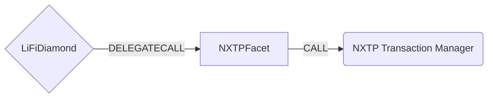
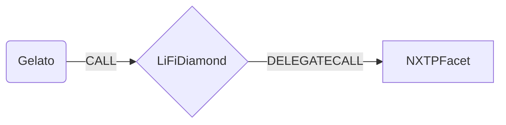

# NXTP Facet

## How it works

The NXTP Facet works by forwarding NXTP (Connext) specific calls to NXTP's TransactionManager contract. This is accomplished by populating NXTP [`PrepareArgs`](https://github.com/connext/nxtp/blob/be883bd54b7e62f448452945c660e6e87055e637/packages/contracts/contracts/interfaces/ITransactionManager.sol#L72-L103) and calling the [`prepare()`](https://github.com/connext/nxtp/blob/be883bd54b7e62f448452945c660e6e87055e637/packages/contracts/contracts/TransactionManager.sol#L251-L267) method on the NXTP Transaction Manager. The NXTP [documentation](https://docs.connext.network/Integration/Guides/initiating-from-contract) details how to get the data needed for `PrepareArgs` using their SDK.



The NXTP protocol also allows for calling contracts on the receiving chain once bridging is complete. This is accomplished by passing `calldata` in the `invariantData` property described in `_nxtpData` below. This is useful if we want to perform a swap on the recieving chain before sending to the receiver. This functionality is provided by [Gelato Network](https://gelato.network) under the hood.



## Public Methods

- `function initNXTP(ITransactionManager _txMgrAddr)`
  - Initializer method. Sets the chain specific NXTP Transaction Manager Contract
- `function startBridgeTokensViaNXTP(LiFiData memory _lifiData, ITransactionManager.PrepareArgs memory _nxtpData)`
  - Simply bridges tokens using NXTP
- `function swapAndStartBridgeTokensViaNXTP( LiFiData memory _lifiData, LibSwap.SwapData[] calldata _swapData, ITransactionManager.PrepareArgs memory _nxtpData)`
  - Performs swap(s) before bridging tokens using NXTP
- `function completeBridgeTokensViaNXTP( LiFiData memory _lifiData, address assetId, address receiver, uint256 amount)`
  - Completes a bridge transaction on the receiving chain and sends the tokens to the receiver. Should be called by the NXTP Gelato Resolver.
- `function swapAndCompleteBridgeTokensViaNXTP( LiFiData memory _lifiData, LibSwap.SwapData[] calldata _swapData, address finalAssetId, address receiver)`
  - Performs swap(s) before completing a bridge transaction on the receiving chain and sending the tokens to the receiver. Should be called by the NXTP Gelato Resolver.

## NXTP Specific Parameters

Some of the methods listed above take a variable labeled `_nxtpData`. This data is specific to NXTP and is represented as the following struct type:

```solidity
/**
 * Arguments for calling prepare()
 * @param invariantData The data for a crosschain transaction that will
 *     not change between sending and receiving chains.
 *     The hash of this data is used as the key to store
 *     the inforamtion that does change between chains
 *     (amount,expiry,preparedBlock) for verification
 * @param amount The amount of the transaction on this chain
 * @param expiry The block.timestamp when the transaction will no longer be
 *     fulfillable and is freely cancellable on this chain
 * @param encryptedCallData The calldata to be executed when the tx is
 *     fulfilled. Used in the function to allow the user
 *     to reconstruct the tx from events. Hash is stored
 *     onchain to prevent shenanigans.
 * @param encodedBid The encoded bid that was accepted by the user for this
 *     crosschain transfer. It is supplied as a param to the
 *     function but is only used in event emission
 * @param bidSignature The signature of the bidder on the encoded bid for
 *     this transaction. Only used within the function for
 *     event emission. The validity of the bid and
 *     bidSignature are enforced offchain
 * @param encodedMeta The meta for the function
 */
struct PrepareArgs {
  InvariantTransactionData invariantData;
  uint256 amount;
  uint256 expiry;
  bytes encryptedCallData;
  bytes encodedBid;
  bytes bidSignature;
  bytes encodedMeta;
}

```

## Swap Data

Some methods accept a `SwapData _swapData` parameter.

Swapping is performed by a swap specific library that expects an array of calldata to can be run on variaous DEXs (i.e. Uniswap) to make one or multiple swaps before performing another action.

The swap library can be found [here](../src/Libraries/LibSwap.sol).

## LiFi Data

Some methods accept a `LiFiData _lifiData` paremeter.

This parameter is strictly for analytics purposes. It's used to emit events that we can later track and index in our subgraphs and provide data on how our contracts are being used. `LiFiData` and the events we can emit can be found [here](../src/Interfaces/ILiFi.sol).
