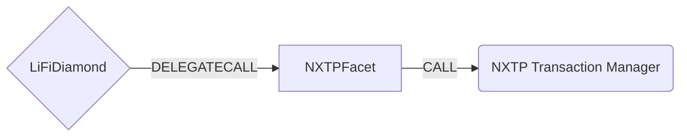

# NXTP Facet

## How it works

The NXTP Facet works by forwarding NXTP (Connext) specific calls to NXTP's TransactionManager contract.



## Public Methods

- `function initNXTP(ITransactionManager _txMgrAddr)`
  - Initializer method. Sets the chain specific NXTP Transaction Manager Contract
- `function startBridgeTokensViaNXTP(LiFiData memory _lifiData, ITransactionManager.PrepareArgs memory _nxtpData)`
  - Simply bridges tokens using NXTP
- `function swapAndStartBridgeTokensViaNXTP( LiFiData memory _lifiData, LibSwap.SwapData[] calldata _swapData, ITransactionManager.PrepareArgs memory _nxtpData)`
  - Performs swap(s) before bridging tokens using NXTP
- `function completeBridgeTokensViaNXTP( LiFiData memory _lifiData, address assetId, address receiver, uint256 amount)`
  - Performs an arbitrary action after recieving tokens on a receiving chain using NXTP
- `function swapAndCompleteBridgeTokensViaNXTP( LiFiData memory _lifiData, LibSwap.SwapData[] calldata _swapData, address finalAssetId, address receiver)`
  - Performs swap(s) before performing an arbitrary action after receiving tokens on a receiving chain using NXTP

## NXTP Specific Parameters

Some of the methods listed above take a variable labeled `_nxtpData`. This data is specific to NXTP and is represented as the following struct type:

```solidity
/**
 * Arguments for calling prepare()
 * @param invariantData The data for a crosschain transaction that will
 *     not change between sending and receiving chains.
 *     The hash of this data is used as the key to store
 *     the inforamtion that does change between chains
 *     (amount,expiry,preparedBlock) for verification
 * @param amount The amount of the transaction on this chain
 * @param expiry The block.timestamp when the transaction will no longer be
 *     fulfillable and is freely cancellable on this chain
 * @param encryptedCallData The calldata to be executed when the tx is
 *     fulfilled. Used in the function to allow the user
 *     to reconstruct the tx from events. Hash is stored
 *     onchain to prevent shenanigans.
 * @param encodedBid The encoded bid that was accepted by the user for this
 *     crosschain transfer. It is supplied as a param to the
 *     function but is only used in event emission
 * @param bidSignature The signature of the bidder on the encoded bid for
 *     this transaction. Only used within the function for
 *     event emission. The validity of the bid and
 *     bidSignature are enforced offchain
 * @param encodedMeta The meta for the function
 */
struct PrepareArgs {
  InvariantTransactionData invariantData;
  uint256 amount;
  uint256 expiry;
  bytes encryptedCallData;
  bytes encodedBid;
  bytes bidSignature;
  bytes encodedMeta;
}

```
