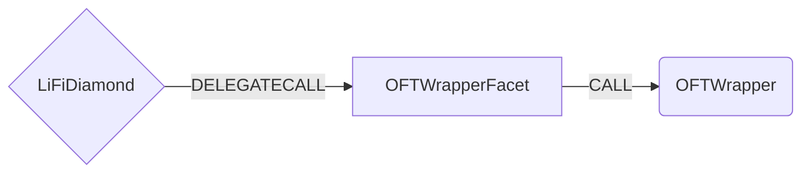

# OFTWrapper Facet

## How it works

The OFTWrapper Facet works by forwarding OFTWrapper specific calls to a [OFTWrapper contract](https://github.com/LayerZero-Labs/oft-wrapper/blob/main/contracts/OFTWrapper.sol). Omnichain Fungible Token (OFT) is LayerZero's token standard.



## Public Methods

- `function initOFTWrapper(ChainIdConfig[] calldata chainIdConfigs, WhitelistConfig[] calldata whitelistConfigs)`
  - Initializer method. Adds a mapping of layerzero chain ids to EVM chainID and adds whitelisted oft addresses.
- `function startBridgeTokensViaOFTWrapperV1(BridgeData calldata _bridgeData, OFTWrapperData calldata _oftWrapperData)`
  - Simply bridges OFT V1 tokens
- `function swapAndStartBridgeTokensViaOFTWrapperV1(BridgeData memory _bridgeData, SwapData[] calldata _swapData, OFTWrapperData calldata _oftWrapperData)`
  - Performs swap(s) before bridging OFT V1 tokens
- `function startBridgeTokensViaOFTWrapperV2(BridgeData calldata _bridgeData, OFTWrapperData calldata _oftWrapperData)`
  - Simply bridges OFT V2 tokens
- `function swapAndStartBridgeTokensViaOFTWrapperV2(BridgeData memory _bridgeData, SwapData[] calldata _swapData, OFTWrapperData calldata _oftWrapperData)`
  - Performs swap(s) before bridging OFT V2 tokens
- `function startBridgeTokensViaOFTWrapperV2WithFee(BridgeData calldata _bridgeData, OFTWrapperData calldata _oftWrapperData)`
  - Simply bridges OFT V2WithFee tokens
- `function swapAndStartBridgeTokensViaOFTWrapperV2WithFee(BridgeData memory _bridgeData, SwapData[] calldata _swapData, OFTWrapperData calldata _oftWrapperData)`
  - Performs swap(s) before bridging OFT V2WithFee tokens
- `function startBridgeTokensViaCustomCodeOFT(BridgeData calldata _bridgeData, OFTWrapperData calldata _oftWrapperData)`
  - Simply bridges custom code OFT tokens
- `function swapAndStartBridgeTokensViaCustomCodeOFT(BridgeData memory _bridgeData, SwapData[] calldata _swapData, OFTWrapperData calldata _oftWrapperData)`
  - Performs swap(s) before bridging custom code OFT tokens
- `function determineOFTBridgeSendFunction(address _sendingAssetId, bool _withSrcSwap)`
  - Determines the function that should be used for bridging a given OFT (V1, V2, V2WithFee or custom code OFT)
- `function isOftV1(address _sendingAssetId)`
  - checks if the given address contains a OFT V1 contract
- `function isOftV2(address _sendingAssetId)`
  - checks if the given address contains a OFT V2 contract
- `function isOftV2WithFee(address _sendingAssetId)`
  - checks if the given address contains a OFT V2WithFee contract
- `function estimateOFTFees(address _sendingAssetId, uint256 _destinationChainId, uint256 _amount, bytes32 _receiver, bool _useZro, bytes memory _adapterParams, uint256 _callerBps)`
  - Returns required amounts for native fee and zro fee

## OFTWrapper Specific Parameters

Some of the methods listed above take a variable labeled `_oftWrapperData`.

To populate `_oftWrapperData` you will need to get the chain ID you are bridging to. You can visit the [LayerZero Mainnet Addresses](https://layerzero.gitbook.io/docs/technical-reference/mainnet/supported-chain-ids) to get the list.

This data is specific to OFTWrapper and is represented as the following struct type:

```solidity
/// @param proxyOftAddress contains address of proxy OFT contract or address(0), if token does not have proxy
/// @param receiver exclusively used for non-EVM receiver addresses (usually we use _bridgeData.receiver)
/// @param minAmount minAmount to be received on dst chain
/// @param lzFee amount of native fee to be sent to Layer Zero endpoint for relaying message
/// @param zroPaymentAddress should be set to address(0) if not paying with ZRO token
/// @param adapterParams parameters for the adapter service, e.g. send some dust native token to dstChain
/// @param feeObj contains information about optional callerFee (= fee taken by dApp)
/// @param customCode_sendTokensCallData contains function identifier and parameters for sending tokens
/// @param customCode_approveTo in case approval to a custom contract is required
struct OFTWrapperData {
  address proxyOftAddress;
  bytes32 receiver;
  uint256 minAmount;
  uint256 lzFee;
  address zroPaymentAddress;
  bytes adapterParams;
  IOFT.FeeObj feeObj;
  bytes customCode_sendTokensCallData;
  address customCode_approveTo;
}
```

## Swap Data

Some methods accept a `SwapData _swapData` parameter.

Swapping is performed by a swap specific library that expects an array of calldata to can be run on variaous DEXs (i.e. Uniswap) to make one or multiple swaps before performing another action.

The swap library can be found [here](../src/Libraries/LibSwap.sol).

## LiFi Data

Some methods accept a `BridgeData _bridgeData` parameter.

This parameter is strictly for analytics purposes. It's used to emit events that we can later track and index in our subgraphs and provide data on how our contracts are being used. `BridgeData` and the events we can emit can be found [here](../src/Interfaces/ILiFi.sol).

## Getting Sample Calls to interact with the Facet

In the following some sample calls are shown that allow you to retrieve a populated transaction that can be sent to our contract via your wallet.

All examples use our [/quote endpoint](https://apidocs.li.finance/reference/get_quote-1) to retrieve a quote which contains a `transactionRequest`. This request can directly be sent to your wallet to trigger the transaction.

The quote result looks like the following:

```javascript
const quoteResult = {
  id: '0x...', // quote id
  type: 'lifi', // the type of the quote (all lifi contract calls have the type "lifi")
  tool: 'oftwrapper', // the bridge tool used for the transaction
  action: {}, // information about what is going to happen
  estimate: {}, // information about the estimated outcome of the call
  includedSteps: [], // steps that are executed by the contract as part of this transaction, e.g. a swap step and a cross step
  transactionRequest: {
    // the transaction that can be sent using a wallet
    data: '0x...',
    to: '0x...',
    value: '0x00',
    from: '{YOUR_WALLET_ADDRESS}',
    chainId: 100,
    gasLimit: '0x...',
    gasPrice: '0x...',
  },
}
```

A detailed explanation on how to use the /quote endpoint and how to trigger the transaction can be found [here](https://apidocs.li.finance/reference/how-to-transfer-tokens).

**Hint**: Don't forget to replace `{YOUR_WALLET_ADDRESS}` with your real wallet address in the examples.

### Cross Only

To get a transaction for a transfer from 20 STG on Polygon to STG on Fantom you can execute the following request:

```shell
curl 'https://li.quest/v1/quote?fromChain=POL&fromAmount=20000000000000000000&fromToken=STG&toChain=FTM&toToken=STG&slippage=0.03&allowBridges=oftWrapper&fromAddress={YOUR_WALLET_ADDRESS}'
```

### Swap & Cross

To get a transaction for a transfer from 10 STG on Polygon to CAKE on Fantom you can execute the following request:

```shell
curl 'https://li.quest/v1/quote?fromChain=POL&fromAmount=10000000000000000000&fromToken=STG&toChain=FTM&toToken=CAKE&slippage=0.03&allowBridges=oftWrapper&fromAddress={YOUR_WALLET_ADDRESS}'
```
