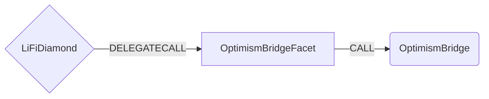

# Optimism Bridge Facet

## How it works

The Optimism Bridge Facet works by forwarding Optimism Bridge specific calls to Optimism Bridge [contract](https://github.com/ethereum-optimism/optimism/blob/master/packages/contracts/contracts/L1/messaging/L1StandardBridge.sol). The standard bridge functionality provides a method for an ERC20 token to be deposited and locked on L1 in exchange of the same amount of an equivalent token on L2.



## Public Methods

- `function startBridgeTokensViaOptimismBridge(BridgeData calldata _lifiData, BridgeData calldata _bridgeData)`
  - Simply bridges tokens using Optimism Native Bridge
- `function swapAndStartBridgeTokensViaOptimismBridge(BridgeData calldata, LibSwap.SwapData[] calldata _swapData, BridgeData calldata _bridgeData)`
  - Performs swap(s) before bridging tokens using Optimism Native Bridge

## Optimism Bridge Specific Parameters

Some of the methods listed above take a variable labeled `_bridgeData`.

To populate `_bridgeData` you will need to get the `l2Token` and `bridge`.
- `l2Token`
  Address of token on L2.
  It can be get from the configuration.
  For native asset, it can be zero address.
- `bridge`
  Optimism Native Bridge has several bridges such as `L1StandardBridge`, `L1DAITokenBridge`, `SynthetixBridgeToOptimism`, etc.
  The bridges for bridging asset can be get from the configuration. If you can't find bridge for the asset from the configuration or for native asset, you should use standard bridge.

This data is specific to Optimism Bridge and is represented as the following struct type:

```solidity
/**
 * @param assetId The contract address of the token being bridged on L1.
 * @param assetIdOnL2 The contract address of the token on L2.
 * @param amount The amount of tokens to bridge.
 * @param receiver The address of the token recipient after bridging.
 * @param bridge The contract address of bridge for token.
 * @param l2Gas Gas limit required to complete the deposit on L2.
 * @param isSynthetix If the sending token is SNX.
 */
struct BridgeData {
  address assetId;
  address assetIdOnL2;
  uint256 amount;
  address receiver;
  address bridge;
  uint32 l2Gas;
  bool isSynthetix;
}

```

## Swap Data

Some methods accept a `SwapData _swapData` parameter.

Swapping is performed by a swap specific library that expects an array of calldata to can be run on variaous DEXs (i.e. Uniswap) to make one or multiple swaps before performing another action.

The swap library can be found [here](../src/Libraries/LibSwap.sol).

## LiFi Data

Some methods accept a `BridgeData _lifiData` parameter.

This parameter is strictly for analytics purposes. It's used to emit events that we can later track and index in our subgraphs and provide data on how our contracts are being used. `BridgeData` and the events we can emit can be found [here](../src/Interfaces/ILiFi.sol).

## Getting Sample Calls to interact with the Facet

In the following some sample calls are shown that allow you to retrieve a populated transaction that can be sent to our contract via your wallet.

All examples use our [/quote endpoint](https://apidocs.li.finance/reference/get_quote-1) to retrieve a quote which contains a `transactionRequest`. This request can directly be sent to your wallet to trigger the transaction.

The quote result looks like the following:

```javascript
const quoteResult = {
  id: '0x...', // quote id
  type: 'lifi', // the type of the quote (all lifi contract calls have the type "lifi")
  tool: 'hop', // the bridge tool used for the transaction
  action: {}, // information about what is going to happen
  estimate: {}, // information about the estimated outcome of the call
  includedSteps: [], // steps that are executed by the contract as part of this transaction, e.g. a swap step and a cross step
  transactionRequest: {
    // the transaction that can be sent using a wallet
    data: '0x...',
    to: '0x...',
    value: '0x00',
    from: '{YOUR_WALLET_ADDRESS}',
    chainId: 100,
    gasLimit: '0x...',
    gasPrice: '0x...',
  },
}
```

A detailed explanation on how to use the /quote endpoint and how to trigger the transaction can be found [here](https://apidocs.li.finance/reference/how-to-transfer-tokens).

**Hint**: Don't forget to replace `{YOUR_WALLET_ADDRESS}` with your real wallet address in the examples.

### Cross Only

To get a transaction for a transfer from 20 DAI on Ethereum to DAI on Optimism you can execute the following request:

```shell
curl 'https://li.quest/v1/quote?fromChain=ETH&fromAmount=20000000000000000000&fromToken=DAI&toChain=OPT&toToken=DAI&slippage=0.03&allowBridges=optimism&fromAddress={YOUR_WALLET_ADDRESS}'
```

### Swap & Cross

To get a transaction for a transfer from 10 USDT on Ethereum to DAI on Optimism you can execute the following request:

```shell
curl 'https://li.quest/v1/quote?fromChain=ETH&fromAmount=10000000000000000000&fromToken=USDT&toChain=OPT&toToken=DAI&slippage=0.03&allowBridges=optimism&fromAddress={YOUR_WALLET_ADDRESS}'
```
