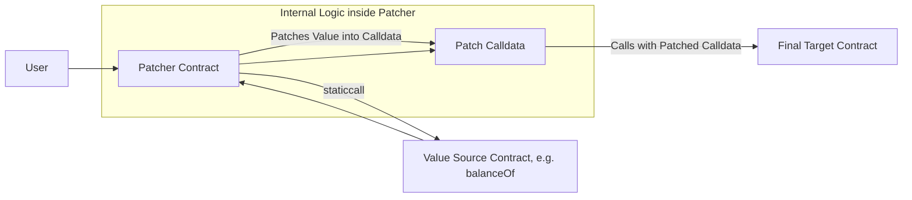

# Patcher

## Description

The Patcher is a utility contract that enables dynamic calldata patching before execution. It allows you to retrieve values dynamically at execution time from external contracts and uses them to replace placeholders (specific positions) in calldata before calling the target contract. This is particularly useful for scenarios where exact amounts are only known at execution time, such as token balances after deposits or bridge transfers.

A common use case is with CoWSwap intent based orders, where the amount to act on (e.g., amountIn) is only determined after the user's funds are bridged to the destination chain.

## How it works

The Patcher works by:

1. Retrieving dynamic values from external contracts via static calls
2. Patching these values into predetermined positions in calldata
3. Executing the final call with the patched data



## Public Methods

### Single Value Patching

- `function executeWithDynamicPatches(address valueSource, bytes calldata valueGetter, address finalTarget, uint256 value, bytes calldata data, uint256[] calldata offsets, bool delegateCall)`
  - Retrieves a single dynamic value and patches it into multiple positions in the calldata before execution

### Token Deposit with Single Value Patching

- `function depositAndExecuteWithDynamicPatches(address tokenAddress, address valueSource, bytes calldata valueGetter, address finalTarget, uint256 value, bytes calldata data, uint256[] calldata offsets, bool delegateCall)`
  - Transfers the caller's entire token balance to the Patcher, approves the final target, then executes with dynamic patching

### Multiple Value Patching

- `function executeWithMultiplePatches(address[] calldata valueSources, bytes[] calldata valueGetters, address finalTarget, uint256 value, bytes calldata data, uint256[][] calldata offsetGroups, bool delegateCall)`
  - Retrieves multiple dynamic values from different sources and patches them into different positions in the calldata

### Token Deposit with Multiple Value Patching

- `function depositAndExecuteWithMultiplePatches(address tokenAddress, address[] calldata valueSources, bytes[] calldata valueGetters, address finalTarget, uint256 value, bytes calldata data, uint256[][] calldata offsetGroups, bool delegateCall)`
  - Transfers the caller's entire token balance to the Patcher, approves the final target, then executes with multiple dynamic patches

## Parameters

### Common Parameters

- `valueSource` / `valueSources`: The contract(s) to query for dynamic values
- `valueGetter` / `valueGetters`: The calldata to use for retrieving the dynamic value(s) (e.g., `balanceOf(address)` call)
- `finalTarget`: The contract to call with the patched data
- `value`: The ETH value to send with the final call
- `data`: The original calldata to patch and execute
- `offsets` / `offsetGroups`: Byte offset(s) in the calldata where the dynamic value(s) should be written
- `delegateCall`: Whether to use delegatecall instead of a regular call for the final execution
- `tokenAddress`: The ERC20 token to transfer from the caller (for deposit methods)

### Offset Calculation

Offsets specify the exact byte position in the calldata where a 32-byte value should be written. These are typically calculated by:

1. Encoding the target function call with placeholder values
2. Finding the byte position of the placeholder in the encoded data
3. Using that position as the offset

## Use Cases

### Cross-Chain Bridge with Destination Swap

The Patcher is particularly useful for cross-chain scenarios where the exact amount received from a bridge is unknown until execution:

1. **Bridge tokens** from source chain to destination chain
2. **Receive variable amount** due to fees, slippage, or exchange rates
3. **Use Patcher** to query the actual received balance
4. **Patch the balance** into a swap call to use the exact amount received
5. **Execute the swap** with the correct amount

### Dynamic Balance Swaps

When you need to swap the entire balance of a token but don't know the exact amount:

1. **Deposit tokens** to the Patcher contract
2. **Query the balance** dynamically
3. **Patch the balance** into a DEX swap call
4. **Execute the swap** using the entire deposited amount

### Oracle-Based Transactions

For transactions that depend on real-time data:

1. **Query price oracles** or other data sources
2. **Patch the values** into transaction parameters
3. **Execute** with up-to-date information

## Error Handling

The Patcher includes several error types for different failure scenarios:

- `FailedToGetDynamicValue()`: Thrown when the static call to retrieve a dynamic value fails
- `MismatchedArrayLengths()`: Thrown when input arrays have different lengths in multiple patch methods
- `InvalidPatchOffset()`: Thrown when a patch offset would write beyond the calldata bounds

## Security Considerations

- The Patcher uses `staticcall` to retrieve dynamic values, ensuring no state changes during value retrieval
- Offset validation prevents writing beyond calldata boundaries
- The contract is designed to be used with delegate calls for integration into larger systems
- Token approvals are given to the final target contract, not stored permanently

## Integration Patterns

### With Bridge Receivers

The Patcher is commonly used in bridge receiver contracts to handle variable bridge amounts:

```solidity
// Pseudo-code example
function handleBridgeMessage(bytes calldata message) external {
    // Decode swap parameters from message
    SwapData memory swapData = abi.decode(message, (SwapData));

    // Use Patcher to deposit received tokens and execute swap with exact balance
    patcher.depositAndExecuteWithDynamicPatches(
        bridgedToken,
        bridgedToken, // value source
        abi.encodeCall(IERC20.balanceOf, (address(patcher))), // value getter
        dexAggregator, // final target
        0, // no ETH value
        swapCalldata, // calldata with placeholder amount
        [amountOffset], // where to patch the amount
        false // regular call
    );
}
```

### With DEX Aggregators

For swapping entire token balances through DEX aggregators:

```solidity
// Pseudo-code example
function swapEntireBalance(address token, bytes calldata swapCalldata, uint256 amountOffset) external {
    patcher.depositAndExecuteWithDynamicPatches(
        token,
        token, // query token balance
        abi.encodeCall(IERC20.balanceOf, (address(patcher))),
        dexAggregator,
        0,
        swapCalldata,
        [amountOffset],
        false
    );
}
```

## Best Practices

1. **Calculate offsets carefully**: Ensure offsets point to the correct parameter positions in the calldata
2. **Use appropriate value getters**: Choose the right function to call for retrieving dynamic values
3. **Handle failures gracefully**: The Patcher will revert if value retrieval fails
4. **Consider gas costs**: Multiple patches and complex calls increase gas usage
5. **Test thoroughly**: Dynamic patching can be complex - test with various scenarios
6. **Validate inputs**: Ensure array lengths match for multiple patch operations
