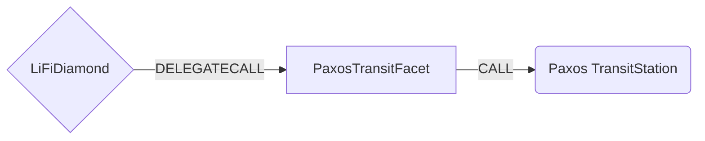

# PaxosTransit Facet

## How it works

The PaxosTransit Facet works by forwarding a Paxos-signed transit quote to the Paxos
`TransitStation` contract via `submitOrder`. The LiFiDiamond custodies the offer asset, approves
the station, and submits the order on behalf of the user, keeping LI.FI's regular funds flow
(including optional pre-bridge swaps). The `wantAsset` is delivered to `quote.receiver` on the
destination chain regardless of who submits the order.

Key properties of Paxos Transit:

- The `offerAsset` is **ERC20-only** (never native). `submitOrder` is `payable` because `msg.value`
  pays the LayerZero cross-chain messaging fee (`nativeFee`), not the offer asset.
- The exchange rate is **locked by the signed quote** — there is no slippage / `amountOutMin`
  parameter. The output is `offerAmount − protocolFee − integratorFee`.
- Orders are **market orders**: there is no user-initiated refund or cancellation, and no failure
  path returns funds to the submitter (the Diamond).



## Public Methods

- `function startBridgeTokensViaPaxosTransit(BridgeData memory _bridgeData, PaxosTransitData calldata _paxosData)`
  - Simply bridges tokens using Paxos Transit without performing any swaps
- `function swapAndStartBridgeTokensViaPaxosTransit(BridgeData memory _bridgeData, LibSwap.SwapData[] calldata _swapData, PaxosTransitData calldata _paxosData)`
  - Performs swap(s) before bridging tokens using Paxos Transit. The quote's `offerAmount` is fixed,
    so the swap must yield at least that amount; any positive slippage is refunded to the caller and
    exactly `offerAmount` is bridged.

## PaxosTransit Specific Parameters

The methods listed above take a variable labeled `_paxosData`. This data is specific to Paxos
Transit and is represented as the following struct type:

```solidity
/// @param quote The Paxos-signed quote describing the transit order
/// @param signature The Paxos signature over the EIP-712 quote digest
/// @param nativeFee The native amount forwarded to Transit to pay the LayerZero messaging fee
struct PaxosTransitData {
    IPaxosTransit.Quote quote;
    bytes signature;
    uint256 nativeFee;
}
```

Where `IPaxosTransit.Quote` is:

```solidity
struct Quote {
    Route route; // { uint32 destEID; address offerAsset; address wantAsset; }
    uint256 offerAmount;
    address receiver;
    uint256 protocolFee;
    uint256 integratorFee;
    address integratorFeeReceiver;
    bytes32 distributorCode;
    uint256 deadline;
    bytes32 salt;
}
```

The facet validates that the on-chain `BridgeData` matches the signed quote — `sendingAssetId ==
route.offerAsset`, `minAmount == offerAmount`, `receiver == quote.receiver` — and that
`distributorCode == LIFI_DISTRIBUTOR_CODE` (`0x4c49464900…`, the left-adjusted bytes32 encoding of
"LIFI"). Any mismatch reverts with `InformationMismatch`.

**Not enforced on-chain:** the destination routing (`route.destEID`) and the destination asset
(`route.wantAsset`) are *not* cross-checked against `_bridgeData.destinationChainId`. Funds always
follow the Paxos-signed quote, so these are trusted from the LI.FI-backend-generated, Paxos-signed
calldata (the same trust model as `AcrossFacetV4`'s `outputAmount`). `_bridgeData.destinationChainId`
is used only for analytics/events — only ever submit backend-generated calldata.

## Swap Data

Some methods accept a `SwapData _swapData` parameter.

Swapping is performed by a swap specific library that expects an array of calldata to can be run on
various DEXs (i.e. Uniswap) to make one or multiple swaps before performing another action.

The swap library can be found [here](../src/Libraries/LibSwap.sol).

## LiFi Data

Some methods accept a `BridgeData _bridgeData` parameter.

This parameter is strictly for analytics purposes. It's used to emit events that we can later track
and index in our subgraphs and provide data on how our contracts are being used. `BridgeData` and
the events we can emit can be found [here](../src/Interfaces/ILiFi.sol).

## Getting Sample Calls to interact with the Facet

In the following some sample calls are shown that allow you to retrieve a populated transaction that
can be sent to our contract via your wallet.

All examples use our [/quote endpoint](https://apidocs.li.fi/reference/get_quote) to retrieve a
quote which contains a `transactionRequest`. This request can directly be sent to your wallet to
trigger the transaction.

The quote result looks like the following:

```javascript
const quoteResult = {
  id: '0x...', // quote id
  type: 'lifi', // the type of the quote (all lifi contract calls have the type "lifi")
  tool: 'paxosTransit', // the bridge tool used for the transaction
  action: {}, // information about what is going to happen
  estimate: {}, // information about the estimated outcome of the call
  includedSteps: [], // steps that are executed by the contract as part of this transaction, e.g. a swap step and a cross step
  transactionRequest: {
    // the transaction that can be sent using a wallet
    data: '0x...',
    to: '0x...',
    value: '0x00',
    from: '{YOUR_WALLET_ADDRESS}',
    chainId: 1,
    gasLimit: '0x...',
    gasPrice: '0x...',
  },
}
```

A detailed explanation on how to use the /quote endpoint and how to trigger the transaction can be
found [here](https://docs.li.fi/products/more-integration-options/li.fi-api/transferring-tokens-example).

**Hint**: Don't forget to replace `{YOUR_WALLET_ADDRESS}` with your real wallet address in the
examples.

### Cross Only

To get a transaction for a transfer from 100 USDC on Ethereum to USDG on Robinhood Chain you can
execute the following request:

```shell
curl 'https://li.quest/v1/quote?fromChain=ETH&fromAmount=100000000&fromToken=USDC&toChain=4663&toToken=USDG&slippage=0.03&allowBridges=paxosTransit&fromAddress={YOUR_WALLET_ADDRESS}'
```

### Swap & Cross

To get a transaction for a transfer from 100 USDT on Ethereum to USDG on Robinhood Chain you can
execute the following request:

```shell
curl 'https://li.quest/v1/quote?fromChain=ETH&fromAmount=100000000&fromToken=USDT&toChain=4663&toToken=USDG&slippage=0.03&allowBridges=paxosTransit&fromAddress={YOUR_WALLET_ADDRESS}'
```
