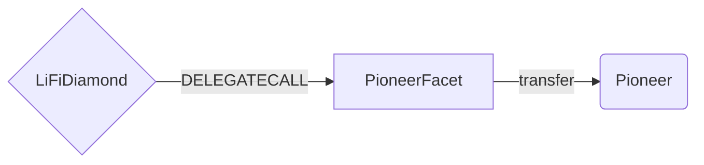

# Pioneer Facet

## How it works

The Pioneer Facet takes in a LI.FI bridgeData parameter which contains a unique transactionID. This transactionId is linked to a specific off-chain quote. The LI.FI solver will pick up this information and transfer the funds to destination based on the information associated with the quote. If the quote cannot be executed

Payments made to Pioneer are sent directly to its EOA.

For potential refunds a refund address can be provided. This address will be emitted in an event that appears in all transactions, meaning also successful transactions will contain this event.



## Public Methods

- `function startBridgeTokensViaPioneer(BridgeData calldata _bridgeData, PioneerData calldata _pioneerData)`
  - Simply bridges tokens using pioneer
- `swapAndStartBridgeTokensViaPioneer(BridgeData memory _bridgeData, LibSwap.SwapData[] calldata _swapData, PioneerData calldata _pioneerData)`
  - Performs swap(s) before bridging tokens using pioneer

## pioneer Specific Parameters

The Pioneer takes a PioneerData struct to provide context on the transaction originator; If the transaction fails and a refund has to be issued, the refund will be sent to `PioneerData.refundAddress`.

```solidity
struct PioneerData {
  address payable refundAddress;
}
```

Additionally, it is expected that the transaction ID of matches the quoteId from the Pioneer api.

## Swap Data

Some methods accept a `SwapData _swapData` parameter.

Swapping is performed by a swap specific library that expects an array of calldata to can be run on various DEXs (i.e. Uniswap) to make one or multiple swaps before performing another action.

The swap library can be found [here](../src/Libraries/LibSwap.sol).

## LiFi Data

Some methods accept a `BridgeData _bridgeData` parameter.

This parameter is integral to the Pioneer bridge as the transactionID is used to lookup off-chain quotes. Additionally it's used to emit events that we can later track and index in our subgraphs and provide data on how our contracts are being used. `BridgeData` and the events we can emit can be found [here](../src/Interfaces/ILiFi.sol).

## Getting Sample Calls to interact with the Facet

In the following some sample calls are shown that allow you to retrieve a populated transaction that can be sent to our contract via your wallet.

All examples use our [/quote endpoint](https://apidocs.li.fi/reference/get_quote) to retrieve a quote which contains a `transactionRequest`. This request can directly be sent to your wallet to trigger the transaction.

The quote result looks like the following:

```javascript
const quoteResult = {
  id: '0x...', // quote id
  type: 'lifi', // the type of the quote (all lifi contract calls have the type "lifi")
  tool: 'pioneer', // the bridge tool used for the transaction
  action: {}, // information about what is going to happen
  estimate: {}, // information about the estimated outcome of the call
  includedSteps: [], // steps that are executed by the contract as part of this transaction, e.g. a swap step and a cross step
  transactionRequest: {
    // the transaction that can be sent using a wallet
    data: '0x...',
    to: '0x...',
    value: '0x00',
    from: '{YOUR_WALLET_ADDRESS}',
    chainId: 100,
    gasLimit: '0x...',
    gasPrice: '0x...',
  },
}
```

A detailed explanation on how to use the /quote endpoint and how to trigger the transaction can be found [here](https://docs.li.fi/products/more-integration-options/li.fi-api/transferring-tokens-example).

**Hint**: Don't forget to replace `{YOUR_WALLET_ADDRESS}` with your real wallet address in the examples.

### Cross Only

To get a transaction for a transfer from 30 USDC.e on Avalanche to USDC on Binance you can execute the following request:

```shell
curl 'https://li.quest/v1/quote?fromChain=AVA&fromAmount=30000000&fromToken=USDC&toChain=BSC&toToken=USDC&slippage=0.03&allowBridges=pioneer&fromAddress={YOUR_WALLET_ADDRESS}'
```

### Swap & Cross

To get a transaction for a transfer from 30 USDT on Avalanche to USDC on Binance you can execute the following request:

```shell
curl 'https://li.quest/v1/quote?fromChain=AVA&fromAmount=30000000&fromToken=USDT&toChain=BSC&toToken=USDC&slippage=0.03&allowBridges=pioneer&fromAddress={YOUR_WALLET_ADDRESS}'
```
