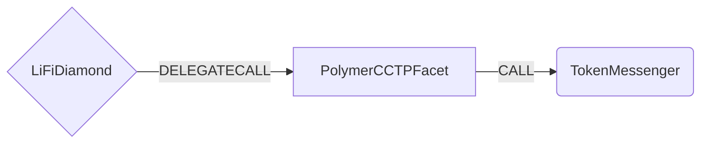

# Polymer CCTP Facet

Polymer CCTP Facet provides functionality for bridging USDC through Polymer's CCTP (Cross-Chain Transfer Protocol) integration. CCTP is a permissionless on-chain utility that can burn native USDC on a source chain and mint native USDC of the same amount on a destination chain.

## How it works

The Polymer CCTP Facet works by forwarding transfers directly to Polymer's TokenMessenger contract, which is an implementation of Circle's CCTP protocol. The facet handles USDC transfers and supports both EVM and non-EVM destination chains.



## Public Methods

- `function startBridgeTokensViaPolymerCCTP(BridgeData memory _bridgeData, PolymerCCTPData calldata _polymerData)`
  - Simply bridges USDC using Polymer CCTP
- `function swapAndStartBridgeTokensViaPolymerCCTP(BridgeData memory _bridgeData, SwapData[] calldata _swapData, PolymerCCTPData calldata _polymerData)`
  - Performs swap(s) before bridging USDC using Polymer CCTP

## Polymer CCTP Specific Parameters

The methods listed above take a variable labeled `_polymerData`. This data is specific to Polymer CCTP and is represented as the following struct type:

```solidity
struct PolymerCCTPData {
  // Token fee taken in USDC by the facet (optional; may be zero)
  uint256 polymerTokenFee;
  // maximum fee to pay on the destination domain, specified in units of burnToken
  uint256 maxCCTPFee;
  // Should only be nonzero if submitting to a nonEVM chain
  bytes32 nonEVMReceiver;
  // the minimum finality at which a burn message will be attested to, will be passed directly to tokenMessenger.depositForBurn method.
  // 1000 = fast path, 2000 = standard path
  uint32 minFinalityThreshold;
}
```

## Swap Data

Some methods accept a `SwapData _swapData` parameter.

Swapping is performed by a swap specific library that expects an array of calldata to can be run on various DEXs (i.e. Uniswap) to make one or multiple swaps before performing another action.

The swap library can be found [here](../src/Libraries/LibSwap.sol).

## LiFi Data

Some methods accept a `BridgeData _bridgeData` parameter.

This parameter is strictly for analytics purposes. It's used to emit events that we can later track and index in our subgraphs and provide data on how our contracts are being used. `BridgeData` and the events we can emit can be found [here](../src/Interfaces/ILiFi.sol).

## Getting Sample Calls to interact with the Facet

In the following some sample calls are shown that allow you to retrieve a populated transaction that can be sent to our contract via your wallet.

All examples use our [/quote endpoint](https://apidocs.li.fi/reference/get_quote) to retrieve a quote which contains a `transactionRequest`. This request can directly be sent to your wallet to trigger the transaction.

The quote result looks like the following:

```javascript
const quoteResult = {
  id: '0x...', // quote id
  type: 'lifi', // the type of the quote (all lifi contract calls have the type "lifi")
  tool: 'polymercctp', // the bridge tool used for the transaction
  action: {}, // information about what is going to happen
  estimate: {}, // information about the estimated outcome of the call
  includedSteps: [], // steps that are executed by the contract as part of this transaction, e.g. a swap step and a cross step
  transactionRequest: {
    // the transaction that can be sent using a wallet
    data: '0x...',
    to: '0x...',
    value: '0x00',
    from: '{YOUR_WALLET_ADDRESS}',
    chainId: 100,
    gasLimit: '0x...',
    gasPrice: '0x...',
  },
}
```

A detailed explanation on how to use the /quote endpoint and how to trigger the transaction can be found [here](https://docs.li.fi/products/more-integration-options/li.fi-api/transferring-tokens-example).

**Hint**: Don't forget to replace `{YOUR_WALLET_ADDRESS}` with your real wallet address in the examples.

### Cross Only

To get a transaction for a transfer from 20 USDC on Ethereum to USDC on Base you can execute the following request:

```shell
curl 'https://li.quest/v1/quote?fromChain=ETH&fromAmount=20000000&fromToken=USDC&toChain=BAS&toToken=USDC&slippage=0.03&allowBridges=polymercctp&fromAddress={YOUR_WALLET_ADDRESS}'
```

### Swap & Cross

To get a transaction for a transfer from 10 USDT on Ethereum to USDC on Base you can execute the following request:

```shell
curl 'https://li.quest/v1/quote?fromChain=ETH&fromAmount=10000000&fromToken=USDT&toChain=BAS&toToken=USDC&slippage=0.03&allowBridges=polymercctp&fromAddress={YOUR_WALLET_ADDRESS}'
```
