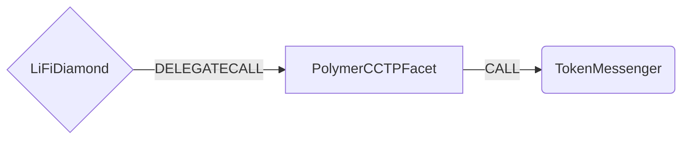

# Polymer CCTP Facet

Polymer CCTP Facet provides functionality for bridging USDC through Polymer's CCTP (Cross-Chain Transfer Protocol) integration. CCTP is a permissionless on-chain utility that can burn native USDC on a source chain and mint native USDC of the same amount on a destination chain.

## How it works

The Polymer CCTP Facet works by forwarding transfers directly to Polymer's TokenMessenger contract, which is an implementation of Circle's CCTP protocol. The facet handles USDC transfers and supports both EVM and non-EVM destination chains.


```mermaid
graph LR;
    D{LiFiDiamond}-- DELEGATECALL -->PolymerCCTPFacet;
    PolymerCCTPFacet -- CALL --> TM(TokenMessenger)
```

## HyperCore deposits

HyperCore (Hyperliquid, LI.FI chain ID `1337`) has no CCTP domain of its own: the USDC burn targets HyperEVM's domain (`19`) and the deposit into HyperCore is performed by [Circle's `CctpForwarder` contract on HyperEVM](https://developers.circle.com/cctp/concepts/forwarding-service). Circle requires that both `mintRecipient` and `destinationCaller` are set to the forwarder; the actual HyperCore recipient is encoded in the `hookData` appended to the burn message (bytes `[32:52]`), together with a destination flag (`0` = perp margin balance, `0xFFFFFFFF` = spot balance).

The facet enforces this flow on-chain via `depositForBurnWithHook`:

- `hookData` is accepted **iff** `destinationChainId == 1337` (hooks toward any other destination revert with `InvalidCallData`, and a hookless transfer to `1337` reverts as well since the USDC would mint on HyperEVM and never reach HyperCore).
- `mintRecipient` and `destinationCaller` are always set to the hardcoded `HYPERCORE_CCTP_FORWARDER` constant — never to caller-supplied values. Rotating the forwarder requires a facet upgrade.
- The recipient encoded in `hookData[32:52]` must equal `BridgeData.receiver` (revert `InvalidReceiver` otherwise), so the emitted `LiFiTransferStarted.receiver` is always the real end user and calldata cannot redirect funds to a recipient other than the declared one.

### Trust assumptions

Verified against the forwarder's published source ([`circlefin/hyperevm-circle-contracts`](https://github.com/circlefin/hyperevm-circle-contracts), `src/CctpForwarder.sol` + `src/messages/CctpForwarderHookData.sol`):

- The forwarder requires `mintRecipient == address(this)` and decodes the deposit recipient from `hookData[32:52]` — exactly the field the facet validates against `BridgeData.receiver`, so the on-chain receiver guarantee binds to the bytes the forwarder actually uses. Its relay entrypoint (`mintAndForward`) is permissionless, but `destinationCaller` pinning means the mint can only ever happen through it, atomically with the forward.
- The magic header (`hookData[0:24]`) and length field are ignored by the forwarder on-chain (they signal Circle's off-chain auto-relay service), which is why the facet does not validate them. The forwarder does require hook version `0` and length ≥ 52; a hook violating either makes `mintAndForward` revert, leaving the transfer burned-but-unmintable (hook bytes are part of the attested message and cannot be replayed with different content). The facet's length guard covers the ≥ 52 bound; version correctness is on the calldata source (LI.FI API).
- `hookData[52:56]` (`destinationId`) selects the HyperCore balance: `0` = perp margin, `0xFFFFFFFF` = spot. It defaults to `0` (perp) if truncated. The facet intentionally does not validate it.
- The forwarder at `0xb21D281DEdb17AE5B501F6AA8256fe38C4e45757` **is** an EIP-1967 upgradeable proxy administered by Circle, and its owner can unset the per-token forwarding address (which would make relays revert until restored). The receiver guarantee therefore ultimately rests on Circle not changing the decode semantics under the same address.
- `hasDestinationCall` remains `false` for HyperCore transfers: the hook is Circle/Polymer forwarding infrastructure with a validated recipient, not a user-defined destination call.

## Public Methods

- `function startBridgeTokensViaPolymerCCTP(BridgeData memory _bridgeData, PolymerCCTPData calldata _polymerData)`
  - Simply bridges USDC using Polymer CCTP
- `function swapAndStartBridgeTokensViaPolymerCCTP(BridgeData memory _bridgeData, SwapData[] calldata _swapData, PolymerCCTPData calldata _polymerData)`
  - Performs swap(s) before bridging USDC using Polymer CCTP
- `function getChainIdToDomainId(uint256 _chainId)`
  - Returns the configured CCTP domain ID for a LI.FI chain ID

## Admin Methods

- `function initPolymerCCTP(ChainIdConfig[] calldata chainIdConfigs)`
  - Sets max USDC approval for the TokenMessenger and batch-initializes chain ID to CCTP domain ID mappings from `config/polymercctp.json` (owner-only)
- `function setChainIdToDomainId(ChainIdConfig[] calldata chainIdConfigs)`
  - Adds or updates one or more chain ID to CCTP domain ID mappings after initialization (owner-only)
- `function unsetChainIdToDomainId(uint256 _chainId)`
  - Removes a chain ID to CCTP domain ID mapping, restoring the unsupported state (owner-only)

After adding mappings to `config/polymercctp.json`, propagate them to all deployed networks:

```bash
bun script/tasks/proposePolymerCCTPChainIdMappings.ts --environment production
```

## Polymer CCTP Specific Parameters

The methods listed above take a variable labeled `_polymerData`. This data is specific to Polymer CCTP and is represented as the following struct type:

```solidity
struct PolymerCCTPData {
  // Token fee taken in USDC by the facet (optional; should be zero for slow path )
  uint256 polymerTokenFee;
  // maximum fee to paid on the destination domain through the difference between burned tokens on src chain and minted token on dest chain, specified in units of burnToken
  uint256 maxCCTPFee;
  // Should only be nonzero if submitting to a nonEVM chain
  bytes32 nonEVMReceiver;
  // For Solana: the receiver's Associated Token Account (ATA) for USDC
  bytes32 solanaReceiverATA;
  // the minimum finality at which a burn message will be attested to, will be passed directly to tokenMessenger.depositForBurn method.
  // 1000 = fast path, 2000 = standard path
  uint32 minFinalityThreshold;
  // CctpForwarder hook data for HyperCore deposits; must encode bridgeData.receiver at
  // bytes [32:52]. Required iff destinationChainId == LIFI_CHAIN_ID_HYPERCORE.
  bytes hookData;
}
```

## Swap Data

Some methods accept a `SwapData _swapData` parameter.

Swapping is performed by a swap specific library that expects an array of calldata to can be run on various DEXs (i.e. Uniswap) to make one or multiple swaps before performing another action.

The swap library can be found [here](../src/Libraries/LibSwap.sol).

## LiFi Data

Some methods accept a `BridgeData _bridgeData` parameter.

This parameter is strictly for analytics purposes. It's used to emit events that we can later track and index in our subgraphs and provide data on how our contracts are being used. `BridgeData` and the events we can emit can be found [here](../src/Interfaces/ILiFi.sol).

## Getting Sample Calls to interact with the Facet

In the following some sample calls are shown that allow you to retrieve a populated transaction that can be sent to our contract via your wallet.

All examples use our [/quote endpoint](https://apidocs.li.fi/reference/get_quote) to retrieve a quote which contains a `transactionRequest`. This request can directly be sent to your wallet to trigger the transaction.

The quote result looks like the following:

```javascript
const quoteResult = {
  id: '0x...', // quote id
  type: 'lifi', // the type of the quote (all lifi contract calls have the type "lifi")
  tool: 'polymercctp', // the bridge tool used for the transaction
  action: {}, // information about what is going to happen
  estimate: {}, // information about the estimated outcome of the call
  includedSteps: [], // steps that are executed by the contract as part of this transaction, e.g. a swap step and a cross step
  transactionRequest: {
    // the transaction that can be sent using a wallet
    data: '0x...',
    to: '0x...',
    value: '0x00',
    from: '{YOUR_WALLET_ADDRESS}',
    chainId: 100,
    gasLimit: '0x...',
    gasPrice: '0x...',
  },
}
```

A detailed explanation on how to use the /quote endpoint and how to trigger the transaction can be found [here](https://docs.li.fi/products/more-integration-options/li.fi-api/transferring-tokens-example).

**Hint**: Don't forget to replace `{YOUR_WALLET_ADDRESS}` with your real wallet address in the examples.

### Cross Only

To get a transaction for a transfer from 20 USDC on Ethereum to USDC on Base you can execute the following request:

```shell
curl 'https://li.quest/v1/quote?fromChain=ETH&fromAmount=20000000&fromToken=USDC&toChain=BAS&toToken=USDC&slippage=0.03&allowBridges=polymercctp&fromAddress={YOUR_WALLET_ADDRESS}'
```

### Swap & Cross

To get a transaction for a transfer from 10 USDT on Ethereum to USDC on Base you can execute the following request:

```shell
curl 'https://li.quest/v1/quote?fromChain=ETH&fromAmount=10000000&fromToken=USDT&toChain=BAS&toToken=USDC&slippage=0.03&allowBridges=polymercctp&fromAddress={YOUR_WALLET_ADDRESS}'
```
