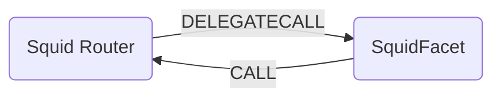

# Squid Bridge Facet

## How it works

The Squid bridge facet works by forwarding calls to the Squid Router contract on the source chain. It is possible to find the contract addresses [here](https://docs.squidrouter.com/resources/urls-and-addresses).

Squid is the cross-chain swap and liquidity routing protocol on Axelar Network.
Squid utilises existing DEXs to swap and send any native token between chains. This can be done via our SDK, Front End or Contracts directly.

Swaps are composable with Axelar's generalised message passing, so Squid can enable one-click transactions between any application and any user, using any asset.

Buy NFTs from any marketplace, use multi-chain DeFi, play a game on another chain, all without signing multiple transactions or downloading multiple wallets.



## Public Methods

- `function startBridgeTokensViaSquid(BridgeData calldata _bridgeData, SquidData calldata _squidData)`
  - Simply bridges tokens using SquidFacet
- `function swapAndStartBridgeTokensViaSquid(BridgeData memory _bridgeData, LibSwap.SwapData[] calldata _swapData, SquidData calldata _squidData)`
  - Performs swap(s) before bridging tokens using bridgeFacet

## Bridge Specific Parameters

Some of the methods listed above take a variable labeled `_squidData`.

This data is specific to Squid and is represented as the following struct type:

```solidity
/// @notice Contains the data needed for bridging via Squid squidRouter
/// @param RouteType the type of route to use
/// @param destinationChain the chain to bridge tokens to
/// @param bridgedTokenSymbol the symbol of the bridged token
/// @param sourceCalls the calls to make on the source chain
/// @param destinationCalls the calls to make on the destination chain
/// @param fee the fee to pay
/// @param forecallEnabled whether or not to forecall
struct SquidData {
    RouteType routeType;
    string destinationChain;
    string bridgedTokenSymbol;
    ISquidMulticall.Call[] sourceCalls;
    ISquidMulticall.Call[] destinationCalls;
    uint256 fee;
    bool forecallEnabled;
}
```
The Squid router performs various different call types depending on the starting token and the desired token recieved on the destination chain.

```solidity
enum RouteType {
  BridgeCall, // Simply bridges then makes call on the destination chain
  CallBridge, // Makes a call on the source chain then bridges
  CallBridgeCall // Makes calls on both chains while bridging in between
}
```
## Swap Data

Some methods accept a `SwapData _swapData` parameter.

Swapping is performed by a swap specific library that expects an array of calldata to can be run on variaous DEXs (i.e. Uniswap) to make one or multiple swaps before performing another action.

The swap library can be found [here](../src/Libraries/LibSwap.sol).

## LiFi Data

Most of the methods accept a `ILiFiBridgeData _bridgeData` parameter.

In the Squid contract call the fields `minAmount` and `sendingAssetId` are used for the transfer amount and the asset to be sent. Since the Squid bridge does not support native token bridging (it's mainly a stablecoin bridge) the methods will fail if native assets are tried to be bridged.

It's also used to emit events that we can later track and index in our subgraphs and provide data on how our contracts are being used. `BridgeData` and the events we can emit can be found [here](../src/Interfaces/ILiFi.sol).

## Getting Sample Calls to interact with the Facet

In the following some sample calls are shown that allow you to retrieve a populated transaction that can be sent to our contract
