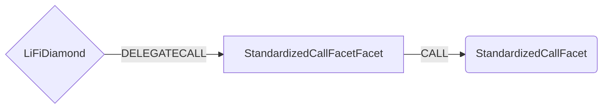

# Standardized Call Facet

## How it works

The StandardizedCallFacet Facet works by parsing the calldata sent to `standardizedCall` and then forwarding to the correct facet using the LiFiDiamond internal storage for facet address lookup.

The additional functions `standardizedSwapCall`, `standardizedBridgeCall` and `standardizedSwapAndBridgeCall` execute the same logic, but allow easier parsing.

## Public Methods

- `function standardizedCall(bytes calldata callData)`
  - Calls the correct facet based on the calldata.
