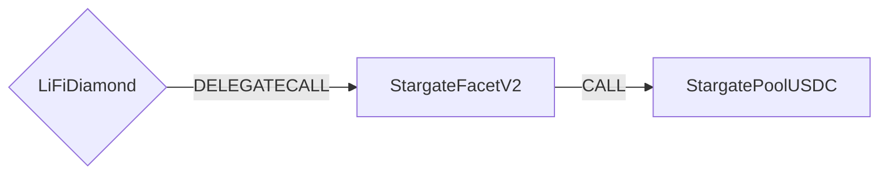

# StargateFacetV2

## How it works

The StargateFacetV2 offers bridging through Stargate's V2 contracts using "Bus" or "Taxi" mode. "Bus mode" is a fee-optimized, batched bridging where several bridging transactions are batched and relayed together (>> taking a bus together) whilst sharing cross-chain fees. The taxi mode on the contrary offers immediate execution in return for covering the full cross-chain fee.
Destination calls can only be combined with taxi mode.



## Public Methods


- `function startBridgeTokensViaStargate(BridgeData memory _bridgeData, StargateData calldata _stargateData)`
  - Simply bridges tokens using Stargate (may include a destination call)
- `function swapAndStartBridgeTokensViaStargate(BridgeData memory _bridgeData, SwapData[] calldata _swapData, StargateData calldata _stargateData)`
  - Performs swap(s) before bridging tokens using Stargate (may include a destination call)


A native gas fee that covers the LayerZero network costs needs to be sent together with the bridge tx.
Our backend will provide an estimate for this fee.


## Stargate Specific Parameters

Some of the methods listed above take a variable labeled `_stargateData`.

To populate `_stargateData` you will need to get the chain ID and pool ID you are bridging from. You can visit the [LayerZero Chain IDs](https://stargateprotocol.gitbook.io/stargate/developers/contract-addresses/mainnet) and [Pool IDs](https://stargateprotocol.gitbook.io/stargate/developers/pool-ids) to get the list.

This data is specific to Stargate and is represented as the following struct type:

```solidity
/// @param assetId The Stargate-specific assetId for the token that should be bridged
/// @param sendParams Various parameters that describe what needs to be bridged, how to bridge it and what to do with it on dst
/// @param fee Information about the (native) LayerZero fee that needs to be sent with the tx
/// @param refundAddress the address that is used for potential refunds
struct StargateData {
    uint16 assetId;
    IStargate.SendParam sendParams;
    IStargate.MessagingFee fee;
    address payable refundAddress;
}
```

## Swap Data

Some methods accept a `SwapData _swapData` parameter.

Swapping is performed by a swap specific library that expects an array of calldata to can be run on various DEXs (i.e. Uniswap) to make one or multiple swaps before performing another action.

The swap library can be found [here](../src/Libraries/LibSwap.sol).

## LiFi Data

Some methods accept a `BridgeData _bridgeData` parameter.

This parameter is strictly for analytics purposes. It's used to emit events that we can later track and index in our subgraphs and provide data on how our contracts are being used. `BridgeData` and the events we can emit can be found [here](../src/Interfaces/ILiFi.sol).

## Getting Sample Calls to interact with the Facet

In the following some sample calls are shown that allow you to retrieve a populated transaction that can be sent to our contract via your wallet.

All examples use our [/quote endpoint](https://apidocs.li.finance/reference/get_quote-1) to retrieve a quote which contains a `transactionRequest`. This request can directly be sent to your wallet to trigger the transaction.

The quote result looks like the following:

```javascript
const quoteResult = {
  id: '0x...', // quote id
  type: 'lifi', // the type of the quote (all lifi contract calls have the type "lifi")
  tool: 'stargate', // the bridge tool used for the transaction
  action: {}, // information about what is going to happen
  estimate: {}, // information about the estimated outcome of the call
  includedSteps: [], // steps that are executed by the contract as part of this transaction, e.g. a swap step and a cross step
  transactionRequest: {
    // the transaction that can be sent using a wallet
    data: '0x...',
    to: '0x...',
    value: '0x00',
    from: '{YOUR_WALLET_ADDRESS}',
    chainId: 100,
    gasLimit: '0x...',
    gasPrice: '0x...',
  },
}
```

A detailed explanation of how to use the /quote endpoint and how to trigger the transaction can be found [here](https://apidocs.li.finance/reference/how-to-transfer-tokens).

**Hint**: Don't forget to replace `{YOUR_WALLET_ADDRESS}` with your real wallet address in the examples.

### Cross Only

To get a transaction for a transfer from 20 USDC on Polygon to USDC on Fantom you can execute the following request:

```shell
curl 'https://li.quest/v1/quote?fromChain=POL&fromAmount=20000000&fromToken=USDC&toChain=FTM&toToken=USDC&slippage=0.03&allowBridges=stargatev2&fromAddress={YOUR_WALLET_ADDRESS}'
```

### Swap & Cross

To get a transaction for a transfer from 10 USDT on Polygon to USDC on Fantom you can execute the following request:

```shell
curl 'https://li.quest/v1/quote?fromChain=POL&fromAmount=10000000&fromToken=USDT&toChain=FTM&toToken=USDC&slippage=0.03&allowBridges=stargatev2&fromAddress={YOUR_WALLET_ADDRESS}'
```
