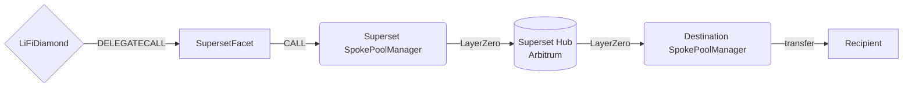

# Superset Facet

## How it works

The Superset Facet bridges tokens through Superset's hub-and-spoke virtual pools.
Liquidity stays on each spoke chain; pricing and settlement are computed on a
hub chain (Arbitrum) using Uniswap-V3 math against mirror tokens.

The same facet is deployed on **both hub and spoke chains** — it auto-detects the
role at construction time from `block.chainid` (Arbitrum = hub) and routes to
the matching Superset entrypoint:

- **Spoke chains** (Base, Unichain) → `SpokePoolManager.multiHopSwapWithOutputChain`
  (9-arg ABI; includes `refundAddress` + `options` because the source → hub LZ
  leg is async).
- **Hub chain** (Arbitrum) → `HubPoolManager.multiHopSwapWithOutputChain`
  (7-arg ABI; no `refundAddress`/`options` because the hub processes
  synchronously on its own chain).

On both paths, the destination delivery is a LayerZero message from the hub to
the destination spoke, which transfers the output token to `bridgeData.receiver`.



## Public Methods

- `function startBridgeTokensViaSuperset(BridgeData calldata _bridgeData, SupersetData calldata _supersetData)`
  - Simply bridges tokens using Superset.
- `function swapAndStartBridgeTokensViaSuperset(BridgeData memory _bridgeData, LibSwap.SwapData[] calldata _swapData, SupersetData calldata _supersetData)`
  - Performs swap(s) on the source chain before bridging via Superset.

## Superset Specific Parameters

The methods above take a variable labeled `_supersetData`. This data is
specific to Superset and is represented as the following struct type:

```solidity
/// @param path Packed `omniTokenId(32) || fee(3) || ... || omniTokenId(32)`
///        describing the multi-hop route on the hub's virtual Uniswap-V3 pools.
/// @param amountOutMin Slippage floor on destination omni-token (absolute amount).
/// @param amountOutMinPercent Fraction (1e18 = 100%) used to recompute `amountOutMin`
///        post source-swap so positive slippage propagates to the destination floor.
/// @param refundAddress Address that receives `amountIn` on the source spoke if the
///        swap fails.
/// @param fallbackEoA Pure EOA fall-through if delivery to `bridgeData.receiver` or
///        `refundAddress` fails on either chain. Must satisfy `code.length == 0`.
/// @param deadline Unix timestamp after which the hub will reject the request.
/// @param toEid LayerZero endpoint ID of the destination spoke chain.
/// @param options LayerZero executor options for the source → hub request.
/// @param lzFee Native value forwarded to the spoke to cover all three LayerZero
///        messages (request + two responses).
struct SupersetData {
    bytes path;
    uint256 amountOutMin;
    uint64 amountOutMinPercent;
    address refundAddress;
    address fallbackEoA;
    uint256 deadline;
    uint32 toEid;
    bytes options;
    uint256 lzFee;
}
```

The Superset pool manager address is configured at deploy time as an immutable
constructor argument and is sourced from `config/superset.json` per chain.
On Arbitrum it points to `HubPoolManager`; on Base/Unichain it points to
`SpokePoolManager`. The facet picks the right ABI via its `IS_HUB` immutable.

On the hub branch, `SupersetData.refundAddress` and `SupersetData.options` are
ignored (the hub has no async failure refund path and no source-side LZ message
to configure). Backends can leave them as `address(0)` / `""` for hub-origin
quotes.

## `fallbackEoA` Constraint

Superset requires the fallback recipient to be a pure EOA
(`code.length == 0`). This is checked both on the facet (cheaper revert) and
on the Superset spoke. For smart-wallet users (Safe, AA, etc.), an explicit
EOA fallback must be supplied by the integrator — there is no automatic
derivation from the smart wallet's address.

## LayerZero Fees

A Superset cross-chain swap is a three-message LayerZero round-trip:

1. Source spoke → hub (request)
2. Hub → source spoke (ack / failure refund signal)
3. Hub → destination spoke (output delivery)

The user pays for all three messages upfront via `SupersetData.lzFee`, which
the facet forwards as `msg.value` to the spoke. Quotes are obtained from
Superset's `PoolManagerMessagingQuoter` and surfaced by the LI.FI backend.
Excess native sent to the facet is refunded to `msg.sender` via the
`refundExcessNative` modifier.

## Refund Flow

If the hub rejects the swap (slippage, deadline, insufficient destination pot,
out-of-gas at hub, etc.), the failure response travels back to the source
spoke, which transfers `amountIn` of the input token to
`SupersetData.refundAddress`. This is asynchronous — typical end-to-end
latency for both success and failure is 2–6 minutes.

The success path delivers output tokens to `bridgeData.receiver` on the
destination spoke. Both `refundAddress` and `receiver` must be addresses the
end user can recover funds from; smart-wallet users should consider their
recovery path before bridging.

## Native Source Asset

Superset does not support native as a source asset, so the facet rejects it.
Both entry points apply the shared `noNativeAsset` modifier.

## Destination Calldata

Superset does not relay arbitrary destination calldata. The facet rejects
`bridgeData.hasDestinationCall == true` via the
`doesNotContainDestinationCalls` modifier.

## Non-EVM Destinations

Superset's current message format encodes `recipient` and `refundAddress` as
20-byte EVM addresses. Non-EVM destinations are not supported; the facet
rejects `bridgeData.receiver == NON_EVM_ADDRESS` with `InvalidNonEVMReceiver`.

## Swap Data

Some methods accept a `SwapData _swapData` parameter.

Swapping is performed by a swap-specific library that expects an array of
calldata to be run on various DEXs (e.g. Uniswap) to make one or multiple
swaps before performing another action.

The swap library can be found [here](../src/Libraries/LibSwap.sol).

## LiFi Data

Some methods accept a `BridgeData _bridgeData` parameter.

This parameter is strictly for analytics purposes. It's used to emit events
that we can later track and index in our subgraphs and provide data on how our
contracts are being used. `BridgeData` and the events we can emit can be found
[here](../src/Interfaces/ILiFi.sol).

## Getting Sample Calls to interact with the Facet

In the following some sample calls are shown that allow you to retrieve a populated transaction that can be sent to our contract via your wallet.

All examples use our [/quote endpoint](https://apidocs.li.fi/reference/get_quote) to retrieve a quote which contains a `transactionRequest`. This request can directly be sent to your wallet to trigger the transaction.

The quote result looks like the following:

```javascript
const quoteResult = {
  id: '0x...', // quote id
  type: 'lifi', // the type of the quote (all lifi contract calls have the type "lifi")
  tool: 'superset', // the bridge tool used for the transaction
  action: {}, // information about what is going to happen
  estimate: {}, // information about the estimated outcome of the call
  includedSteps: [], // steps that are executed by the contract as part of this transaction, e.g. a swap step and a cross step
  transactionRequest: {
    // the transaction that can be sent using a wallet
    data: '0x...',
    to: '0x...',
    value: '0x00',
    from: '{YOUR_WALLET_ADDRESS}',
    chainId: 8453,
    gasLimit: '0x...',
    gasPrice: '0x...',
  },
}
```

A detailed explanation on how to use the /quote endpoint and how to trigger the transaction can be found [here](https://docs.li.fi/products/more-integration-options/li.fi-api/transferring-tokens-example).

**Hint**: Don't forget to replace `{YOUR_WALLET_ADDRESS}` with your real wallet address in the examples.

### Cross Only

To get a transaction for a transfer from 100 USDC on Base to USDT on Unichain you can execute the following request:

```shell
curl 'https://li.quest/v1/quote?fromChain=BAS&fromAmount=100000000&fromToken=USDC&toChain=UNI&toToken=USDT&slippage=0.005&allowBridges=superset&fromAddress={YOUR_WALLET_ADDRESS}'
```

### Swap & Cross

To get a transaction for a transfer from 100 USDT on Base to USDC on Unichain you can execute the following request:

```shell
curl 'https://li.quest/v1/quote?fromChain=BAS&fromAmount=100000000&fromToken=USDT&toChain=UNI&toToken=USDC&slippage=0.005&allowBridges=superset&fromAddress={YOUR_WALLET_ADDRESS}'
```
