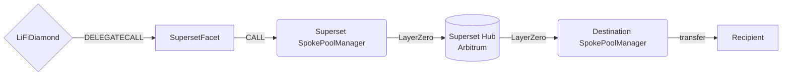

# Superset Facet

## How it works

The Superset Facet bridges tokens through Superset's hub-and-spoke virtual pools.
Liquidity stays on each spoke chain; pricing and settlement are computed on a
hub chain (Arbitrum) using Uniswap-V3 math against mirror tokens.

The same facet is deployed on **both hub and spoke chains** — it auto-detects the
role at construction time from `block.chainid` (Arbitrum = hub) and routes to
the matching Superset entrypoint:

- **Spoke chains** (Base, Unichain) → `SpokePoolManager.multiHopSwapWithOutputChain`
  (9-arg ABI; includes `refundAddress` + `options` because the source → hub LZ
  leg is async).
- **Hub chain** (Arbitrum) → `HubPoolManager.multiHopSwapWithOutputChain`
  (7-arg ABI; no `refundAddress`/`options` because the hub processes
  synchronously on its own chain).

On both paths, the destination delivery is a LayerZero message from the hub to
the destination spoke, which transfers the output token to `bridgeData.receiver`.



## Public Methods

- `function startBridgeTokensViaSuperset(BridgeData calldata _bridgeData, SupersetData calldata _supersetData)`
  - Simply bridges tokens using Superset.
- `function swapAndStartBridgeTokensViaSuperset(BridgeData memory _bridgeData, LibSwap.SwapData[] calldata _swapData, SupersetData calldata _supersetData)`
  - Performs swap(s) on the source chain before bridging via Superset.
- `function getChainIdToEid(uint256 _chainId)`
  - Returns the LayerZero EID configured for a LI.FI chain ID.

## Admin Methods

- `function initSuperset(ChainIdConfig[] calldata _chainIdConfigs)`
  - Owner-only one-shot. Invoked atomically by `diamondCut` via its `_init`/`_calldata` payload to seed the chain ID → LayerZero EID mapping from `config/superset.json` (`mappings` array). The selector is intentionally excluded from the diamond cut (see `UpdateSupersetFacet.s.sol` `getExcludes()`), so post-deploy it is no longer reachable — use `setChainIdToEid` for any later changes. Required to run before any bridge can be processed.
- `function setChainIdToEid(ChainIdConfig[] calldata _chainIdConfigs)`
  - Owner-only. Adds or updates entries in the mapping after initialization. Use when a new spoke is onboarded without redeploying the facet.

After adding mappings to `config/superset.json`, propagate them to every chain where SupersetFacet is deployed (Safe-proposed Diamond cut + initSuperset / setChainIdToEid call).

## Destination Chain Validation

The facet validates that the backend-supplied `_supersetData.toEid` matches the LayerZero EID stored for `_bridgeData.destinationChainId`. A mismatch reverts with `InvalidConfig`; a destination chain that has not been onboarded reverts with `UnsupportedChainId(chainId)`. This makes the off-chain `(destinationChainId, toEid)` pair structurally consistent with on-chain configuration.

## Superset Specific Parameters

The methods above take a variable labeled `_supersetData`. This data is
specific to Superset and is represented as the following struct type:

```solidity
/// @param path Packed `omniTokenId(32) || fee(3) || ... || omniTokenId(32)`
///        describing the multi-hop route on the hub's virtual Uniswap-V3 pools.
/// @param amountOutMin Backend-quoted slippage floor on the destination omni-token
///        (absolute amount, in destination-token raw units). For
///        `swapAndStartBridgeTokensViaSuperset` the facet scales it post-swap to
///        preserve the backend's percentage slippage budget — see "Positive
///        Slippage Handling" below.
/// @param refundAddress Address that receives `amountIn` on the source spoke if the
///        swap fails.
/// @param fallbackEoA Pure EOA fall-through if delivery to `bridgeData.receiver` or
///        `refundAddress` fails on either chain. Must satisfy `code.length == 0`.
/// @param deadline Unix timestamp after which the hub will reject the request.
/// @param toEid LayerZero endpoint ID of the destination spoke chain.
/// @param options LayerZero executor options for the source → hub request.
/// @param lzFee Native value forwarded to the spoke to cover all three LayerZero
///        messages (request + two responses).
struct SupersetData {
    bytes path;
    uint256 amountOutMin;
    address refundAddress;
    address fallbackEoA;
    uint256 deadline;
    uint32 toEid;
    bytes options;
    uint256 lzFee;
}
```

The Superset pool manager address is configured at deploy time as an immutable
constructor argument and is sourced from `config/superset.json` per chain.
On Arbitrum it points to `HubPoolManager`; on Base/Unichain it points to
`SpokePoolManager`. The facet picks the right ABI via its `IS_HUB` immutable.

On the hub branch, Superset itself ignores `SupersetData.options` (no source →
hub LZ leg) and does not consume `SupersetData.refundAddress` (no async failure
refund). The facet, however, still uses `refundAddress` as the local sink for
excess native and source-side swap leftovers, so it is validated to be non-zero
on every path. Backends must supply a non-zero `refundAddress` for both hub and
spoke origins; `options` may be left as `""` for hub-origin quotes.

## Input Token Binding

The pool manager pulls the token resolved from the first OmniToken ID packed in
`SupersetData.path` (via its `OmniTokenAddressBook`), not the `sendingAssetId`
the facet deposits and approves. The facet binds the two: it resolves
`getAddressForOmniToken(path.firstOmniToken)` on the pool manager and requires
it to equal `bridgeData.sendingAssetId`, reverting `InvalidConfig` otherwise.
This prevents a mismatched path from directing the pool manager to pull a
different token from the diamond via a stale allowance. On
`swapAndStartBridgeTokensViaSuperset` the facet additionally requires the last
swap's `receivingAssetId` to equal `sendingAssetId`, so the bridged token, the
swap output, and the pool-pulled token are all the same asset.

## `fallbackEoA` Constraint

Superset requires the fallback recipient to be a pure EOA
(`code.length == 0`). This is checked both on the facet (cheaper revert) and
on the Superset spoke. For smart-wallet users (Safe, AA, etc.), an explicit
EOA fallback must be supplied by the integrator — there is no automatic
derivation from the smart wallet's address.

This check intentionally mirrors Superset's `SwapDelivery.sol` check verbatim, which means **EIP-7702 delegated EOAs are also rejected**: once an EOA opts into a 7702 delegation it carries the 23-byte `0xef0100…` designator as `code`, so `code.length != 0` and the facet reverts. Backends serving 7702 users must supply a separate pure-EOA address (e.g. a freshly generated recovery wallet) as `fallbackEoA`. Switching the facet to `LibAsset.isContract` here would diverge from the spoke and cause Superset's own check to revert later, so the constraint stays.

## LayerZero Fees

A Superset cross-chain swap is a three-message LayerZero round-trip:

1. Source spoke → hub (request)
2. Hub → source spoke (ack / failure refund signal)
3. Hub → destination spoke (output delivery)

The user pays for all three messages upfront via `SupersetData.lzFee`, which
the facet forwards as `msg.value` to the spoke. Quotes are obtained from
Superset's `PoolManagerMessagingQuoter` and surfaced by the LI.FI backend.

Because `lzFee` is a LayerZero quote that drifts with gas price between quote
and execution, the backend overpays `msg.value` on essentially every call, so a
refund is the normal case. The facet refunds excess native — and any source-side
swap leftovers — to `SupersetData.refundAddress` (not `msg.sender`), so refunds
reach the user even when the call is routed through `Permit2Proxy` (whose
`msg.sender` would otherwise strand the funds in the proxy). `refundAddress` must
be non-zero. This deviates from facets like `AcrossFacetV3` that refund to
`msg.sender`; it is intentional given the structural overpayment above.

## Positive Slippage Handling

`startBridgeTokensViaSuperset` (no source-side swap) forwards `amountOutMin` unchanged.

`swapAndStartBridgeTokensViaSuperset` scales `amountOutMin` after the source-side swap to preserve the backend's percentage bridge-slippage budget against the actual swap output:

```
modifiedAmountOutMin = amountOutMin * actualPostSwap / preSwapMinAmount
```

where `preSwapMinAmount` is the value of `bridgeData.minAmount` before `_depositAndSwap` runs (the swap floor) and `actualPostSwap` is the swap's actual output. Because `_depositAndSwap` reverts when the swap returns less than the floor, the ratio is always `>= 1` and the scaling either leaves `amountOutMin` unchanged or increases it proportionally to positive swap slippage.

### Example

```
backend quote (1% bridge slippage on top of 1% swap slippage):
  expected swap median:   3,000 USDC
  bridgeData.minAmount:   2,970 USDC   (1% swap floor)
  amountOutMin:           2,940 USDC   (1% bridge slippage on the floor)

execution — actual swap output = 3,100 USDC (positive slippage):
  modifiedAmountOutMin = 2,940 * 3,100 / 2,970 = 3,069 USDC
  bridge tolerance: 31 / 3,100 ≈ 1.0%   ← same as backend's intent
```

If the swap had instead landed exactly at the floor (2,970), `modifiedAmountOutMin` would equal `amountOutMin` (no scaling). At any output above the floor, both numerator (`amountOutMin × actualPostSwap`) and denominator (`preSwapMinAmount`) grow together so the percentage tolerance is preserved.

Both fields are absolute token amounts in their native decimals — there is no multiplier or fraction to encode, and no cross-decimal overflow risk because the scaling ratio is computed from same-decimal pairs (source-token / source-token).

## Refund Flow

If the hub rejects the swap (slippage, deadline, insufficient destination pot,
out-of-gas at hub, etc.), the failure response travels back to the source
spoke, which transfers `amountIn` of the input token to
`SupersetData.refundAddress`. This is asynchronous — typical end-to-end
latency for both success and failure is 2–6 minutes.

The success path delivers output tokens to `bridgeData.receiver` on the
destination spoke. Both `refundAddress` and `receiver` must be addresses the
end user can recover funds from; smart-wallet users should consider their
recovery path before bridging.

## Native Source Asset

Superset does not support native as a source asset, so the facet rejects it.
Both entry points apply the shared `noNativeAsset` modifier.

## Destination Calldata

Superset does not relay arbitrary destination calldata. The facet rejects
`bridgeData.hasDestinationCall == true` via the
`doesNotContainDestinationCalls` modifier.

## Swap Data

Some methods accept a `SwapData _swapData` parameter.

Swapping is performed by a swap-specific library that expects an array of
calldata to be run on various DEXs (e.g. Uniswap) to make one or multiple
swaps before performing another action.

The swap library can be found [here](../src/Libraries/LibSwap.sol).

## LiFi Data

Some methods accept a `BridgeData _bridgeData` parameter.

This parameter is strictly for analytics purposes. It's used to emit events
that we can later track and index in our subgraphs and provide data on how our
contracts are being used. `BridgeData` and the events we can emit can be found
[here](../src/Interfaces/ILiFi.sol).

## Getting Sample Calls to interact with the Facet

In the following some sample calls are shown that allow you to retrieve a populated transaction that can be sent to our contract via your wallet.

All examples use our [/quote endpoint](https://apidocs.li.fi/reference/get_quote) to retrieve a quote which contains a `transactionRequest`. This request can directly be sent to your wallet to trigger the transaction.

The quote result looks like the following:

```javascript
const quoteResult = {
  id: '0x...', // quote id
  type: 'lifi', // the type of the quote (all lifi contract calls have the type "lifi")
  tool: 'superset', // the bridge tool used for the transaction
  action: {}, // information about what is going to happen
  estimate: {}, // information about the estimated outcome of the call
  includedSteps: [], // steps that are executed by the contract as part of this transaction, e.g. a swap step and a cross step
  transactionRequest: {
    // the transaction that can be sent using a wallet
    data: '0x...',
    to: '0x...',
    value: '0x00',
    from: '{YOUR_WALLET_ADDRESS}',
    chainId: 8453,
    gasLimit: '0x...',
    gasPrice: '0x...',
  },
}
```

A detailed explanation on how to use the /quote endpoint and how to trigger the transaction can be found [here](https://docs.li.fi/products/more-integration-options/li.fi-api/transferring-tokens-example).

**Hint**: Don't forget to replace `{YOUR_WALLET_ADDRESS}` with your real wallet address in the examples.

### Cross Only

To get a transaction for a transfer from 100 USDC on Base to USDT on Unichain you can execute the following request:

```shell
curl 'https://li.quest/v1/quote?fromChain=BAS&fromAmount=100000000&fromToken=USDC&toChain=UNI&toToken=USDT&slippage=0.005&allowBridges=superset&fromAddress={YOUR_WALLET_ADDRESS}'
```

### Swap & Cross

To get a transaction for a transfer from 100 USDT on Base to USDC on Unichain you can execute the following request:

```shell
curl 'https://li.quest/v1/quote?fromChain=BAS&fromAmount=100000000&fromToken=USDT&toChain=UNI&toToken=USDC&slippage=0.005&allowBridges=superset&fromAddress={YOUR_WALLET_ADDRESS}'
```
